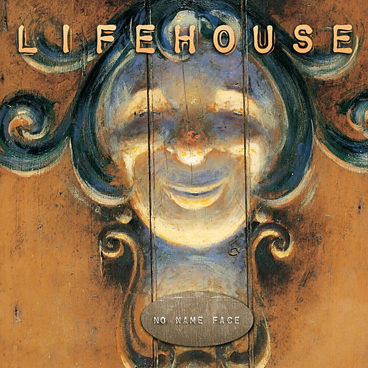

# No Name Face

By **Lifehouse**

## Album Data

- **Catalog:** Beets
- **Format:** Digital, Album
- **Album:** No Name Face
- **Artist:** Lifehouse
- **Albumartist:** Lifehouse
- **Genre:** Post-Grunge
- **MusicBrainz Album Artist ID:** [04591295-6d94-45cb-b6c7-1ae17c6f380e](https://musicbrainz.org/artist/04591295-6d94-45cb-b6c7-1ae17c6f380e)
- **MusicBrainz Album ID:** [ba99974f-66cf-4fa1-b9cf-8739eeb19b39](https://musicbrainz.org/release/ba99974f-66cf-4fa1-b9cf-8739eeb19b39)
- **MusicBrainz Release Group ID:** [ae76bd62-2ca4-3665-a061-9674a6397998](https://musicbrainz.org/release-group/ae76bd62-2ca4-3665-a061-9674a6397998)
- **Year:** 2000
- **Catalog #:** 0044-50231-2
- **Label:** DreamWorks Records
- **Total Tracks:** 12

## Album Tracks

### Track 01 - Hanging by a Moment

- **Artist:** Lifehouse
- **Format:** MP3
- **Genre:** Alternative Rock
- **Length:** 3:37
- **MusicBrainz Track ID:** [7d5e3bdd-b0b1-47c4-9fb2-877a683f210c](https://musicbrainz.org/recording/7d5e3bdd-b0b1-47c4-9fb2-877a683f210c)
- **Title:** Hanging by a Moment
- **Track:** 01
- **Year:** 2000

### Track 02 - Sick Cycle Carousel

- **Artist:** Lifehouse
- **Format:** MP3
- **Genre:** Alternative Rock
- **Length:** 4:25
- **MusicBrainz Track ID:** [e3fd5578-74e4-4a8a-ba5b-0c219a73b165](https://musicbrainz.org/recording/e3fd5578-74e4-4a8a-ba5b-0c219a73b165)
- **Title:** Sick Cycle Carousel
- **Track:** 02
- **Year:** 2000

### Track 03 - Unknown

- **Artist:** Lifehouse
- **Format:** MP3
- **Genre:** Post-Grunge
- **Length:** 4:08
- **MusicBrainz Track ID:** [98a39ce2-e65b-4887-a97f-f768eac6d8d2](https://musicbrainz.org/recording/98a39ce2-e65b-4887-a97f-f768eac6d8d2)
- **Title:** Unknown
- **Track:** 03
- **Year:** 2000

### Track 04 - Somebody Else’s Song

- **Artist:** Lifehouse
- **Format:** MP3
- **Genre:** Post-Grunge
- **Length:** 4:38
- **MusicBrainz Track ID:** [e9ed8c81-21ae-44bf-8a3b-309634aa71c7](https://musicbrainz.org/recording/e9ed8c81-21ae-44bf-8a3b-309634aa71c7)
- **Title:** Somebody Else’s Song
- **Track:** 04
- **Year:** 2000

### Track 05 - Trying

- **Artist:** Lifehouse
- **Format:** MP3
- **Genre:** Christian Rock
- **Length:** 3:54
- **MusicBrainz Track ID:** [28e7f425-5442-4ac1-93ea-ea7c3b238927](https://musicbrainz.org/recording/28e7f425-5442-4ac1-93ea-ea7c3b238927)
- **Title:** Trying
- **Track:** 05
- **Year:** 2000

### Track 06 - Only One

- **Artist:** Lifehouse
- **Format:** MP3
- **Genre:** Pop Rock
- **Length:** 4:58
- **MusicBrainz Track ID:** [558618b0-3434-41d9-a276-80e0dff01c05](https://musicbrainz.org/recording/558618b0-3434-41d9-a276-80e0dff01c05)
- **Title:** Only One
- **Track:** 06
- **Year:** 2000

### Track 07 - Simon

- **Artist:** Lifehouse
- **Format:** MP3
- **Genre:** Alternative Rock
- **Length:** 6:02
- **MusicBrainz Track ID:** [651cd2cf-204d-4b2d-b30e-bc2ba8c43e4b](https://musicbrainz.org/recording/651cd2cf-204d-4b2d-b30e-bc2ba8c43e4b)
- **Title:** Simon
- **Track:** 07
- **Year:** 2000

### Track 08 - Cling and Clatter

- **Artist:** Lifehouse
- **Format:** MP3
- **Genre:** Soft Rock
- **Length:** 4:30
- **MusicBrainz Track ID:** [d8109875-62ce-4b72-8cfe-14ea06a320ff](https://musicbrainz.org/recording/d8109875-62ce-4b72-8cfe-14ea06a320ff)
- **Title:** Cling and Clatter
- **Track:** 08
- **Year:** 2000

### Track 09 - Breathing

- **Artist:** Lifehouse
- **Format:** MP3
- **Genre:** Alternative Rock
- **Length:** 4:27
- **MusicBrainz Track ID:** [644c2275-39e8-4deb-b6db-455a128d7196](https://musicbrainz.org/recording/644c2275-39e8-4deb-b6db-455a128d7196)
- **Title:** Breathing
- **Track:** 09
- **Year:** 2000

### Track 10 - Quasimodo

- **Artist:** Lifehouse
- **Format:** MP3
- **Genre:** Christian Rock
- **Length:** 4:34
- **MusicBrainz Track ID:** [61670d66-eb13-4eb4-9300-7f60ef669208](https://musicbrainz.org/recording/61670d66-eb13-4eb4-9300-7f60ef669208)
- **Title:** Quasimodo
- **Track:** 10
- **Year:** 2000

### Track 11 - Somewhere in Between

- **Artist:** Lifehouse
- **Format:** MP3
- **Genre:** Christian Rock
- **Length:** 4:16
- **MusicBrainz Track ID:** [0b308d30-d178-4b89-bcab-bd24604033f3](https://musicbrainz.org/recording/0b308d30-d178-4b89-bcab-bd24604033f3)
- **Title:** Somewhere in Between
- **Track:** 11
- **Year:** 2000

### Track 12 - Everything

- **Artist:** Lifehouse
- **Format:** MP3
- **Genre:** Soft Rock
- **Length:** 6:06
- **MusicBrainz Track ID:** [ff26536b-9a05-499d-9d4e-fb3148927e92](https://musicbrainz.org/recording/ff26536b-9a05-499d-9d4e-fb3148927e92)
- **Title:** Everything
- **Track:** 12
- **Year:** 2000

