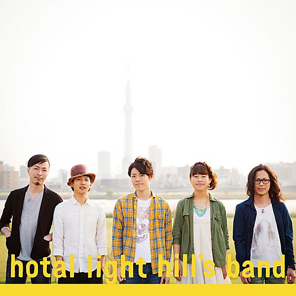

# Light the Band

By **Light the Band**

## Album Data

- **Catalog:** Beets
- **Format:** Digital, Album
- **Album:** Light the Band
- **Artist:** Light The Band
- **Albumartist:** Light the Band
- **Genre:** Unknown
- **MusicBrainz Album Artist ID:** [https](https://musicbrainz.org/artist/https)
- **MusicBrainz Album ID:** [https](https://musicbrainz.org/release/https)
- **MusicBrainz Release Group ID:** 
- **Year:** 2016
- **Catalog #:** 
- **Label:** Light the Band
- **Total Tracks:** 15

## Album Tracks

### Track 01 - Electric Sock

- **Artist:** Light the Band
- **Format:** ALAC
- **Genre:** Unknown
- **Length:** 6:36
- **MusicBrainz Track ID:** [https](https://musicbrainz.org/recording/https)
- **Title:** Electric Sock
- **Track:** 01
- **Year:** 2016

### Track 02 - What Was Her Name?

- **Artist:** Light the Band
- **Format:** ALAC
- **Genre:** Unknown
- **Length:** 5:24
- **MusicBrainz Track ID:** [https](https://musicbrainz.org/recording/https)
- **Title:** What Was Her Name?
- **Track:** 02
- **Year:** 2016

### Track 03 - Way Down Low

- **Artist:** Light the Band
- **Format:** ALAC
- **Genre:** Unknown
- **Length:** 9:09
- **MusicBrainz Track ID:** [https](https://musicbrainz.org/recording/https)
- **Title:** Way Down Low
- **Track:** 03
- **Year:** 2016

### Track 04 - Maddy's Jam Pt. 1

- **Artist:** Light the Band
- **Format:** ALAC
- **Genre:** Unknown
- **Length:** 1:40
- **MusicBrainz Track ID:** [https](https://musicbrainz.org/recording/https)
- **Title:** Maddy's Jam Pt. 1
- **Track:** 04
- **Year:** 2016

### Track 05 - Stealin' Food > Isabella

- **Artist:** Light the Band
- **Format:** ALAC
- **Genre:** Unknown
- **Length:** 11:40
- **MusicBrainz Track ID:** [https](https://musicbrainz.org/recording/https)
- **Title:** Stealin' Food > Isabella
- **Track:** 05
- **Year:** 2016

### Track 06 - Baboon Crazy

- **Artist:** Light the Band
- **Format:** ALAC
- **Genre:** Unknown
- **Length:** 5:39
- **MusicBrainz Track ID:** [https](https://musicbrainz.org/recording/https)
- **Title:** Baboon Crazy
- **Track:** 06
- **Year:** 2016

### Track 07 - Sh'mona Dank

- **Artist:** Light the Band
- **Format:** ALAC
- **Genre:** Unknown
- **Length:** 5:31
- **MusicBrainz Track ID:** [https](https://musicbrainz.org/recording/https)
- **Title:** Sh'mona Dank
- **Track:** 07
- **Year:** 2016

### Track 08 - Maddy's Jam Pt. 2

- **Artist:** Light the Band
- **Format:** ALAC
- **Genre:** Unknown
- **Length:** 1:43
- **MusicBrainz Track ID:** [https](https://musicbrainz.org/recording/https)
- **Title:** Maddy's Jam Pt. 2
- **Track:** 08
- **Year:** 2016

### Track 09 - Skeet Freak

- **Artist:** Light the Band
- **Format:** ALAC
- **Genre:** Unknown
- **Length:** 5:14
- **MusicBrainz Track ID:** [https](https://musicbrainz.org/recording/https)
- **Title:** Skeet Freak
- **Track:** 09
- **Year:** 2016

### Track 10 - Where's My Bagel?

- **Artist:** Light the Band
- **Format:** ALAC
- **Genre:** Unknown
- **Length:** 3:30
- **MusicBrainz Track ID:** [https](https://musicbrainz.org/recording/https)
- **Title:** Where's My Bagel?
- **Track:** 10
- **Year:** 2016

### Track 11 - Ratch Box

- **Artist:** Light the Band
- **Format:** ALAC
- **Genre:** Unknown
- **Length:** 3:17
- **MusicBrainz Track ID:** [https](https://musicbrainz.org/recording/https)
- **Title:** Ratch Box
- **Track:** 11
- **Year:** 2016

### Track 12 - Bonzo

- **Artist:** Light the Band
- **Format:** ALAC
- **Genre:** Unknown
- **Length:** 3:19
- **MusicBrainz Track ID:** [https](https://musicbrainz.org/recording/https)
- **Title:** Bonzo
- **Track:** 12
- **Year:** 2016

### Track 13 - Maddy's Jam Pt. 3

- **Artist:** Light the Band
- **Format:** ALAC
- **Genre:** Unknown
- **Length:** 1:50
- **MusicBrainz Track ID:** [https](https://musicbrainz.org/recording/https)
- **Title:** Maddy's Jam Pt. 3
- **Track:** 13
- **Year:** 2016

### Track 14 - Me & Baby Brother

- **Artist:** Light the Band
- **Format:** ALAC
- **Genre:** Unknown
- **Length:** 3:36
- **MusicBrainz Track ID:** [https](https://musicbrainz.org/recording/https)
- **Title:** Me & Baby Brother
- **Track:** 14
- **Year:** 2016

### Track 15 - Free

- **Artist:** Light the Band
- **Format:** ALAC
- **Genre:** Unknown
- **Length:** 8:11
- **MusicBrainz Track ID:** [https](https://musicbrainz.org/recording/https)
- **Title:** Free
- **Track:** 15
- **Year:** 2016

