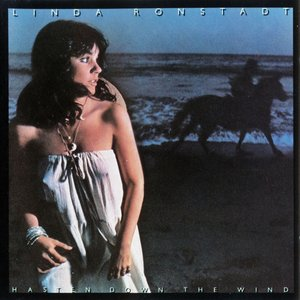

# Hasten Down the Wind

By **Linda Ronstadt**

## Album Data

- **Catalog:** Beets
- **Format:** Digital, Album
- **Album:** Hasten Down the Wind
- **Artist:** Linda Ronstadt
- **Albumartist:** Linda Ronstadt
- **Genre:** Country Rock
- **MusicBrainz Album Artist ID:** [498f2581-be21-4eef-8756-fbb89d79b1c0](https://musicbrainz.org/artist/498f2581-be21-4eef-8756-fbb89d79b1c0)
- **MusicBrainz Album ID:** [75bc3504-0417-3603-880a-9a08bc3b0c5d](https://musicbrainz.org/release/75bc3504-0417-3603-880a-9a08bc3b0c5d)
- **MusicBrainz Release Group ID:** [df4e3615-eaf0-3478-a170-e70a1cde9fd4](https://musicbrainz.org/release-group/df4e3615-eaf0-3478-a170-e70a1cde9fd4)
- **Year:** 2009
- **Catalog #:** C2-46073
- **Label:** Capitol Records
- **Total Tracks:** 10

## Album Tracks

### Track 01 - You're No Good

- **Artist:** Linda Ronstadt
- **Format:** MP3
- **Genre:** Country Rock
- **Length:** 3:44
- **MusicBrainz Track ID:** [fda8a640-5fa7-4cff-9d8f-a141d9a3d26e](https://musicbrainz.org/recording/fda8a640-5fa7-4cff-9d8f-a141d9a3d26e)
- **Title:** You're No Good
- **Track:** 01
- **Year:** 1985

### Track 02 - It Doesn't Matter Anymore

- **Artist:** Linda Ronstadt
- **Format:** MP3
- **Genre:** Soft Rock
- **Length:** 3:26
- **MusicBrainz Track ID:** [93f88f9a-eacc-49ee-a5ac-f8189cbdd0a8](https://musicbrainz.org/recording/93f88f9a-eacc-49ee-a5ac-f8189cbdd0a8)
- **Title:** It Doesn't Matter Anymore
- **Track:** 02
- **Year:** 1985

### Track 03 - Faithless Love

- **Artist:** Linda Ronstadt
- **Format:** MP3
- **Genre:** Country Rock
- **Length:** 3:15
- **MusicBrainz Track ID:** [cc31d9da-2348-4bd6-aaa0-c8057c0e9694](https://musicbrainz.org/recording/cc31d9da-2348-4bd6-aaa0-c8057c0e9694)
- **Title:** Faithless Love
- **Track:** 03
- **Year:** 1985

### Track 04 - The Dark End of the Street

- **Artist:** Linda Ronstadt
- **Format:** MP3
- **Genre:** Soft Rock
- **Length:** 3:54
- **MusicBrainz Track ID:** [b36dd3fa-26bb-4ab0-8b6a-03331b733899](https://musicbrainz.org/recording/b36dd3fa-26bb-4ab0-8b6a-03331b733899)
- **Title:** The Dark End of the Street
- **Track:** 04
- **Year:** 1985

### Track 05 - Heart Like a Wheel

- **Artist:** Linda Ronstadt
- **Format:** MP3
- **Genre:** Soft Rock
- **Length:** 3:10
- **MusicBrainz Track ID:** [9002ae30-8b61-4a4f-b203-c3a06db2335c](https://musicbrainz.org/recording/9002ae30-8b61-4a4f-b203-c3a06db2335c)
- **Title:** Heart Like a Wheel
- **Track:** 05
- **Year:** 1985

### Track 06 - When Will I Be Loved?

- **Artist:** Linda Ronstadt
- **Format:** MP3
- **Genre:** Country Rock
- **Length:** 2:04
- **MusicBrainz Track ID:** [70a4d2a4-3c9a-4f6b-909e-88de3cc52b40](https://musicbrainz.org/recording/70a4d2a4-3c9a-4f6b-909e-88de3cc52b40)
- **Title:** When Will I Be Loved?
- **Track:** 06
- **Year:** 1985

### Track 07 - Willin'

- **Artist:** Linda Ronstadt
- **Format:** MP3
- **Genre:** Soft Rock
- **Length:** 3:01
- **MusicBrainz Track ID:** [9487587f-0926-4016-b32f-67731b7f9391](https://musicbrainz.org/recording/9487587f-0926-4016-b32f-67731b7f9391)
- **Title:** Willin'
- **Track:** 07
- **Year:** 1985

### Track 08 - I Can't Help It (If I'm Still in Love With You)

- **Artist:** Linda Ronstadt
- **Format:** MP3
- **Genre:** Soft Rock
- **Length:** 2:45
- **MusicBrainz Track ID:** [f56d6daf-6012-4086-8b0b-eefe6ab9e0e0](https://musicbrainz.org/recording/f56d6daf-6012-4086-8b0b-eefe6ab9e0e0)
- **Title:** I Can't Help It (If I'm Still in Love With You)
- **Track:** 08
- **Year:** 1985

### Track 09 - Keep Me From Blowing Away

- **Artist:** Linda Ronstadt
- **Format:** MP3
- **Genre:** Soul
- **Length:** 3:10
- **MusicBrainz Track ID:** [3ba4b69d-2c0b-4639-b46d-435bb74f2083](https://musicbrainz.org/recording/3ba4b69d-2c0b-4639-b46d-435bb74f2083)
- **Title:** Keep Me From Blowing Away
- **Track:** 09
- **Year:** 1985

### Track 10 - You Can Close Your Eyes

- **Artist:** Linda Ronstadt
- **Format:** MP3
- **Genre:** Pop
- **Length:** 3:09
- **MusicBrainz Track ID:** [c5169af0-1918-4f44-9029-ce1035fd9a16](https://musicbrainz.org/recording/c5169af0-1918-4f44-9029-ce1035fd9a16)
- **Title:** You Can Close Your Eyes
- **Track:** 10
- **Year:** 1985

