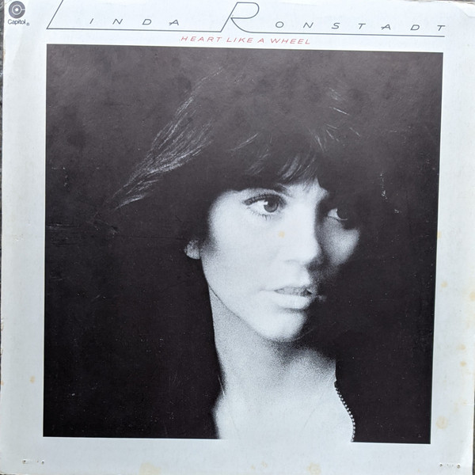

# Heart Like a Wheel

By **Linda Ronstadt**

## Album Data

- **Catalog:** Beets
- **Format:** Digital, Album
- **Album:** Heart Like a Wheel
- **Artist:** Linda Ronstadt
- **Albumartist:** Linda Ronstadt
- **Genre:** Soft Rock
- **MusicBrainz Album Artist ID:** [498f2581-be21-4eef-8756-fbb89d79b1c0](https://musicbrainz.org/artist/498f2581-be21-4eef-8756-fbb89d79b1c0)
- **MusicBrainz Album ID:** [0729ce4e-6848-3593-b4e1-e1b25f5a7f09](https://musicbrainz.org/release/0729ce4e-6848-3593-b4e1-e1b25f5a7f09)
- **MusicBrainz Release Group ID:** [3a026caf-ae4f-3b51-9d70-bb85ba6e1e7d](https://musicbrainz.org/release-group/3a026caf-ae4f-3b51-9d70-bb85ba6e1e7d)
- **Year:** 1985
- **Catalog #:** UDCD 785
- **Label:** Mobile Fidelity Sound Lab
- **Total Tracks:** 10

## Album Tracks

### Track 01 - It’s So Easy

- **Artist:** Linda Ronstadt
- **Format:** MP3
- **Genre:** Soft Rock
- **Length:** 2:25
- **MusicBrainz Track ID:** [676f8861-b4a6-44a6-9a2d-173d62989294](https://musicbrainz.org/recording/676f8861-b4a6-44a6-9a2d-173d62989294)
- **Title:** It’s So Easy
- **Track:** 01
- **Year:** 2010

### Track 02 - Carmelita

- **Artist:** Linda Ronstadt
- **Format:** MP3
- **Genre:** Country Rock
- **Length:** 3:07
- **MusicBrainz Track ID:** [35e4c8b6-1a79-455c-a947-3102ed3415a7](https://musicbrainz.org/recording/35e4c8b6-1a79-455c-a947-3102ed3415a7)
- **Title:** Carmelita
- **Track:** 02
- **Year:** 2010

### Track 03 - Simple Man, Simple Dream

- **Artist:** Linda Ronstadt
- **Format:** MP3
- **Genre:** Soft Rock
- **Length:** 3:13
- **MusicBrainz Track ID:** [80cc18a4-c12f-4852-ba29-bc46978f07db](https://musicbrainz.org/recording/80cc18a4-c12f-4852-ba29-bc46978f07db)
- **Title:** Simple Man, Simple Dream
- **Track:** 03
- **Year:** 2010

### Track 04 - Sorrow Lives Here

- **Artist:** Linda Ronstadt
- **Format:** MP3
- **Genre:** Soft Rock
- **Length:** 2:57
- **MusicBrainz Track ID:** [8f562a4d-0470-4f49-beb9-3df71fa50367](https://musicbrainz.org/recording/8f562a4d-0470-4f49-beb9-3df71fa50367)
- **Title:** Sorrow Lives Here
- **Track:** 04
- **Year:** 2010

### Track 05 - I Never Will Marry

- **Artist:** Linda Ronstadt
- **Format:** MP3
- **Genre:** Soft Rock
- **Length:** 3:14
- **MusicBrainz Track ID:** [8ed1447d-f7a1-45d1-83aa-c7f935e7a4ba](https://musicbrainz.org/recording/8ed1447d-f7a1-45d1-83aa-c7f935e7a4ba)
- **Title:** I Never Will Marry
- **Track:** 05
- **Year:** 2010

### Track 06 - Blue Bayou

- **Artist:** Linda Ronstadt
- **Format:** MP3
- **Genre:** Country Rock
- **Length:** 3:59
- **MusicBrainz Track ID:** [1cf41f14-2597-41d1-b113-a902b69d6f1b](https://musicbrainz.org/recording/1cf41f14-2597-41d1-b113-a902b69d6f1b)
- **Title:** Blue Bayou
- **Track:** 06
- **Year:** 2010

### Track 07 - Poor, Poor Pitiful Me

- **Artist:** Linda Ronstadt
- **Format:** MP3
- **Genre:** Soft Rock
- **Length:** 3:40
- **MusicBrainz Track ID:** [974c4b79-ddda-4c1b-ab22-1b7a1d26c2f2](https://musicbrainz.org/recording/974c4b79-ddda-4c1b-ab22-1b7a1d26c2f2)
- **Title:** Poor, Poor Pitiful Me
- **Track:** 07
- **Year:** 2010

### Track 08 - Maybe I’m Right

- **Artist:** Linda Ronstadt
- **Format:** MP3
- **Genre:** Soft Rock
- **Length:** 3:07
- **MusicBrainz Track ID:** [685dab58-df3d-467d-b5cc-f62605397e1d](https://musicbrainz.org/recording/685dab58-df3d-467d-b5cc-f62605397e1d)
- **Title:** Maybe I’m Right
- **Track:** 08
- **Year:** 2010

### Track 09 - Tumbling Dice

- **Artist:** Linda Ronstadt
- **Format:** MP3
- **Genre:** Soft Rock
- **Length:** 3:09
- **MusicBrainz Track ID:** [24fb6fb0-8c7a-4a51-a77f-b2d9941196b7](https://musicbrainz.org/recording/24fb6fb0-8c7a-4a51-a77f-b2d9941196b7)
- **Title:** Tumbling Dice
- **Track:** 09
- **Year:** 2010

### Track 10 - Old Paint

- **Artist:** Linda Ronstadt
- **Format:** MP3
- **Genre:** Soft Rock
- **Length:** 3:04
- **MusicBrainz Track ID:** [00feb7a1-5e9d-4659-b2f8-b032d296cf19](https://musicbrainz.org/recording/00feb7a1-5e9d-4659-b2f8-b032d296cf19)
- **Title:** Old Paint
- **Track:** 10
- **Year:** 2010

## See also

- [Hasten Down the Wind](Hasten_Down_the_Wind.md)
- [Simple Dreams](Simple_Dreams.md)
- [Roon: Canciones de mi Padre (2016 Remaster)](../../Roon/Linda_Ronstadt/Canciones_de_mi_Padre_2016_Remaster.md)
- [Roon: Different Drum](../../Roon/Linda_Ronstadt/Different_Drum.md)
- [Roon: Get Closer](../../Roon/Linda_Ronstadt/Get_Closer.md)
- [Roon: Hasten Down the Wind](../../Roon/Linda_Ronstadt/Hasten_Down_the_Wind.md)
- [Roon: Heart Like A Wheel](../../Roon/Linda_Ronstadt/Heart_Like_A_Wheel.md)
- [Roon: Linda Ronstadt](../../Roon/Linda_Ronstadt/Linda_Ronstadt.md)
- [Roon: Living in the USA](../../Roon/Linda_Ronstadt/Living_in_the_USA.md)
- [Roon: Lush Life](../../Roon/Linda_Ronstadt/Lush_Life.md)
- [Roon: Mad Love](../../Roon/Linda_Ronstadt/Mad_Love.md)
- [Roon: Mas Canciones (2016 Remaster)](../../Roon/Linda_Ronstadt/Mas_Canciones_2016_Remaster.md)
- [Roon: Silk Purse](../../Roon/Linda_Ronstadt/Silk_Purse.md)
- [Roon: Simple Dreams (40th Anniversary Edition)](../../Roon/Linda_Ronstadt/Simple_Dreams_40th_Anniversary_Edition.md)
- [Roon: The Stone Poneys](../../Roon/Linda_Ronstadt/The_Stone_Poneys.md)
- [Vinyl: Don't Cry Now](../../Vinyl/Linda_Ronstadt/Dont_Cry_Now.md)
- [Vinyl: Hasten Down The Wind](../../Vinyl/Linda_Ronstadt/Hasten_Down_The_Wind.md)
- [Vinyl: Heart Like A Wheel](../../Vinyl/Linda_Ronstadt/Heart_Like_A_Wheel.md)
- [Vinyl: ](../../Vinyl/Linda_Ronstadt/Linda_Ronstadt.md)
- [Vinyl: Simple Dreams](../../Vinyl/Linda_Ronstadt/Simple_Dreams.md)
