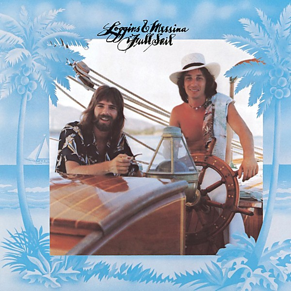

# Full Sail

By **Loggins & Messina**

## Album Data

- **Catalog:** Beets
- **Format:** Digital, Album
- **Album:** Full Sail
- **Artist:** Loggins & Messina
- **Albumartist:** Loggins & Messina
- **Genre:** Soft Rock
- **MusicBrainz Album Artist ID:** [aef6e491-3121-4048-b035-4704a9ce0716](https://musicbrainz.org/artist/aef6e491-3121-4048-b035-4704a9ce0716)
- **MusicBrainz Album ID:** [189d1dba-90cd-4f06-a7c1-511108d68a72](https://musicbrainz.org/release/189d1dba-90cd-4f06-a7c1-511108d68a72)
- **MusicBrainz Release Group ID:** [7802406c-7884-36f0-9948-944a85bfcd09](https://musicbrainz.org/release-group/7802406c-7884-36f0-9948-944a85bfcd09)
- **Year:** 1973
- **Catalog #:** 
- **Label:** Columbia
- **Total Tracks:** 11

## Album Tracks

### Track 01 - Good Friend

- **Artist:** Loggins & Messina
- **Format:** ALAC
- **Genre:** Folk Rock
- **Length:** 4:07
- **MusicBrainz Track ID:** [a0021f2d-0881-4a2f-a28a-37a78d1af528](https://musicbrainz.org/recording/a0021f2d-0881-4a2f-a28a-37a78d1af528)
- **Title:** Good Friend
- **Track:** 01
- **Year:** 1972

### Track 02 - Whiskey

- **Artist:** Loggins & Messina
- **Format:** ALAC
- **Genre:** Folk Rock
- **Length:** 2:00
- **MusicBrainz Track ID:** [98c49230-a570-4224-891c-52c090a52859](https://musicbrainz.org/recording/98c49230-a570-4224-891c-52c090a52859)
- **Title:** Whiskey
- **Track:** 02
- **Year:** 1972

### Track 03 - Your Mama Don't Dance

- **Artist:** Loggins & Messina
- **Format:** ALAC
- **Genre:** Southern Rock
- **Length:** 2:51
- **MusicBrainz Track ID:** [666c8005-35be-4b2a-8cc4-d0e651024c97](https://musicbrainz.org/recording/666c8005-35be-4b2a-8cc4-d0e651024c97)
- **Title:** Your Mama Don't Dance
- **Track:** 03
- **Year:** 1972

### Track 04 - Long Tail Cat

- **Artist:** Loggins & Messina
- **Format:** ALAC
- **Genre:** Folk Rock
- **Length:** 3:50
- **MusicBrainz Track ID:** [cfb7fd83-d594-44a7-9ebb-376dc2eaacea](https://musicbrainz.org/recording/cfb7fd83-d594-44a7-9ebb-376dc2eaacea)
- **Title:** Long Tail Cat
- **Track:** 04
- **Year:** 1972

### Track 05 - Golden Ribbons

- **Artist:** Loggins & Messina
- **Format:** ALAC
- **Genre:** Psychedelic Rock
- **Length:** 6:12
- **MusicBrainz Track ID:** [7020af96-e459-4677-a4c6-5f419e26812d](https://musicbrainz.org/recording/7020af96-e459-4677-a4c6-5f419e26812d)
- **Title:** Golden Ribbons
- **Track:** 05
- **Year:** 1972

### Track 06 - Thinking of You

- **Artist:** Loggins & Messina
- **Format:** ALAC
- **Genre:** Soft Rock
- **Length:** 2:21
- **MusicBrainz Track ID:** [30f09424-575d-4752-ada7-36ea340b6a92](https://musicbrainz.org/recording/30f09424-575d-4752-ada7-36ea340b6a92)
- **Title:** Thinking of You
- **Track:** 06
- **Year:** 1972

### Track 07 - Just Before the News

- **Artist:** Loggins & Messina
- **Format:** ALAC
- **Genre:** Folk Rock
- **Length:** 1:12
- **MusicBrainz Track ID:** [ca9d44fa-beef-4371-be76-5b3d9a1fabca](https://musicbrainz.org/recording/ca9d44fa-beef-4371-be76-5b3d9a1fabca)
- **Title:** Just Before the News
- **Track:** 07
- **Year:** 1972

### Track 08 - Till the Ends Meet

- **Artist:** Loggins & Messina
- **Format:** ALAC
- **Genre:** Folk Rock
- **Length:** 3:13
- **MusicBrainz Track ID:** [535765ba-2fad-4941-902e-95ed9c95c23e](https://musicbrainz.org/recording/535765ba-2fad-4941-902e-95ed9c95c23e)
- **Title:** Till the Ends Meet
- **Track:** 08
- **Year:** 1972

### Track 09 - Holiday Hotel

- **Artist:** Loggins & Messina
- **Format:** ALAC
- **Genre:** Folk Rock
- **Length:** 2:04
- **MusicBrainz Track ID:** [8c5aa504-95ca-4dab-a76d-818723e6268b](https://musicbrainz.org/recording/8c5aa504-95ca-4dab-a76d-818723e6268b)
- **Title:** Holiday Hotel
- **Track:** 09
- **Year:** 1972

### Track 10 - Lady of My Heart

- **Artist:** Loggins & Messina
- **Format:** ALAC
- **Genre:** Soft Rock
- **Length:** 1:46
- **MusicBrainz Track ID:** [e743d266-ad5d-41ee-b17c-aaf214ebda9d](https://musicbrainz.org/recording/e743d266-ad5d-41ee-b17c-aaf214ebda9d)
- **Title:** Lady of My Heart
- **Track:** 10
- **Year:** 1972

### Track 11 - Angry Eyes

- **Artist:** Loggins & Messina
- **Format:** ALAC
- **Genre:** Folk Rock
- **Length:** 7:40
- **MusicBrainz Track ID:** [c492a553-1258-4d02-9fd9-7506c3be7a09](https://musicbrainz.org/recording/c492a553-1258-4d02-9fd9-7506c3be7a09)
- **Title:** Angry Eyes
- **Track:** 11
- **Year:** 1972

## See also

- [Loggins and Messina](Loggins_and_Messina.md)
- [Mother Lode](Mother_Lode.md)
- [Sittin' In](Sittin_In.md)
- [Sittin' In (Ripped Vinyl)](Sittin_In_Ripped_Vinyl.md)
- [Roon: Sittin' In](../../Roon/Loggins_and_Messina/Sittin_In.md)
