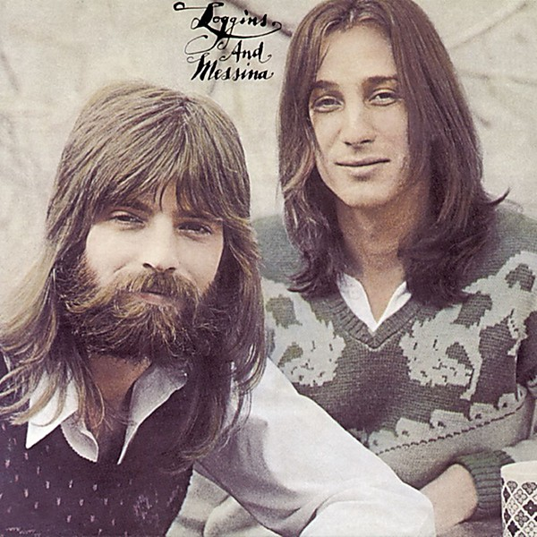

# Loggins and Messina

By **Loggins & Messina**

## Album Data

- **Catalog:** Beets
- **Format:** Digital, Album
- **Album:** Loggins and Messina
- **Artist:** Loggins & Messina
- **Albumartist:** Loggins & Messina
- **Genre:** Soft Rock
- **MusicBrainz Album Artist ID:** [aef6e491-3121-4048-b035-4704a9ce0716](https://musicbrainz.org/artist/aef6e491-3121-4048-b035-4704a9ce0716)
- **MusicBrainz Album ID:** [2c2a3a56-dd5d-44e4-bf67-3a96fc8250cb](https://musicbrainz.org/release/2c2a3a56-dd5d-44e4-bf67-3a96fc8250cb)
- **MusicBrainz Release Group ID:** [fd8a0b3e-3ea8-3220-929f-66bc440f1467](https://musicbrainz.org/release-group/fd8a0b3e-3ea8-3220-929f-66bc440f1467)
- **Year:** 1972
- **Catalog #:** CK 33175
- **Label:** Columbia
- **Total Tracks:** 10

## Album Tracks

### Track 01 - Growin'

- **Artist:** Loggins & Messina
- **Format:** ALAC
- **Genre:** Pop Rock
- **Length:** 2:39
- **MusicBrainz Track ID:** [4205f61d-29c2-44bb-a6e5-c4593bdff03e](https://musicbrainz.org/recording/4205f61d-29c2-44bb-a6e5-c4593bdff03e)
- **Title:** Growin'
- **Track:** 01
- **Year:** 1989

### Track 02 - Be Free

- **Artist:** Loggins & Messina
- **Format:** ALAC
- **Genre:** Folk Rock
- **Length:** 7:01
- **MusicBrainz Track ID:** [223f13c5-b8fb-46b5-96e4-2e93b67a8ba5](https://musicbrainz.org/recording/223f13c5-b8fb-46b5-96e4-2e93b67a8ba5)
- **Title:** Be Free
- **Track:** 02
- **Year:** 1989

### Track 03 - Changes

- **Artist:** Loggins & Messina
- **Format:** ALAC
- **Genre:** Folk Rock
- **Length:** 3:53
- **MusicBrainz Track ID:** [ebe3ead1-ada7-4a8e-8592-f59fb7023d60](https://musicbrainz.org/recording/ebe3ead1-ada7-4a8e-8592-f59fb7023d60)
- **Title:** Changes
- **Track:** 03
- **Year:** 1989

### Track 04 - Brighter Days

- **Artist:** Loggins & Messina
- **Format:** ALAC
- **Genre:** Folk Rock
- **Length:** 3:42
- **MusicBrainz Track ID:** [2fd8f24c-ca42-455e-96a8-2788389d8ae8](https://musicbrainz.org/recording/2fd8f24c-ca42-455e-96a8-2788389d8ae8)
- **Title:** Brighter Days
- **Track:** 04
- **Year:** 1989

### Track 05 - Time to Space

- **Artist:** Loggins & Messina
- **Format:** ALAC
- **Genre:** Folk Rock
- **Length:** 5:48
- **MusicBrainz Track ID:** [c2380755-3355-4a41-9a41-186b12cd27de](https://musicbrainz.org/recording/c2380755-3355-4a41-9a41-186b12cd27de)
- **Title:** Time to Space
- **Track:** 05
- **Year:** 1989

### Track 06 - Lately My Love

- **Artist:** Loggins & Messina
- **Format:** ALAC
- **Genre:** Folk Rock
- **Length:** 3:32
- **MusicBrainz Track ID:** [12b513ad-b6df-406c-8520-d6cf033b3e8f](https://musicbrainz.org/recording/12b513ad-b6df-406c-8520-d6cf033b3e8f)
- **Title:** Lately My Love
- **Track:** 06
- **Year:** 1989

### Track 07 - Move On

- **Artist:** Loggins & Messina
- **Format:** ALAC
- **Genre:** Rock
- **Length:** 7:29
- **MusicBrainz Track ID:** [21f86dc9-734f-4399-a5c6-b8c56ba45665](https://musicbrainz.org/recording/21f86dc9-734f-4399-a5c6-b8c56ba45665)
- **Title:** Move On
- **Track:** 07
- **Year:** 1989

### Track 08 - Get a Hold

- **Artist:** Loggins & Messina
- **Format:** ALAC
- **Genre:** Pop
- **Length:** 3:37
- **MusicBrainz Track ID:** [5e722e0b-fd28-4c3d-a111-1ab791079b8b](https://musicbrainz.org/recording/5e722e0b-fd28-4c3d-a111-1ab791079b8b)
- **Title:** Get a Hold
- **Track:** 08
- **Year:** 1989

### Track 09 - Keep Me in Mind

- **Artist:** Loggins & Messina
- **Format:** ALAC
- **Genre:** Folk Rock
- **Length:** 3:38
- **MusicBrainz Track ID:** [d9238ab8-6718-4ccc-b522-246078e85c98](https://musicbrainz.org/recording/d9238ab8-6718-4ccc-b522-246078e85c98)
- **Title:** Keep Me in Mind
- **Track:** 09
- **Year:** 1989

### Track 10 - Fever Dream

- **Artist:** Loggins & Messina
- **Format:** ALAC
- **Genre:** Folk Rock
- **Length:** 3:03
- **MusicBrainz Track ID:** [60c270cd-7fbb-4d33-b101-1b31bfe52c30](https://musicbrainz.org/recording/60c270cd-7fbb-4d33-b101-1b31bfe52c30)
- **Title:** Fever Dream
- **Track:** 10
- **Year:** 1989

## See also

- [Full Sail](Full_Sail.md)
- [Mother Lode](Mother_Lode.md)
- [Sittin' In](Sittin_In.md)
- [Sittin' In (Ripped Vinyl)](Sittin_In_Ripped_Vinyl.md)
- [Roon: Sittin' In](../../Roon/Loggins_and_Messina/Sittin_In.md)
