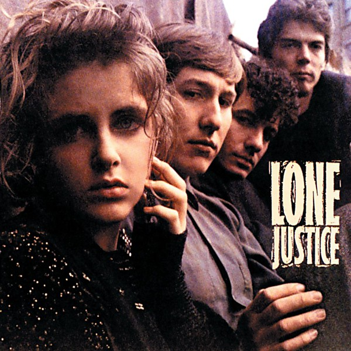

# Lone Justice

By **Lone Justice**

## Album Data

- **Catalog:** Beets
- **Format:** Digital, Album
- **Album:** Lone Justice
- **Artist:** Lone Justice
- **Albumartist:** Lone Justice
- **Genre:** Cowpunk
- **MusicBrainz Album Artist ID:** [778b34b7-736f-45d1-9486-2c9545ea6daa](https://musicbrainz.org/artist/778b34b7-736f-45d1-9486-2c9545ea6daa)
- **MusicBrainz Album ID:** [31e96b19-43f4-41b2-95b7-872a0103d353](https://musicbrainz.org/release/31e96b19-43f4-41b2-95b7-872a0103d353)
- **MusicBrainz Release Group ID:** [084f1392-7a05-3245-9ece-4cd9022886ec](https://musicbrainz.org/release-group/084f1392-7a05-3245-9ece-4cd9022886ec)
- **Year:** 1985
- **Catalog #:** 9 24060-2
- **Label:** Geffen Records
- **Total Tracks:** 10

## Album Tracks

### Track 01 - East of Eden

- **Artist:** Lone Justice
- **Format:** MP3
- **Genre:** Alternative Country
- **Length:** 2:36
- **MusicBrainz Track ID:** [25ee5e62-d1b1-42a2-ab2f-0640d1d48753](https://musicbrainz.org/recording/25ee5e62-d1b1-42a2-ab2f-0640d1d48753)
- **Title:** East of Eden
- **Track:** 01
- **Year:** 1985

### Track 02 - After the Flood

- **Artist:** Lone Justice
- **Format:** MP3
- **Genre:** Rock
- **Length:** 3:40
- **MusicBrainz Track ID:** [703589ca-391b-4785-a6a5-5276a5909f1a](https://musicbrainz.org/recording/703589ca-391b-4785-a6a5-5276a5909f1a)
- **Title:** After the Flood
- **Track:** 02
- **Year:** 1985

### Track 03 - Ways to Be Wicked

- **Artist:** Lone Justice
- **Format:** MP3
- **Genre:** Cowpunk
- **Length:** 3:28
- **MusicBrainz Track ID:** [18b4a620-14e4-49c8-b364-b0bf225cd651](https://musicbrainz.org/recording/18b4a620-14e4-49c8-b364-b0bf225cd651)
- **Title:** Ways to Be Wicked
- **Track:** 03
- **Year:** 1985

### Track 04 - Don't Toss Us Away

- **Artist:** Lone Justice
- **Format:** MP3
- **Genre:** Classic Country
- **Length:** 4:19
- **MusicBrainz Track ID:** [028fcec9-8ad2-42f7-9cfd-575fb09fed64](https://musicbrainz.org/recording/028fcec9-8ad2-42f7-9cfd-575fb09fed64)
- **Title:** Don't Toss Us Away
- **Track:** 04
- **Year:** 1985

### Track 05 - Working Late

- **Artist:** Lone Justice
- **Format:** MP3
- **Genre:** Cowpunk
- **Length:** 2:45
- **MusicBrainz Track ID:** [08b40c3d-d114-4e4e-b956-b9b7c4370016](https://musicbrainz.org/recording/08b40c3d-d114-4e4e-b956-b9b7c4370016)
- **Title:** Working Late
- **Track:** 05
- **Year:** 1985

### Track 06 - Sweet, Sweet Baby (I’m Falling)

- **Artist:** Lone Justice
- **Format:** MP3
- **Genre:** Cowpunk
- **Length:** 4:12
- **MusicBrainz Track ID:** [f738392a-7249-4a94-80d6-73931a82200f](https://musicbrainz.org/recording/f738392a-7249-4a94-80d6-73931a82200f)
- **Title:** Sweet, Sweet Baby (I’m Falling)
- **Track:** 06
- **Year:** 1985

### Track 07 - Pass It On

- **Artist:** Lone Justice
- **Format:** MP3
- **Genre:** Rock
- **Length:** 3:39
- **MusicBrainz Track ID:** [576691a4-a158-453c-a6f2-972f10cd8382](https://musicbrainz.org/recording/576691a4-a158-453c-a6f2-972f10cd8382)
- **Title:** Pass It On
- **Track:** 07
- **Year:** 1985

### Track 08 - Wait ’til We Get Home

- **Artist:** Lone Justice
- **Format:** MP3
- **Genre:** Cowpunk
- **Length:** 3:18
- **MusicBrainz Track ID:** [7cdc6723-eded-46ed-81c1-7e8440426d33](https://musicbrainz.org/recording/7cdc6723-eded-46ed-81c1-7e8440426d33)
- **Title:** Wait ’til We Get Home
- **Track:** 08
- **Year:** 1985

### Track 09 - Soap, Soup and Salvation

- **Artist:** Lone Justice
- **Format:** MP3
- **Genre:** Cowpunk
- **Length:** 4:04
- **MusicBrainz Track ID:** [c8d37478-fc06-4877-806b-bc3da661ca4c](https://musicbrainz.org/recording/c8d37478-fc06-4877-806b-bc3da661ca4c)
- **Title:** Soap, Soup and Salvation
- **Track:** 09
- **Year:** 1985

### Track 10 - You Are the Light

- **Artist:** Lone Justice
- **Format:** MP3
- **Genre:** Rock
- **Length:** 3:58
- **MusicBrainz Track ID:** [0ab81de1-49e8-4aaa-a038-2cb38b65a4aa](https://musicbrainz.org/recording/0ab81de1-49e8-4aaa-a038-2cb38b65a4aa)
- **Title:** You Are the Light
- **Track:** 10
- **Year:** 1985

