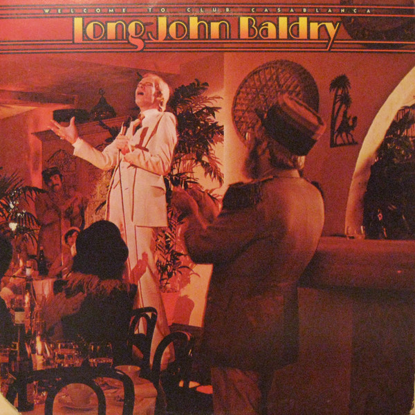

# Welcome To Club Casablanca

By **Long John Baldry**

## Album Data

- **Catalog:** Beets
- **Format:** Digital, Album
- **Album:** Welcome To Club Casablanca
- **Artist:** Long John Baldry
- **Albumartist:** Long John Baldry
- **Genre:** Rock
- **MusicBrainz Album Artist ID:** 
- **MusicBrainz Album ID:** 
- **MusicBrainz Release Group ID:** 
- **Year:** 0000
- **Catalog #:** 
- **Label:** 
- **Total Tracks:** 00

## Album Tracks

### Track 00 - Abusive Treatment

- **Artist:** Long John Baldry
- **Format:** AAC
- **Genre:** Rock
- **Length:** 3:31
- **MusicBrainz Track ID:** 
- **Title:** Abusive Treatment
- **Track:** 00
- **Year:** 0000

### Track 00 - I Keep Forgetting

- **Artist:** Long John Baldry
- **Format:** AAC
- **Genre:** Rock
- **Length:** 4:17
- **MusicBrainz Track ID:** 
- **Title:** I Keep Forgetting
- **Track:** 00
- **Year:** 0000

### Track 00 - I'll See You Again

- **Artist:** Long John Baldry
- **Format:** AAC
- **Genre:** Rock
- **Length:** 2:01
- **MusicBrainz Track ID:** 
- **Title:** I'll See You Again
- **Track:** 00
- **Year:** 0000

## See also

- [It Ain't Easy](It_Aint_Easy.md)
- [Roon: Everything Stops For Tea](../../Roon/Long_John_Baldry/Everything_Stops_For_Tea.md)
- [Roon: It Ain't Easy (Expanded)](../../Roon/Long_John_Baldry/It_Aint_Easy_Expanded.md)
- [Roon: Rhino Hi-Five](../../Roon/Long_John_Baldry/Rhino_Hi-Five-_Long_John_Baldry.md)
