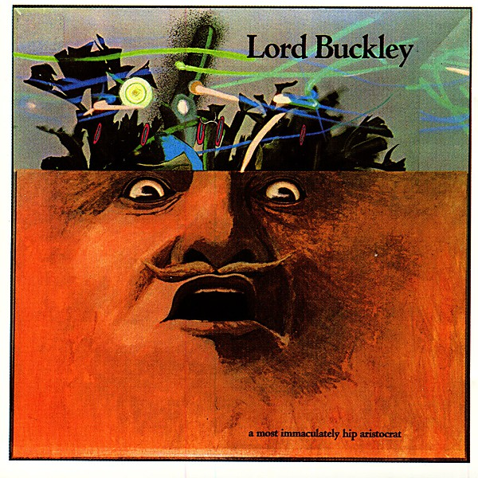

# A Most Immaculately Hip Aristocrat

By **Lord Buckley**

## Album Data

- **Catalog:** Beets
- **Format:** Digital, Album
- **Album:** A Most Immaculately Hip Aristocrat
- **Artist:** Lord Buckley
- **Albumartist:** Lord Buckley
- **Genre:** Jazz
- **MusicBrainz Album Artist ID:** [02f828a7-52a2-4e69-9bf6-6e2be2b727e3](https://musicbrainz.org/artist/02f828a7-52a2-4e69-9bf6-6e2be2b727e3)
- **MusicBrainz Album ID:** [f82f98d7-7103-3fbf-8b15-e2e2561eccca](https://musicbrainz.org/release/f82f98d7-7103-3fbf-8b15-e2e2561eccca)
- **MusicBrainz Release Group ID:** [89ad2810-aad0-3786-b6f1-f09d29c65303](https://musicbrainz.org/release-group/89ad2810-aad0-3786-b6f1-f09d29c65303)
- **Year:** 1989
- **Catalog #:** 7 73398-2
- **Label:** Enigma Retro
- **Total Tracks:** 05

## Album Tracks

### Track 01 - The Bad-Rapping of the Marquis de Sade - The King of Bad Cats

- **Artist:** Lord Buckley
- **Format:** MP3
- **Genre:** Jazz
- **Length:** 13:11
- **MusicBrainz Track ID:** [765ba6e1-e257-403f-a37d-03149026a1f9](https://musicbrainz.org/recording/765ba6e1-e257-403f-a37d-03149026a1f9)
- **Title:** The Bad-Rapping of the Marquis de Sade - The King of Bad Cats
- **Track:** 01
- **Year:** 1989

### Track 02 - Governor Slugwell

- **Artist:** Lord Buckley
- **Format:** MP3
- **Genre:** Jazz
- **Length:** 5:17
- **MusicBrainz Track ID:** [e3c1bd6d-14e8-48c6-b950-3ad3137a9bc7](https://musicbrainz.org/recording/e3c1bd6d-14e8-48c6-b950-3ad3137a9bc7)
- **Title:** Governor Slugwell
- **Track:** 02
- **Year:** 1989

### Track 03 - “The Raven”

- **Artist:** Lord Buckley
- **Format:** MP3
- **Genre:** Jazz
- **Length:** 7:44
- **MusicBrainz Track ID:** [ca364316-fd22-410d-8c9d-c214b181c4b5](https://musicbrainz.org/recording/ca364316-fd22-410d-8c9d-c214b181c4b5)
- **Title:** “The Raven”
- **Track:** 03
- **Year:** 1989

### Track 04 - The Train

- **Artist:** Lord Buckley
- **Format:** MP3
- **Genre:** Jazz
- **Length:** 2:29
- **MusicBrainz Track ID:** [5e3fa32c-b289-446a-adc2-d7b1935881af](https://musicbrainz.org/recording/5e3fa32c-b289-446a-adc2-d7b1935881af)
- **Title:** The Train
- **Track:** 04
- **Year:** 1989

### Track 05 - The Hip Einie

- **Artist:** Lord Buckley
- **Format:** MP3
- **Genre:** Jazz
- **Length:** 10:06
- **MusicBrainz Track ID:** [4e0fb313-d189-42eb-b700-b1e9a51bbfec](https://musicbrainz.org/recording/4e0fb313-d189-42eb-b700-b1e9a51bbfec)
- **Title:** The Hip Einie
- **Track:** 05
- **Year:** 1989

