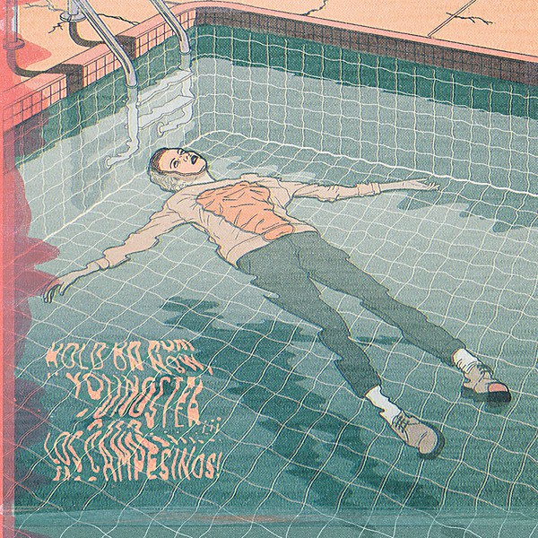

# Hold On Now, Youngster…

By **Los Campesinos!**

## Album Data

- **Catalog:** Beets
- **Format:** Digital, Album
- **Album:** Hold On Now, Youngster…
- **Artist:** Los Campesinos!
- **Albumartist:** Los Campesinos!
- **Genre:** Indie Rock
- **MusicBrainz Album Artist ID:** [e1194e66-e4f0-4351-9d26-ac95df530d0c](https://musicbrainz.org/artist/e1194e66-e4f0-4351-9d26-ac95df530d0c)
- **MusicBrainz Album ID:** [88c7d2b8-724f-3c79-8570-e803c52ba451](https://musicbrainz.org/release/88c7d2b8-724f-3c79-8570-e803c52ba451)
- **MusicBrainz Release Group ID:** [dda17bae-1003-3aed-a99b-e7a47bc21610](https://musicbrainz.org/release-group/dda17bae-1003-3aed-a99b-e7a47bc21610)
- **Year:** 2008
- **Catalog #:** 
- **Label:** Arts & Crafts
- **Total Tracks:** 12

## Album Tracks

### Track 01 - Death to Los Campesinos!

- **Artist:** Los Campesinos!
- **Format:** AAC
- **Genre:** Indie Pop
- **Length:** 2:49
- **MusicBrainz Track ID:** [c4087235-b7c0-42c4-89d6-e9547eed75a4](https://musicbrainz.org/recording/c4087235-b7c0-42c4-89d6-e9547eed75a4)
- **Title:** Death to Los Campesinos!
- **Track:** 01
- **Year:** 2008

### Track 02 - Broken Heartbeats Sound Like Breakbeats

- **Artist:** Los Campesinos!
- **Format:** AAC
- **Genre:** Indie Rock
- **Length:** 3:33
- **MusicBrainz Track ID:** [29269ecb-169a-4678-ae95-2bd410f8d39c](https://musicbrainz.org/recording/29269ecb-169a-4678-ae95-2bd410f8d39c)
- **Title:** Broken Heartbeats Sound Like Breakbeats
- **Track:** 02
- **Year:** 2008

### Track 03 - Don’t Tell Me to Do the Math(s)

- **Artist:** Los Campesinos!
- **Format:** AAC
- **Genre:** Indie Rock
- **Length:** 3:20
- **MusicBrainz Track ID:** [a03062f3-49e8-4aa8-9a2c-685c5a67d768](https://musicbrainz.org/recording/a03062f3-49e8-4aa8-9a2c-685c5a67d768)
- **Title:** Don’t Tell Me to Do the Math(s)
- **Track:** 03
- **Year:** 2008

### Track 04 - Drop It Doe Eyes

- **Artist:** Los Campesinos!
- **Format:** AAC
- **Genre:** Indie Rock
- **Length:** 2:41
- **MusicBrainz Track ID:** [0d984b2a-3e3c-47b4-ab45-e4691e6c426c](https://musicbrainz.org/recording/0d984b2a-3e3c-47b4-ab45-e4691e6c426c)
- **Title:** Drop It Doe Eyes
- **Track:** 04
- **Year:** 2008

### Track 05 - My Year in Lists

- **Artist:** Los Campesinos!
- **Format:** AAC
- **Genre:** Indie Rock
- **Length:** 1:49
- **MusicBrainz Track ID:** [7abbe662-4266-4699-908a-6a1dc2d61c60](https://musicbrainz.org/recording/7abbe662-4266-4699-908a-6a1dc2d61c60)
- **Title:** My Year in Lists
- **Track:** 05
- **Year:** 2008

### Track 06 - Knee Deep at ATP

- **Artist:** Los Campesinos!
- **Format:** AAC
- **Genre:** Indie Rock
- **Length:** 2:46
- **MusicBrainz Track ID:** [2f8337c9-00f3-4bcc-ba6c-493a3e80bdeb](https://musicbrainz.org/recording/2f8337c9-00f3-4bcc-ba6c-493a3e80bdeb)
- **Title:** Knee Deep at ATP
- **Track:** 06
- **Year:** 2008

### Track 07 - This Is How You Spell “HAHAHA, We Destroyed the Hopes and Dreams of a Generation of Faux-Romantics”

- **Artist:** Los Campesinos!
- **Format:** AAC
- **Genre:** Indie Rock
- **Length:** 4:18
- **MusicBrainz Track ID:** [be5eb6f4-d142-4ac2-a29a-8268d98acc2c](https://musicbrainz.org/recording/be5eb6f4-d142-4ac2-a29a-8268d98acc2c)
- **Title:** This Is How You Spell “HAHAHA, We Destroyed the Hopes and Dreams of a Generation of Faux-Romantics”
- **Track:** 07
- **Year:** 2008

### Track 08 - We Are All Accelerated Readers

- **Artist:** Los Campesinos!
- **Format:** AAC
- **Genre:** Indie Rock
- **Length:** 2:52
- **MusicBrainz Track ID:** [4d8f5050-54b9-46e5-b73a-48b1462a0b49](https://musicbrainz.org/recording/4d8f5050-54b9-46e5-b73a-48b1462a0b49)
- **Title:** We Are All Accelerated Readers
- **Track:** 08
- **Year:** 2008

### Track 09 - You! Me! Dancing!

- **Artist:** Los Campesinos!
- **Format:** AAC
- **Genre:** Indie Rock
- **Length:** 6:45
- **MusicBrainz Track ID:** [fa3feedd-b912-43e3-a795-14061cea22e9](https://musicbrainz.org/recording/fa3feedd-b912-43e3-a795-14061cea22e9)
- **Title:** You! Me! Dancing!
- **Track:** 09
- **Year:** 2008

### Track 10 - …and We Exhale and Roll Our Eyes in Unison

- **Artist:** Los Campesinos!
- **Format:** AAC
- **Genre:** Indie Rock
- **Length:** 2:48
- **MusicBrainz Track ID:** [15391652-05ed-460f-a1fa-aee66ad81343](https://musicbrainz.org/recording/15391652-05ed-460f-a1fa-aee66ad81343)
- **Title:** …and We Exhale and Roll Our Eyes in Unison
- **Track:** 10
- **Year:** 2008

### Track 11 - Sweet Dreams, Sweet Cheeks

- **Artist:** Los Campesinos!
- **Format:** AAC
- **Genre:** Indie Rock
- **Length:** 4:29
- **MusicBrainz Track ID:** [17998c40-c2a5-4776-852c-4344e9cc8737](https://musicbrainz.org/recording/17998c40-c2a5-4776-852c-4344e9cc8737)
- **Title:** Sweet Dreams, Sweet Cheeks
- **Track:** 11
- **Year:** 2008

### Track 12 - 2007, the Year Punk Broke (My Heart)

- **Artist:** Los Campesinos!
- **Format:** AAC
- **Genre:** Indie Pop
- **Length:** 4:43
- **MusicBrainz Track ID:** [fb6b6d55-8188-4a4b-80f2-f81438375620](https://musicbrainz.org/recording/fb6b6d55-8188-4a4b-80f2-f81438375620)
- **Title:** 2007, the Year Punk Broke (My Heart)
- **Track:** 12
- **Year:** 2008

