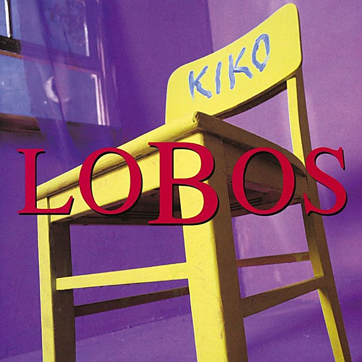

# Kiko

By **Los Lobos**

## Album Data

- **Catalog:** Beets
- **Format:** Digital, Album
- **Album:** Kiko
- **Artist:** Los Lobos
- **Albumartist:** Los Lobos
- **Genre:** Uk Garage
- **MusicBrainz Album Artist ID:** [2b9967c7-3246-4658-a561-ded5408dd9af](https://musicbrainz.org/artist/2b9967c7-3246-4658-a561-ded5408dd9af)
- **MusicBrainz Album ID:** [e0af8d08-7640-42c3-a1ba-891cc138e328](https://musicbrainz.org/release/e0af8d08-7640-42c3-a1ba-891cc138e328)
- **MusicBrainz Release Group ID:** [531222dc-781b-3417-961e-bbb3ed47dd12](https://musicbrainz.org/release-group/531222dc-781b-3417-961e-bbb3ed47dd12)
- **Year:** 2009
- **Catalog #:** 
- **Label:** Rhino
- **Total Tracks:** 16

## Album Tracks

### Track 01 - Dream in Blue

- **Artist:** Los Lobos
- **Format:** ALAC
- **Genre:** Rock And Roll
- **Length:** 3:34
- **MusicBrainz Track ID:** [9c19875b-29d9-4c94-9f4b-a9d9ab4d679a](https://musicbrainz.org/recording/9c19875b-29d9-4c94-9f4b-a9d9ab4d679a)
- **Title:** Dream in Blue
- **Track:** 01
- **Year:** 2009

### Track 02 - Wake Up Dolores

- **Artist:** Los Lobos
- **Format:** ALAC
- **Genre:** Rock
- **Length:** 2:55
- **MusicBrainz Track ID:** [9fcb9b41-ca4f-4f93-878d-736ab918c390](https://musicbrainz.org/recording/9fcb9b41-ca4f-4f93-878d-736ab918c390)
- **Title:** Wake Up Dolores
- **Track:** 02
- **Year:** 2009

### Track 03 - Angels With Dirty Faces

- **Artist:** Los Lobos
- **Format:** ALAC
- **Genre:** Rock And Roll
- **Length:** 4:02
- **MusicBrainz Track ID:** [6997c074-e265-4387-a70e-89edc68cd50f](https://musicbrainz.org/recording/6997c074-e265-4387-a70e-89edc68cd50f)
- **Title:** Angels With Dirty Faces
- **Track:** 03
- **Year:** 2009

### Track 04 - That Train Don’t Stop Here

- **Artist:** Los Lobos
- **Format:** ALAC
- **Genre:** Uk Garage
- **Length:** 3:52
- **MusicBrainz Track ID:** [f0caa1d4-ac55-4cf9-a817-6885003cc2cf](https://musicbrainz.org/recording/f0caa1d4-ac55-4cf9-a817-6885003cc2cf)
- **Title:** That Train Don’t Stop Here
- **Track:** 04
- **Year:** 2009

### Track 05 - Kiko and the Lavender Moon

- **Artist:** Los Lobos
- **Format:** ALAC
- **Genre:** Soft Rock
- **Length:** 3:35
- **MusicBrainz Track ID:** [40e75a0b-5fe0-49f0-ad1f-58479abbab58](https://musicbrainz.org/recording/40e75a0b-5fe0-49f0-ad1f-58479abbab58)
- **Title:** Kiko and the Lavender Moon
- **Track:** 05
- **Year:** 2009

### Track 06 - Saint Behind the Glass

- **Artist:** Los Lobos
- **Format:** ALAC
- **Genre:** Americana
- **Length:** 3:17
- **MusicBrainz Track ID:** [4d86a342-3eca-491c-91c1-35592bdf2532](https://musicbrainz.org/recording/4d86a342-3eca-491c-91c1-35592bdf2532)
- **Title:** Saint Behind the Glass
- **Track:** 06
- **Year:** 2009

### Track 07 - Reva’s House

- **Artist:** Los Lobos
- **Format:** ALAC
- **Genre:** Uk Garage
- **Length:** 3:04
- **MusicBrainz Track ID:** [ff038084-fad3-4923-821e-24ee75f38d41](https://musicbrainz.org/recording/ff038084-fad3-4923-821e-24ee75f38d41)
- **Title:** Reva’s House
- **Track:** 07
- **Year:** 2009

### Track 08 - When the Circus Comes

- **Artist:** Los Lobos
- **Format:** ALAC
- **Genre:** Rock And Roll
- **Length:** 3:16
- **MusicBrainz Track ID:** [b18b4afd-a196-427f-91e7-348eb8e4ce09](https://musicbrainz.org/recording/b18b4afd-a196-427f-91e7-348eb8e4ce09)
- **Title:** When the Circus Comes
- **Track:** 08
- **Year:** 2009

### Track 09 - Arizona Skies

- **Artist:** Los Lobos
- **Format:** ALAC
- **Genre:** Americana
- **Length:** 2:45
- **MusicBrainz Track ID:** [3c5bac51-61d1-43c4-98b8-96cedb9a2201](https://musicbrainz.org/recording/3c5bac51-61d1-43c4-98b8-96cedb9a2201)
- **Title:** Arizona Skies
- **Track:** 09
- **Year:** 2009

### Track 10 - Short Side of Nothing

- **Artist:** Los Lobos
- **Format:** ALAC
- **Genre:** Rock
- **Length:** 2:57
- **MusicBrainz Track ID:** [071af1e6-0391-4a95-bd1c-c4bf3a05fc8d](https://musicbrainz.org/recording/071af1e6-0391-4a95-bd1c-c4bf3a05fc8d)
- **Title:** Short Side of Nothing
- **Track:** 10
- **Year:** 2009

### Track 11 - Two Janes

- **Artist:** Los Lobos
- **Format:** ALAC
- **Genre:** Rock
- **Length:** 3:53
- **MusicBrainz Track ID:** [67797421-9854-4908-b7e9-7a4c7334d4b5](https://musicbrainz.org/recording/67797421-9854-4908-b7e9-7a4c7334d4b5)
- **Title:** Two Janes
- **Track:** 11
- **Year:** 2009

### Track 12 - Wicked Rain

- **Artist:** Los Lobos
- **Format:** ALAC
- **Genre:** Rock
- **Length:** 3:04
- **MusicBrainz Track ID:** [5aee5f30-db57-4369-998b-fa59a96cf244](https://musicbrainz.org/recording/5aee5f30-db57-4369-998b-fa59a96cf244)
- **Title:** Wicked Rain
- **Track:** 12
- **Year:** 2009

### Track 13 - Whiskey Trail

- **Artist:** Los Lobos
- **Format:** ALAC
- **Genre:** Rock
- **Length:** 2:41
- **MusicBrainz Track ID:** [6b72354e-e9a3-4e2c-a18b-38b324b45295](https://musicbrainz.org/recording/6b72354e-e9a3-4e2c-a18b-38b324b45295)
- **Title:** Whiskey Trail
- **Track:** 13
- **Year:** 2009

### Track 14 - Just a Man

- **Artist:** Los Lobos
- **Format:** ALAC
- **Genre:** Rock
- **Length:** 3:40
- **MusicBrainz Track ID:** [80725020-6c19-4bcb-a093-83d2530a86f5](https://musicbrainz.org/recording/80725020-6c19-4bcb-a093-83d2530a86f5)
- **Title:** Just a Man
- **Track:** 14
- **Year:** 2009

### Track 15 - Peace

- **Artist:** Los Lobos
- **Format:** ALAC
- **Genre:** Rock
- **Length:** 3:55
- **MusicBrainz Track ID:** [070f010a-908d-4168-ade8-b4979f312830](https://musicbrainz.org/recording/070f010a-908d-4168-ade8-b4979f312830)
- **Title:** Peace
- **Track:** 15
- **Year:** 2009

### Track 16 - Río de Tenampa

- **Artist:** Los Lobos
- **Format:** ALAC
- **Genre:** Uk Garage
- **Length:** 1:59
- **MusicBrainz Track ID:** [18b00b42-6768-4681-ba67-791b1d0a98a7](https://musicbrainz.org/recording/18b00b42-6768-4681-ba67-791b1d0a98a7)
- **Title:** Río de Tenampa
- **Track:** 16
- **Year:** 2009

## See also

- [Roon: How Will the Wolf Survive?](../../Roon/Los_Lobos/How_Will_the_Wolf_Survive.md)
- [Roon: Kiko](../../Roon/Los_Lobos/Kiko.md)
- [Roon: Native Sons](../../Roon/Los_Lobos/Native_Sons.md)
