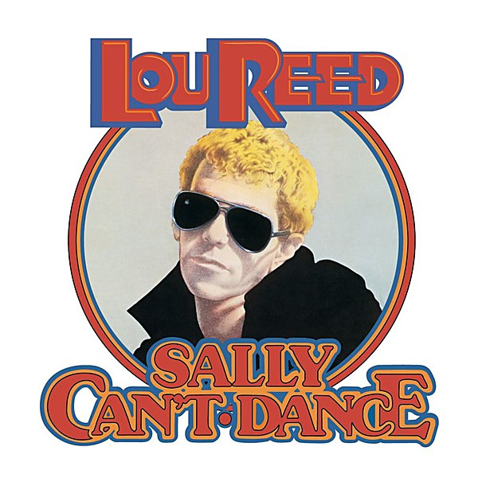

# Sally Can’t Dance

By **Lou Reed**

## Album Data

- **Catalog:** Beets
- **Format:** Digital, Album
- **Album:** Sally Can’t Dance
- **Artist:** Lou Reed
- **Albumartist:** Lou Reed
- **Genre:** Glam Rock
- **MusicBrainz Album Artist ID:** [9d1ebcfe-4c15-4d18-95d3-d919898638a1](https://musicbrainz.org/artist/9d1ebcfe-4c15-4d18-95d3-d919898638a1)
- **MusicBrainz Album ID:** [503738a8-07f1-31d9-bca1-7deeffb902e3](https://musicbrainz.org/release/503738a8-07f1-31d9-bca1-7deeffb902e3)
- **MusicBrainz Release Group ID:** [e4ba363a-c837-3a09-8838-23c3d84e1bf9](https://musicbrainz.org/release-group/e4ba363a-c837-3a09-8838-23c3d84e1bf9)
- **Year:** 2008
- **Catalog #:** RCA 07863 69383-2
- **Label:** RCA
- **Total Tracks:** 10

## Album Tracks

### Track 01 - Ride Sally Ride

- **Artist:** Lou Reed
- **Format:** ALAC
- **Genre:** Rock
- **Length:** 4:05
- **MusicBrainz Track ID:** [cb2562d4-f49b-49bc-82f6-6a7c5a71a8da](https://musicbrainz.org/recording/cb2562d4-f49b-49bc-82f6-6a7c5a71a8da)
- **Title:** Ride Sally Ride
- **Track:** 01
- **Year:** 2008

### Track 02 - Animal Language

- **Artist:** Lou Reed
- **Format:** ALAC
- **Genre:** Glam Rock
- **Length:** 3:05
- **MusicBrainz Track ID:** [941e978e-b143-4cad-9613-5d6e12aba398](https://musicbrainz.org/recording/941e978e-b143-4cad-9613-5d6e12aba398)
- **Title:** Animal Language
- **Track:** 02
- **Year:** 2008

### Track 03 - Baby Face

- **Artist:** Lou Reed
- **Format:** ALAC
- **Genre:** Rock
- **Length:** 5:05
- **MusicBrainz Track ID:** [d2f52e89-1bfb-4691-b77c-1d536dea48ce](https://musicbrainz.org/recording/d2f52e89-1bfb-4691-b77c-1d536dea48ce)
- **Title:** Baby Face
- **Track:** 03
- **Year:** 2008

### Track 04 - N.Y. Stars

- **Artist:** Lou Reed
- **Format:** ALAC
- **Genre:** Rock
- **Length:** 4:01
- **MusicBrainz Track ID:** [0df62aa6-019b-48ee-abfc-0ddd53ad979e](https://musicbrainz.org/recording/0df62aa6-019b-48ee-abfc-0ddd53ad979e)
- **Title:** N.Y. Stars
- **Track:** 04
- **Year:** 2008

### Track 05 - Kill Your Sons

- **Artist:** Lou Reed
- **Format:** ALAC
- **Genre:** Glam Rock
- **Length:** 3:40
- **MusicBrainz Track ID:** [a230d7a2-b24f-448d-9d49-850f7b33ef1b](https://musicbrainz.org/recording/a230d7a2-b24f-448d-9d49-850f7b33ef1b)
- **Title:** Kill Your Sons
- **Track:** 05
- **Year:** 2008

### Track 06 - Ennui

- **Artist:** Lou Reed
- **Format:** ALAC
- **Genre:** Alternative Rock
- **Length:** 3:43
- **MusicBrainz Track ID:** [dc8febaa-e89b-4fa3-bfc4-6d6e7c4cc2bf](https://musicbrainz.org/recording/dc8febaa-e89b-4fa3-bfc4-6d6e7c4cc2bf)
- **Title:** Ennui
- **Track:** 06
- **Year:** 2008

### Track 07 - Sally Can’t Dance

- **Artist:** Lou Reed
- **Format:** ALAC
- **Genre:** Glam Rock
- **Length:** 4:12
- **MusicBrainz Track ID:** [b969a9b6-b449-4799-b0ff-6fc65993632b](https://musicbrainz.org/recording/b969a9b6-b449-4799-b0ff-6fc65993632b)
- **Title:** Sally Can’t Dance
- **Track:** 07
- **Year:** 2008

### Track 08 - Billy

- **Artist:** Lou Reed
- **Format:** ALAC
- **Genre:** Rock
- **Length:** 5:10
- **MusicBrainz Track ID:** [6f79acb8-c3f4-44cb-8349-bb7d110b8cc4](https://musicbrainz.org/recording/6f79acb8-c3f4-44cb-8349-bb7d110b8cc4)
- **Title:** Billy
- **Track:** 08
- **Year:** 2008

### Track 09 - Good Taste

- **Artist:** Lou Reed
- **Format:** ALAC
- **Genre:** Rock
- **Length:** 3:30
- **MusicBrainz Track ID:** [7f682f4f-6b63-4789-95c8-d5b89f059934](https://musicbrainz.org/recording/7f682f4f-6b63-4789-95c8-d5b89f059934)
- **Title:** Good Taste
- **Track:** 09
- **Year:** 2008

### Track 10 - Sally Can’t Dance (single version)

- **Artist:** Lou Reed
- **Format:** ALAC
- **Genre:** Glam Rock
- **Length:** 2:54
- **MusicBrainz Track ID:** [b75b20d9-450c-48d3-8fc2-eb5a6f4aee29](https://musicbrainz.org/recording/b75b20d9-450c-48d3-8fc2-eb5a6f4aee29)
- **Title:** Sally Can’t Dance (single version)
- **Track:** 10
- **Year:** 2008

