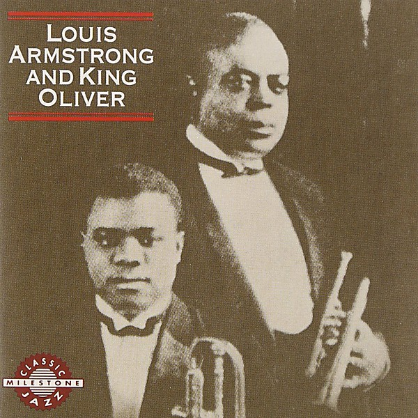

# Louis Armstrong and King Oliver

By **Louis Armstrong**

## Album Data

- **Catalog:** Beets
- **Format:** Digital, Album
- **Album:** Louis Armstrong and King Oliver
- **Artist:** Louis Armstrong
- **Albumartist:** Louis Armstrong
- **Genre:** Swing
- **MusicBrainz Album Artist ID:** 
- **MusicBrainz Album ID:** 
- **MusicBrainz Release Group ID:** 
- **Year:** 1974
- **Catalog #:** 
- **Label:** 
- **Total Tracks:** 00

## Album Tracks

### Track 01 - Just Gone

- **Artist:** Louis Armstrong
- **Format:** MP3
- **Genre:** Jazz
- **Length:** 2:41
- **MusicBrainz Track ID:** 
- **Title:** Just Gone
- **Track:** 01
- **Year:** 1974

### Track 02 - Canal Street Blues

- **Artist:** Louis Armstrong
- **Format:** MP3
- **Genre:** Dixieland
- **Length:** 2:28
- **MusicBrainz Track ID:** 
- **Title:** Canal Street Blues
- **Track:** 02
- **Year:** 1974

### Track 03 - Mandy Lee Blues

- **Artist:** Louis Armstrong
- **Format:** MP3
- **Genre:** Jazz
- **Length:** 2:09
- **MusicBrainz Track ID:** 
- **Title:** Mandy Lee Blues
- **Track:** 03
- **Year:** 1974

### Track 04 - I'm Going Away to Wear You Off My Mind

- **Artist:** Louis Armstrong
- **Format:** MP3
- **Genre:** Jazz
- **Length:** 2:59
- **MusicBrainz Track ID:** 
- **Title:** I'm Going Away to Wear You Off My Mind
- **Track:** 04
- **Year:** 1974

### Track 05 - Chimes Blues

- **Artist:** Louis Armstrong
- **Format:** MP3
- **Genre:** Jazz
- **Length:** 2:52
- **MusicBrainz Track ID:** 
- **Title:** Chimes Blues
- **Track:** 05
- **Year:** 1974

### Track 06 - Weather Bird Rag

- **Artist:** Louis Armstrong
- **Format:** MP3
- **Genre:** Ragtime
- **Length:** 2:41
- **MusicBrainz Track ID:** 
- **Title:** Weather Bird Rag
- **Track:** 06
- **Year:** 1974

### Track 07 - Dipper Mouth Blues

- **Artist:** Louis Armstrong
- **Format:** MP3
- **Genre:** Jazz
- **Length:** 2:38
- **MusicBrainz Track ID:** 
- **Title:** Dipper Mouth Blues
- **Track:** 07
- **Year:** 1974

### Track 08 - Froggie Moore

- **Artist:** Louis Armstrong
- **Format:** MP3
- **Genre:** Jazz
- **Length:** 3:03
- **MusicBrainz Track ID:** 
- **Title:** Froggie Moore
- **Track:** 08
- **Year:** 1974

### Track 09 - Snake Rag

- **Artist:** Louis Armstrong
- **Format:** MP3
- **Genre:** Jazz
- **Length:** 3:02
- **MusicBrainz Track ID:** 
- **Title:** Snake Rag
- **Track:** 09
- **Year:** 1974

### Track 10 - Alligator Hop

- **Artist:** Louis Armstrong
- **Format:** MP3
- **Genre:** Swing
- **Length:** 2:23
- **MusicBrainz Track ID:** 
- **Title:** Alligator Hop
- **Track:** 10
- **Year:** 1974

### Track 11 - Zulu's Ball

- **Artist:** Louis Armstrong
- **Format:** MP3
- **Genre:** Swing
- **Length:** 2:28
- **MusicBrainz Track ID:** 
- **Title:** Zulu's Ball
- **Track:** 11
- **Year:** 1974

### Track 12 - Working Man Blues

- **Artist:** Louis Armstrong
- **Format:** MP3
- **Genre:** Swing
- **Length:** 2:11
- **MusicBrainz Track ID:** 
- **Title:** Working Man Blues
- **Track:** 12
- **Year:** 1974

### Track 13 - Krooked Blues

- **Artist:** Louis Armstrong
- **Format:** MP3
- **Genre:** Jazz
- **Length:** 2:53
- **MusicBrainz Track ID:** 
- **Title:** Krooked Blues
- **Track:** 13
- **Year:** 1974

### Track 14 - Mabel's Dream (take 1)

- **Artist:** Louis Armstrong
- **Format:** MP3
- **Genre:** Swing
- **Length:** 2:52
- **MusicBrainz Track ID:** 
- **Title:** Mabel's Dream (take 1)
- **Track:** 14
- **Year:** 1974

### Track 15 - Mabel's Dream (take 2)

- **Artist:** Louis Armstrong
- **Format:** MP3
- **Genre:** Swing
- **Length:** 2:47
- **MusicBrainz Track ID:** 
- **Title:** Mabel's Dream (take 2)
- **Track:** 15
- **Year:** 1974

### Track 16 - Southern Stomps (take 1)

- **Artist:** Louis Armstrong
- **Format:** MP3
- **Genre:** Swing
- **Length:** 2:41
- **MusicBrainz Track ID:** 
- **Title:** Southern Stomps (take 1)
- **Track:** 16
- **Year:** 1974

### Track 17 - Southern Stomps (take 2)

- **Artist:** Louis Armstrong
- **Format:** MP3
- **Genre:** Swing
- **Length:** 2:43
- **MusicBrainz Track ID:** 
- **Title:** Southern Stomps (take 2)
- **Track:** 17
- **Year:** 1974

### Track 18 - Riverside Blues

- **Artist:** Louis Armstrong
- **Format:** MP3
- **Genre:** Swing
- **Length:** 2:56
- **MusicBrainz Track ID:** 
- **Title:** Riverside Blues
- **Track:** 18
- **Year:** 1974

### Track 19 - King Porter Stomp

- **Artist:** Louis Armstrong
- **Format:** MP3
- **Genre:** Swing
- **Length:** 2:29
- **MusicBrainz Track ID:** 
- **Title:** King Porter Stomp
- **Track:** 19
- **Year:** 1974

### Track 20 - Tom Cat Blues

- **Artist:** Louis Armstrong
- **Format:** MP3
- **Genre:** Swing
- **Length:** 2:47
- **MusicBrainz Track ID:** 
- **Title:** Tom Cat Blues
- **Track:** 20
- **Year:** 1974

### Track 21 - Terrible Blues

- **Artist:** Louis Armstrong
- **Format:** MP3
- **Genre:** Swing
- **Length:** 2:49
- **MusicBrainz Track ID:** 
- **Title:** Terrible Blues
- **Track:** 21
- **Year:** 1974

### Track 22 - Santa Claus Blues

- **Artist:** Louis Armstrong
- **Format:** MP3
- **Genre:** Jazz
- **Length:** 2:45
- **MusicBrainz Track ID:** 
- **Title:** Santa Claus Blues
- **Track:** 22
- **Year:** 1974

### Track 23 - Texas Moaner Blues

- **Artist:** Louis Armstrong
- **Format:** MP3
- **Genre:** Jazz
- **Length:** 3:03
- **MusicBrainz Track ID:** 
- **Title:** Texas Moaner Blues
- **Track:** 23
- **Year:** 1974

### Track 24 - Of All the Wrongs You've Done to Me

- **Artist:** Louis Armstrong
- **Format:** MP3
- **Genre:** Swing
- **Length:** 2:49
- **MusicBrainz Track ID:** 
- **Title:** Of All the Wrongs You've Done to Me
- **Track:** 24
- **Year:** 1974

### Track 25 - Nobody Knows the Way I Feel This Morning

- **Artist:** Louis Armstrong
- **Format:** MP3
- **Genre:** Swing
- **Length:** 2:50
- **MusicBrainz Track ID:** 
- **Title:** Nobody Knows the Way I Feel This Morning
- **Track:** 25
- **Year:** 1974

### Track 26 - Early Every Morn

- **Artist:** Louis Armstrong
- **Format:** MP3
- **Genre:** Swing
- **Length:** 2:56
- **MusicBrainz Track ID:** 
- **Title:** Early Every Morn
- **Track:** 26
- **Year:** 1974

### Track 27 - Cake Walking Babies from Home

- **Artist:** Louis Armstrong
- **Format:** MP3
- **Genre:** Swing
- **Length:** 3:26
- **MusicBrainz Track ID:** 
- **Title:** Cake Walking Babies from Home
- **Track:** 27
- **Year:** 1974

## See also

- [Kiss of Fire](Kiss_of_Fire.md)
