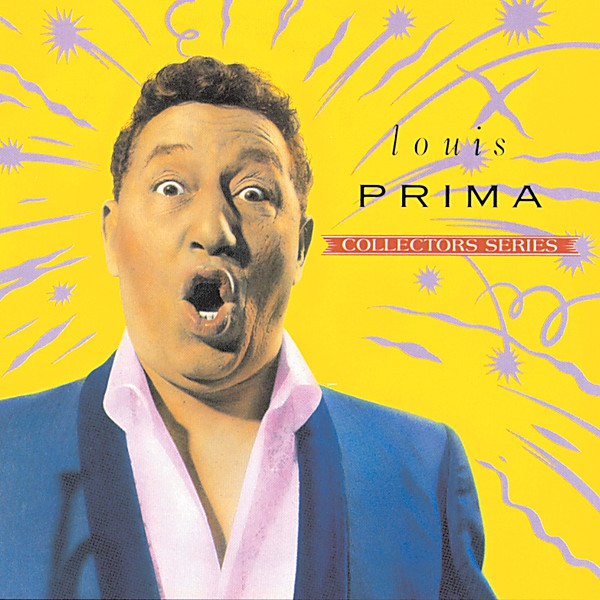

# Louis Prima

By **Louis Prima**

## Album Data

- **Catalog:** Beets
- **Format:** Digital, Album
- **Album:** Louis Prima
- **Artist:** Louis Prima
- **Albumartist:** Louis Prima
- **Genre:** Swing
- **MusicBrainz Album Artist ID:** [b5997eef-2516-491a-a10e-5cee842bbcdc](https://musicbrainz.org/artist/b5997eef-2516-491a-a10e-5cee842bbcdc)
- **MusicBrainz Album ID:** [ce4b8b3b-d542-4bce-ac5a-c0578b5773c6](https://musicbrainz.org/release/ce4b8b3b-d542-4bce-ac5a-c0578b5773c6)
- **MusicBrainz Release Group ID:** [4a12c9c8-cc55-36df-9c9a-3ed37e775ae2](https://musicbrainz.org/release-group/4a12c9c8-cc55-36df-9c9a-3ed37e775ae2)
- **Year:** 1991
- **Catalog #:** 
- **Label:** Capitol Records
- **Total Tracks:** 26

## Album Tracks

### Track 01 - Just a Gigolo / I Ain’t Got Nobody

- **Artist:** Louis Prima
- **Format:** AAC
- **Genre:** Swing
- **Length:** 4:43
- **MusicBrainz Track ID:** [17b34ffa-9d5c-444d-889a-7994e30415a9](https://musicbrainz.org/recording/17b34ffa-9d5c-444d-889a-7994e30415a9)
- **Title:** Just a Gigolo / I Ain’t Got Nobody
- **Track:** 01
- **Year:** 1991

### Track 02 - Oh Marie

- **Artist:** Louis Prima
- **Format:** AAC
- **Genre:** Swing
- **Length:** 2:27
- **MusicBrainz Track ID:** [e9a7ba8f-3c9c-4a5e-8c2a-a02c8ab51caf](https://musicbrainz.org/recording/e9a7ba8f-3c9c-4a5e-8c2a-a02c8ab51caf)
- **Title:** Oh Marie
- **Track:** 02
- **Year:** 1991

### Track 03 - Buona Sera

- **Artist:** Louis Prima
- **Format:** AAC
- **Genre:** Swing
- **Length:** 3:07
- **MusicBrainz Track ID:** [35dde849-6c60-4a7a-90b3-6947dd7644ac](https://musicbrainz.org/recording/35dde849-6c60-4a7a-90b3-6947dd7644ac)
- **Title:** Buona Sera
- **Track:** 03
- **Year:** 1991

### Track 04 - Jump, Jive An’ Wail

- **Artist:** Louis Prima
- **Format:** AAC
- **Genre:** Swing
- **Length:** 3:29
- **MusicBrainz Track ID:** [b89ccfb7-deb4-49fb-8647-1c931d8badda](https://musicbrainz.org/recording/b89ccfb7-deb4-49fb-8647-1c931d8badda)
- **Title:** Jump, Jive An’ Wail
- **Track:** 04
- **Year:** 1991

### Track 05 - Basin Street Blues / When It’s Sleepy Time Down South

- **Artist:** Louis Prima
- **Format:** AAC
- **Genre:** Swing
- **Length:** 4:13
- **MusicBrainz Track ID:** [467e3dc2-1f87-42d5-90a6-d40a6020f4fa](https://musicbrainz.org/recording/467e3dc2-1f87-42d5-90a6-d40a6020f4fa)
- **Title:** Basin Street Blues / When It’s Sleepy Time Down South
- **Track:** 05
- **Year:** 1991

### Track 07 - Whistle Stop

- **Artist:** Louis Prima
- **Format:** AAC
- **Genre:** Boogie
- **Length:** 2:16
- **MusicBrainz Track ID:** [88680a8c-9e29-4095-835f-526eb2009b96](https://musicbrainz.org/recording/88680a8c-9e29-4095-835f-526eb2009b96)
- **Title:** Whistle Stop
- **Track:** 07
- **Year:** 1991

### Track 08 - 5 Months, 2 Weeks, 2 Days

- **Artist:** Louis Prima
- **Format:** AAC
- **Genre:** Swing
- **Length:** 2:09
- **MusicBrainz Track ID:** [a916177c-85bc-45a8-9184-2ca954a2b827](https://musicbrainz.org/recording/a916177c-85bc-45a8-9184-2ca954a2b827)
- **Title:** 5 Months, 2 Weeks, 2 Days
- **Track:** 08
- **Year:** 1991

### Track 09 - Banana Split for My Baby

- **Artist:** Louis Prima
- **Format:** AAC
- **Genre:** Swing
- **Length:** 2:30
- **MusicBrainz Track ID:** [51f435fa-cfa2-4188-93dc-0ab8433fcf5e](https://musicbrainz.org/recording/51f435fa-cfa2-4188-93dc-0ab8433fcf5e)
- **Title:** Banana Split for My Baby
- **Track:** 09
- **Year:** 1991

### Track 11 - When You’re Smiling / The Sheik of Araby

- **Artist:** Louis Prima
- **Format:** AAC
- **Genre:** Swing
- **Length:** 3:58
- **MusicBrainz Track ID:** [787892a5-3049-469c-b8cf-7abcadb5ee2d](https://musicbrainz.org/recording/787892a5-3049-469c-b8cf-7abcadb5ee2d)
- **Title:** When You’re Smiling / The Sheik of Araby
- **Track:** 11
- **Year:** 1991

### Track 13 - I’ve Got the World on a String

- **Artist:** Louis Prima
- **Format:** AAC
- **Genre:** Swing
- **Length:** 2:26
- **MusicBrainz Track ID:** [0c67ad72-863c-4df3-9c17-bc4154f9f89f](https://musicbrainz.org/recording/0c67ad72-863c-4df3-9c17-bc4154f9f89f)
- **Title:** I’ve Got the World on a String
- **Track:** 13
- **Year:** 1991

### Track 14 - Pennies From Heaven

- **Artist:** Louis Prima
- **Format:** AAC
- **Genre:** Swing
- **Length:** 2:20
- **MusicBrainz Track ID:** [53d6410c-e033-4b3d-9612-cd1945c6bd29](https://musicbrainz.org/recording/53d6410c-e033-4b3d-9612-cd1945c6bd29)
- **Title:** Pennies From Heaven
- **Track:** 14
- **Year:** 1991

### Track 15 - Angelina / Zooma Zooma

- **Artist:** Louis Prima
- **Format:** AAC
- **Genre:** Swing
- **Length:** 4:16
- **MusicBrainz Track ID:** [da479dec-792e-4a52-a90e-70b6d0646f46](https://musicbrainz.org/recording/da479dec-792e-4a52-a90e-70b6d0646f46)
- **Title:** Angelina / Zooma Zooma
- **Track:** 15
- **Year:** 1991

### Track 16 - Beep! Beep!

- **Artist:** Louis Prima
- **Format:** AAC
- **Genre:** Swing
- **Length:** 2:13
- **MusicBrainz Track ID:** [6b781d72-36ab-4031-ae16-40f232da2087](https://musicbrainz.org/recording/6b781d72-36ab-4031-ae16-40f232da2087)
- **Title:** Beep! Beep!
- **Track:** 16
- **Year:** 1991

### Track 18 - Sing, Sing, Sing

- **Artist:** Louis Prima
- **Format:** AAC
- **Genre:** Swing
- **Length:** 4:08
- **MusicBrainz Track ID:** [dbcadcf2-76f4-46ef-84fb-f476bb8ab0a4](https://musicbrainz.org/recording/dbcadcf2-76f4-46ef-84fb-f476bb8ab0a4)
- **Title:** Sing, Sing, Sing
- **Track:** 18
- **Year:** 1991

### Track 20 - The Music Goes ’Round and Around

- **Artist:** Louis Prima
- **Format:** AAC
- **Genre:** Swing
- **Length:** 2:34
- **MusicBrainz Track ID:** [7df79de3-1888-4ced-a340-20db2c72bad9](https://musicbrainz.org/recording/7df79de3-1888-4ced-a340-20db2c72bad9)
- **Title:** The Music Goes ’Round and Around
- **Track:** 20
- **Year:** 1991

### Track 22 - Lazy River

- **Artist:** Louis Prima
- **Format:** AAC
- **Genre:** Swing
- **Length:** 3:27
- **MusicBrainz Track ID:** [b26cc7e6-ee1f-4d54-9d43-9414559e50de](https://musicbrainz.org/recording/b26cc7e6-ee1f-4d54-9d43-9414559e50de)
- **Title:** Lazy River
- **Track:** 22
- **Year:** 1991

### Track 24 - You’re Just in Love

- **Artist:** Louis Prima
- **Format:** AAC
- **Genre:** Swing
- **Length:** 2:27
- **MusicBrainz Track ID:** [dc566ae9-f3d8-47c0-b104-76c41e70a698](https://musicbrainz.org/recording/dc566ae9-f3d8-47c0-b104-76c41e70a698)
- **Title:** You’re Just in Love
- **Track:** 24
- **Year:** 1991

### Track 25 - Twist All Night

- **Artist:** Louis Prima
- **Format:** AAC
- **Genre:** Swing
- **Length:** 2:01
- **MusicBrainz Track ID:** [9b86c614-ac54-4c7b-832f-10e9fe465555](https://musicbrainz.org/recording/9b86c614-ac54-4c7b-832f-10e9fe465555)
- **Title:** Twist All Night
- **Track:** 25
- **Year:** 1991

### Track 26 - St. Louis Blues

- **Artist:** Louis Prima
- **Format:** AAC
- **Genre:** Swing
- **Length:** 2:55
- **MusicBrainz Track ID:** [f37b4749-b7a7-4a39-85b9-e3ffe5b9dd41](https://musicbrainz.org/recording/f37b4749-b7a7-4a39-85b9-e3ffe5b9dd41)
- **Title:** St. Louis Blues
- **Track:** 26
- **Year:** 1991

### Track 10 - There’ll Be No Next Time

- **Artist:** Louis Prima & Sam Butera
- **Format:** AAC
- **Genre:** Jazz
- **Length:** 3:14
- **MusicBrainz Track ID:** [0562a271-d459-4ac8-9c5f-b5debff047a9](https://musicbrainz.org/recording/0562a271-d459-4ac8-9c5f-b5debff047a9)
- **Title:** There’ll Be No Next Time
- **Track:** 10
- **Year:** 1991

### Track 06 - The Lip

- **Artist:** Louis Prima & Keely Smith
- **Format:** AAC
- **Genre:** Swing
- **Length:** 2:16
- **MusicBrainz Track ID:** [4c5653d6-a753-4647-9dde-fab570cd440c](https://musicbrainz.org/recording/4c5653d6-a753-4647-9dde-fab570cd440c)
- **Title:** The Lip
- **Track:** 06
- **Year:** 1991

### Track 12 - Baby, Won’t You Please Come Home

- **Artist:** Louis Prima & Keely Smith
- **Format:** AAC
- **Genre:** Swing
- **Length:** 2:05
- **MusicBrainz Track ID:** [89becc1d-1a1f-4068-843b-b558486293f0](https://musicbrainz.org/recording/89becc1d-1a1f-4068-843b-b558486293f0)
- **Title:** Baby, Won’t You Please Come Home
- **Track:** 12
- **Year:** 1991

### Track 17 - Embraceable You / I Got It Bad and That Ain’t Good

- **Artist:** Louis Prima & Keely Smith
- **Format:** AAC
- **Genre:** Swing
- **Length:** 2:57
- **MusicBrainz Track ID:** [8340b3dd-025a-4644-8f3d-26c6511f8351](https://musicbrainz.org/recording/8340b3dd-025a-4644-8f3d-26c6511f8351)
- **Title:** Embraceable You / I Got It Bad and That Ain’t Good
- **Track:** 17
- **Year:** 1991

### Track 19 - That Old Black Magic

- **Artist:** Louis Prima & Keely Smith
- **Format:** AAC
- **Genre:** Vocal Jazz
- **Length:** 2:56
- **MusicBrainz Track ID:** [cd046ea9-94d5-423d-903b-93bdcba7f2d4](https://musicbrainz.org/recording/cd046ea9-94d5-423d-903b-93bdcba7f2d4)
- **Title:** That Old Black Magic
- **Track:** 19
- **Year:** 1991

### Track 21 - Hey, Boy! Hey, Girl!

- **Artist:** Louis Prima & Keely Smith
- **Format:** AAC
- **Genre:** Swing
- **Length:** 2:41
- **MusicBrainz Track ID:** [2881ef7f-f77c-4c18-bd4d-e0a19ac6caf8](https://musicbrainz.org/recording/2881ef7f-f77c-4c18-bd4d-e0a19ac6caf8)
- **Title:** Hey, Boy! Hey, Girl!
- **Track:** 21
- **Year:** 1991

### Track 23 - I’ve Got You Under My Skin

- **Artist:** Louis Prima & Keely Smith
- **Format:** AAC
- **Genre:** Swing
- **Length:** 2:37
- **MusicBrainz Track ID:** [f31feab9-c265-4588-95af-1f3396c7af14](https://musicbrainz.org/recording/f31feab9-c265-4588-95af-1f3396c7af14)
- **Title:** I’ve Got You Under My Skin
- **Track:** 23
- **Year:** 1991

## See also

- [Vinyl: ](../../Vinyl/Louis_Prima/Louis_Prima.md)
- [Vinyl: Wonderland By Night / Ol' Man Mose](../../Vinyl/Louis_Prima/Wonderland_By_Night_-_Ol_Man_Mose.md)
