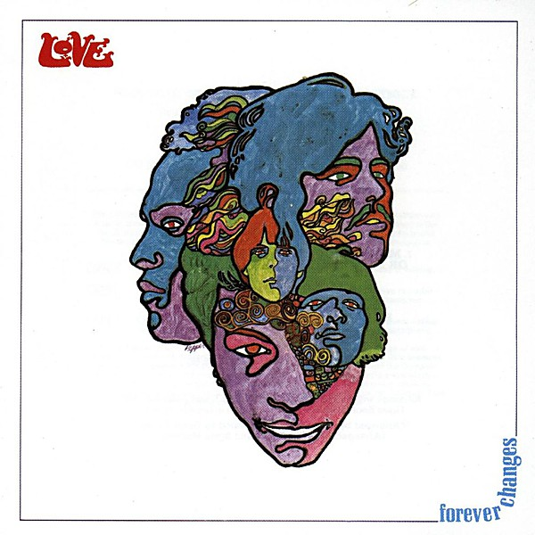

# Forever Changes

By **Love**

## Album Data

- **Catalog:** Beets
- **Format:** Digital, Album
- **Album:** Forever Changes
- **Artist:** Love
- **Albumartist:** Love
- **Genre:** Psychedelic Rock
- **MusicBrainz Album Artist ID:** [34ec9a8d-c65b-48fd-bcdd-aad2f72fdb47](https://musicbrainz.org/artist/34ec9a8d-c65b-48fd-bcdd-aad2f72fdb47)
- **MusicBrainz Album ID:** [ee357d43-52aa-38be-a226-4b9ac8853063](https://musicbrainz.org/release/ee357d43-52aa-38be-a226-4b9ac8853063)
- **MusicBrainz Release Group ID:** [c7035bc6-6101-326f-992c-401d451c1716](https://musicbrainz.org/release-group/c7035bc6-6101-326f-992c-401d451c1716)
- **Year:** 1987
- **Catalog #:** 7559-60656-2
- **Label:** Elektra
- **Total Tracks:** 11

## Album Tracks

### Track 01 - Alone Again Or

- **Artist:** Love
- **Format:** ALAC
- **Genre:** Psychedelic Rock
- **Length:** 3:18
- **MusicBrainz Track ID:** [086fef90-7e9a-42d5-b3cb-47b529cafdbe](https://musicbrainz.org/recording/086fef90-7e9a-42d5-b3cb-47b529cafdbe)
- **Title:** Alone Again Or
- **Track:** 01
- **Year:** 1987

### Track 02 - A House Is Not a Motel

- **Artist:** Love
- **Format:** ALAC
- **Genre:** Psychedelic Rock
- **Length:** 3:32
- **MusicBrainz Track ID:** [c414c5b8-9f7c-4033-b2ca-0b6369d2dbb1](https://musicbrainz.org/recording/c414c5b8-9f7c-4033-b2ca-0b6369d2dbb1)
- **Title:** A House Is Not a Motel
- **Track:** 02
- **Year:** 1987

### Track 03 - Andmoreagain

- **Artist:** Love
- **Format:** ALAC
- **Genre:** Psychedelic Rock
- **Length:** 3:21
- **MusicBrainz Track ID:** [cb7097c9-7b20-4239-8d97-8c43f0e10d00](https://musicbrainz.org/recording/cb7097c9-7b20-4239-8d97-8c43f0e10d00)
- **Title:** Andmoreagain
- **Track:** 03
- **Year:** 1987

### Track 04 - The Daily Planet

- **Artist:** Love
- **Format:** ALAC
- **Genre:** Psychedelic Rock
- **Length:** 3:31
- **MusicBrainz Track ID:** [b46b3c38-7529-4df5-936c-e54e7525e20a](https://musicbrainz.org/recording/b46b3c38-7529-4df5-936c-e54e7525e20a)
- **Title:** The Daily Planet
- **Track:** 04
- **Year:** 1987

### Track 05 - Old Man

- **Artist:** Love
- **Format:** ALAC
- **Genre:** Psychedelic Rock
- **Length:** 3:02
- **MusicBrainz Track ID:** [cd70755f-5060-487a-8ba9-3ce1127582a2](https://musicbrainz.org/recording/cd70755f-5060-487a-8ba9-3ce1127582a2)
- **Title:** Old Man
- **Track:** 05
- **Year:** 1987

### Track 06 - The Red Telephone

- **Artist:** Love
- **Format:** ALAC
- **Genre:** Psychedelic Rock
- **Length:** 4:45
- **MusicBrainz Track ID:** [c66db88c-a350-42cf-9268-f9752dad70ed](https://musicbrainz.org/recording/c66db88c-a350-42cf-9268-f9752dad70ed)
- **Title:** The Red Telephone
- **Track:** 06
- **Year:** 1987

### Track 07 - Maybe the People Would Be the Times or Between Clark and Hilldale

- **Artist:** Love
- **Format:** ALAC
- **Genre:** Psychedelic Rock
- **Length:** 3:35
- **MusicBrainz Track ID:** [e5570e63-8281-435c-9a14-8e0552806cb5](https://musicbrainz.org/recording/e5570e63-8281-435c-9a14-8e0552806cb5)
- **Title:** Maybe the People Would Be the Times or Between Clark and Hilldale
- **Track:** 07
- **Year:** 1987

### Track 08 - Live and Let Live

- **Artist:** Love
- **Format:** ALAC
- **Genre:** Psychedelic Rock
- **Length:** 5:27
- **MusicBrainz Track ID:** [e6f87002-6ba5-4184-a8a8-b32048ab3fc5](https://musicbrainz.org/recording/e6f87002-6ba5-4184-a8a8-b32048ab3fc5)
- **Title:** Live and Let Live
- **Track:** 08
- **Year:** 1987

### Track 09 - The Good Humor Man He Sees Everything Like This

- **Artist:** Love
- **Format:** ALAC
- **Genre:** Psychedelic Rock
- **Length:** 3:08
- **MusicBrainz Track ID:** [77a3aeb9-9b1c-4bb1-9410-6221765a7c1e](https://musicbrainz.org/recording/77a3aeb9-9b1c-4bb1-9410-6221765a7c1e)
- **Title:** The Good Humor Man He Sees Everything Like This
- **Track:** 09
- **Year:** 1987

### Track 10 - Bummer in the Summer

- **Artist:** Love
- **Format:** ALAC
- **Genre:** Psychedelic Rock
- **Length:** 2:24
- **MusicBrainz Track ID:** [8e8538d8-64eb-4088-bc2d-a623310094ea](https://musicbrainz.org/recording/8e8538d8-64eb-4088-bc2d-a623310094ea)
- **Title:** Bummer in the Summer
- **Track:** 10
- **Year:** 1987

### Track 11 - You Set the Scene

- **Artist:** Love
- **Format:** ALAC
- **Genre:** Psychedelic Rock
- **Length:** 6:49
- **MusicBrainz Track ID:** [e5215da6-12c2-4120-91c4-4f6fa08d788c](https://musicbrainz.org/recording/e5215da6-12c2-4120-91c4-4f6fa08d788c)
- **Title:** You Set the Scene
- **Track:** 11
- **Year:** 1987

## See also

- [Roon: Forever Changes (2015 Remaster)](../../Roon/Love/Forever_Changes_2015_Remaster.md)
