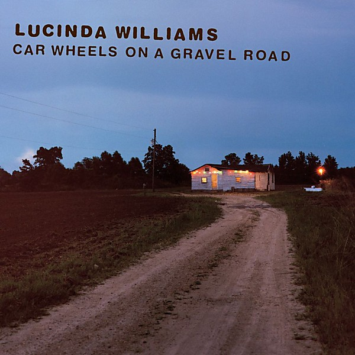

# Car Wheels on a Gravel Road

By **Lucinda Williams**

## Album Data

- **Catalog:** Beets
- **Format:** Digital, Album
- **Album:** Car Wheels on a Gravel Road
- **Artist:** Lucinda Williams
- **Albumartist:** Lucinda Williams
- **Genre:** Americana
- **MusicBrainz Album Artist ID:** [21685b15-3074-446e-aa1d-ff7157014f53](https://musicbrainz.org/artist/21685b15-3074-446e-aa1d-ff7157014f53)
- **MusicBrainz Album ID:** [386ec7ec-d3de-42d4-b5ac-71a0b547d384](https://musicbrainz.org/release/386ec7ec-d3de-42d4-b5ac-71a0b547d384)
- **MusicBrainz Release Group ID:** [493de006-33bf-3404-9bb7-1f3b0c22ce05](https://musicbrainz.org/release-group/493de006-33bf-3404-9bb7-1f3b0c22ce05)
- **Year:** 1998
- **Catalog #:** 314 558 338-2
- **Label:** Mercury Records
- **Total Tracks:** 13

## Album Tracks

### Track 01 - Right in Time

- **Artist:** Lucinda Williams
- **Format:** ALAC
- **Genre:** Americana
- **Length:** 4:36
- **MusicBrainz Track ID:** [61370b82-b13a-4385-b6af-ca69d5aa4a41](https://musicbrainz.org/recording/61370b82-b13a-4385-b6af-ca69d5aa4a41)
- **Title:** Right in Time
- **Track:** 01
- **Year:** 1998

### Track 02 - Car Wheels on a Gravel Road

- **Artist:** Lucinda Williams
- **Format:** ALAC
- **Genre:** Country Rock
- **Length:** 4:44
- **MusicBrainz Track ID:** [ecfebe28-969d-4977-b9a1-4b0c996f629e](https://musicbrainz.org/recording/ecfebe28-969d-4977-b9a1-4b0c996f629e)
- **Title:** Car Wheels on a Gravel Road
- **Track:** 02
- **Year:** 1998

### Track 03 - 2 Kool 2 Be 4-Gotten

- **Artist:** Lucinda Williams
- **Format:** ALAC
- **Genre:** Country Rock
- **Length:** 4:42
- **MusicBrainz Track ID:** [0d008d9e-9a6d-442c-a01b-88df96da02b9](https://musicbrainz.org/recording/0d008d9e-9a6d-442c-a01b-88df96da02b9)
- **Title:** 2 Kool 2 Be 4-Gotten
- **Track:** 03
- **Year:** 1998

### Track 04 - Drunken Angel

- **Artist:** Lucinda Williams
- **Format:** ALAC
- **Genre:** Country Rock
- **Length:** 3:20
- **MusicBrainz Track ID:** [e7743b3f-bf91-40b7-87cf-36c106473268](https://musicbrainz.org/recording/e7743b3f-bf91-40b7-87cf-36c106473268)
- **Title:** Drunken Angel
- **Track:** 04
- **Year:** 1998

### Track 05 - Concrete and Barbed Wire

- **Artist:** Lucinda Williams
- **Format:** ALAC
- **Genre:** Americana
- **Length:** 3:08
- **MusicBrainz Track ID:** [4d2220fb-a6f2-4788-a16d-639073b1c8c9](https://musicbrainz.org/recording/4d2220fb-a6f2-4788-a16d-639073b1c8c9)
- **Title:** Concrete and Barbed Wire
- **Track:** 05
- **Year:** 1998

### Track 06 - Lake Charles

- **Artist:** Lucinda Williams
- **Format:** ALAC
- **Genre:** Country Rock
- **Length:** 5:28
- **MusicBrainz Track ID:** [5f998e93-f3ac-4188-8969-45a07b3a3291](https://musicbrainz.org/recording/5f998e93-f3ac-4188-8969-45a07b3a3291)
- **Title:** Lake Charles
- **Track:** 06
- **Year:** 1998

### Track 07 - Can’t Let Go

- **Artist:** Lucinda Williams
- **Format:** ALAC
- **Genre:** Americana
- **Length:** 3:28
- **MusicBrainz Track ID:** [39f6ab36-a715-4d80-8913-0cabacc5b0a8](https://musicbrainz.org/recording/39f6ab36-a715-4d80-8913-0cabacc5b0a8)
- **Title:** Can’t Let Go
- **Track:** 07
- **Year:** 1998

### Track 08 - I Lost It

- **Artist:** Lucinda Williams
- **Format:** ALAC
- **Genre:** Americana
- **Length:** 3:31
- **MusicBrainz Track ID:** [ae03cb2c-99a6-4ae4-bb1d-3df938831ac5](https://musicbrainz.org/recording/ae03cb2c-99a6-4ae4-bb1d-3df938831ac5)
- **Title:** I Lost It
- **Track:** 08
- **Year:** 1998

### Track 09 - Metal Firecracker

- **Artist:** Lucinda Williams
- **Format:** ALAC
- **Genre:** Country Rock
- **Length:** 3:30
- **MusicBrainz Track ID:** [82113209-c6bf-4088-b8e9-b358c4062563](https://musicbrainz.org/recording/82113209-c6bf-4088-b8e9-b358c4062563)
- **Title:** Metal Firecracker
- **Track:** 09
- **Year:** 1998

### Track 10 - Greenville

- **Artist:** Lucinda Williams
- **Format:** ALAC
- **Genre:** Americana
- **Length:** 3:23
- **MusicBrainz Track ID:** [ffa7e930-e34c-4be0-b29a-02c83f705f6b](https://musicbrainz.org/recording/ffa7e930-e34c-4be0-b29a-02c83f705f6b)
- **Title:** Greenville
- **Track:** 10
- **Year:** 1998

### Track 11 - Still I Long for Your Kiss

- **Artist:** Lucinda Williams
- **Format:** ALAC
- **Genre:** Americana
- **Length:** 4:09
- **MusicBrainz Track ID:** [a49262f9-d3a3-4ad5-b774-6844b9dc947f](https://musicbrainz.org/recording/a49262f9-d3a3-4ad5-b774-6844b9dc947f)
- **Title:** Still I Long for Your Kiss
- **Track:** 11
- **Year:** 1998

### Track 12 - Joy

- **Artist:** Lucinda Williams
- **Format:** ALAC
- **Genre:** Folk Rock
- **Length:** 4:01
- **MusicBrainz Track ID:** [7508c977-c262-44a4-b507-29c93954c055](https://musicbrainz.org/recording/7508c977-c262-44a4-b507-29c93954c055)
- **Title:** Joy
- **Track:** 12
- **Year:** 1998

### Track 13 - Jackson

- **Artist:** Lucinda Williams
- **Format:** ALAC
- **Genre:** Americana
- **Length:** 3:42
- **MusicBrainz Track ID:** [434cd6f9-c0a3-4172-9419-b6f83a57442c](https://musicbrainz.org/recording/434cd6f9-c0a3-4172-9419-b6f83a57442c)
- **Title:** Jackson
- **Track:** 13
- **Year:** 1998

## See also

- [Live @ the Fillmore Disc 2](Live_@_the_Fillmore_Disc_2.md)
- [Roon: Car Wheels On A Gravel Road](../../Roon/Lucinda_Williams/Car_Wheels_On_A_Gravel_Road.md)
