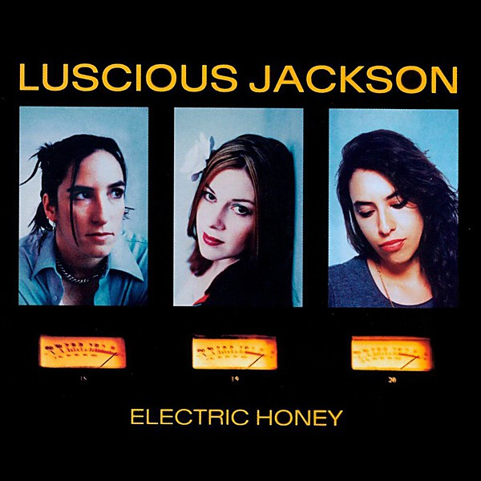

# Electric Honey

By **Luscious Jackson**

## Album Data

- **Catalog:** Beets
- **Format:** Digital, Album
- **Album:** Electric Honey
- **Artist:** Luscious Jackson
- **Albumartist:** Luscious Jackson
- **Genre:** Indie Rock
- **MusicBrainz Album Artist ID:** [8be5d1de-e925-4e9f-b410-6d702cd8dcaa](https://musicbrainz.org/artist/8be5d1de-e925-4e9f-b410-6d702cd8dcaa)
- **MusicBrainz Album ID:** [c847affe-0e84-45f0-b746-f37e915897a7](https://musicbrainz.org/release/c847affe-0e84-45f0-b746-f37e915897a7)
- **MusicBrainz Release Group ID:** [4d91b955-3763-3af0-9e2e-59d65286e1f2](https://musicbrainz.org/release-group/4d91b955-3763-3af0-9e2e-59d65286e1f2)
- **Year:** 1999
- **Catalog #:** CDP 7243 8 35534 2 6
- **Label:** Grand Royal
- **Total Tracks:** 14

## Album Tracks

### Track 01 - Naked Eye

- **Artist:** Luscious Jackson
- **Format:** ALAC
- **Genre:** Indie Rock
- **Length:** 4:40
- **MusicBrainz Track ID:** [c721547c-1a4d-4fa0-97ba-c9d653c57ee1](https://musicbrainz.org/recording/c721547c-1a4d-4fa0-97ba-c9d653c57ee1)
- **Title:** Naked Eye
- **Track:** 01
- **Year:** 1996

### Track 02 - Don’t Look Back

- **Artist:** Luscious Jackson
- **Format:** ALAC
- **Genre:** Alternative Rock
- **Length:** 3:11
- **MusicBrainz Track ID:** [fe741257-bb5d-4f3c-b219-e829b3123155](https://musicbrainz.org/recording/fe741257-bb5d-4f3c-b219-e829b3123155)
- **Title:** Don’t Look Back
- **Track:** 02
- **Year:** 1996

### Track 03 - Door

- **Artist:** Luscious Jackson
- **Format:** ALAC
- **Genre:** Funk
- **Length:** 0:06
- **MusicBrainz Track ID:** [f1f591d5-1f91-4a50-b4ed-bdf84bb5b740](https://musicbrainz.org/recording/f1f591d5-1f91-4a50-b4ed-bdf84bb5b740)
- **Title:** Door
- **Track:** 03
- **Year:** 1996

### Track 04 - Mood Swing

- **Artist:** Luscious Jackson
- **Format:** ALAC
- **Genre:** Indie Rock
- **Length:** 3:21
- **MusicBrainz Track ID:** [24e4d172-7f5b-43c2-b924-237fcf9b0ee2](https://musicbrainz.org/recording/24e4d172-7f5b-43c2-b924-237fcf9b0ee2)
- **Title:** Mood Swing
- **Track:** 04
- **Year:** 1996

### Track 05 - Under Your Skin

- **Artist:** Luscious Jackson
- **Format:** ALAC
- **Genre:** Indie Rock
- **Length:** 3:58
- **MusicBrainz Track ID:** [e10ed155-2e1d-44dc-a80c-8d0e51fcfac8](https://musicbrainz.org/recording/e10ed155-2e1d-44dc-a80c-8d0e51fcfac8)
- **Title:** Under Your Skin
- **Track:** 05
- **Year:** 1996

### Track 06 - Electric

- **Artist:** Luscious Jackson
- **Format:** ALAC
- **Genre:** Alternative Rock
- **Length:** 3:10
- **MusicBrainz Track ID:** [01492b0a-d09d-4164-9a2d-84106c76aa3e](https://musicbrainz.org/recording/01492b0a-d09d-4164-9a2d-84106c76aa3e)
- **Title:** Electric
- **Track:** 06
- **Year:** 1996

### Track 07 - Take a Ride

- **Artist:** Luscious Jackson
- **Format:** ALAC
- **Genre:** Indie Rock
- **Length:** 6:47
- **MusicBrainz Track ID:** [baa43cdc-5d0f-4671-9ff9-8550943a11a5](https://musicbrainz.org/recording/baa43cdc-5d0f-4671-9ff9-8550943a11a5)
- **Title:** Take a Ride
- **Track:** 07
- **Year:** 1996

### Track 08 - Water Your Garden

- **Artist:** Luscious Jackson
- **Format:** ALAC
- **Genre:** Pop Rock
- **Length:** 4:23
- **MusicBrainz Track ID:** [5caaeda0-a8c0-4c9c-8427-57c404fc394a](https://musicbrainz.org/recording/5caaeda0-a8c0-4c9c-8427-57c404fc394a)
- **Title:** Water Your Garden
- **Track:** 08
- **Year:** 1996

### Track 09 - Soothe Yourself

- **Artist:** Luscious Jackson
- **Format:** ALAC
- **Genre:** Uk Garage
- **Length:** 4:14
- **MusicBrainz Track ID:** [f5cadb5d-2907-438b-823f-2394fa1401bd](https://musicbrainz.org/recording/f5cadb5d-2907-438b-823f-2394fa1401bd)
- **Title:** Soothe Yourself
- **Track:** 09
- **Year:** 1996

### Track 10 - Why Do I Lie?

- **Artist:** Luscious Jackson
- **Format:** ALAC
- **Genre:** Indie Rock
- **Length:** 3:19
- **MusicBrainz Track ID:** [35e8aa5f-fc14-4c8c-86c3-d0224433594e](https://musicbrainz.org/recording/35e8aa5f-fc14-4c8c-86c3-d0224433594e)
- **Title:** Why Do I Lie?
- **Track:** 10
- **Year:** 1996

### Track 11 - One Thing

- **Artist:** Luscious Jackson
- **Format:** ALAC
- **Genre:** Soft Rock
- **Length:** 3:04
- **MusicBrainz Track ID:** [83c964fd-d6dd-4f54-ac39-a2e9e3af6829](https://musicbrainz.org/recording/83c964fd-d6dd-4f54-ac39-a2e9e3af6829)
- **Title:** One Thing
- **Track:** 11
- **Year:** 1996

### Track 12 - Parade

- **Artist:** Luscious Jackson
- **Format:** ALAC
- **Genre:** Alternative Rock
- **Length:** 0:11
- **MusicBrainz Track ID:** [aad04da0-a231-4473-9fc1-af19ff4086b1](https://musicbrainz.org/recording/aad04da0-a231-4473-9fc1-af19ff4086b1)
- **Title:** Parade
- **Track:** 12
- **Year:** 1996

### Track 13 - Faith

- **Artist:** Luscious Jackson
- **Format:** ALAC
- **Genre:** Indie Rock
- **Length:** 3:05
- **MusicBrainz Track ID:** [6da0210b-8245-4d3b-945a-1de724c5e0d0](https://musicbrainz.org/recording/6da0210b-8245-4d3b-945a-1de724c5e0d0)
- **Title:** Faith
- **Track:** 13
- **Year:** 1996

### Track 14 - Stardust

- **Artist:** Luscious Jackson
- **Format:** ALAC
- **Genre:** Pop Rock
- **Length:** 3:49
- **MusicBrainz Track ID:** [e953662f-f470-4a7a-9c68-fbb23a5d385e](https://musicbrainz.org/recording/e953662f-f470-4a7a-9c68-fbb23a5d385e)
- **Title:** Stardust
- **Track:** 14
- **Year:** 1996

## See also

- [Fever in Fever Out](Fever_in_Fever_Out.md)
- [Natural Ingredients](Natural_Ingredients.md)
