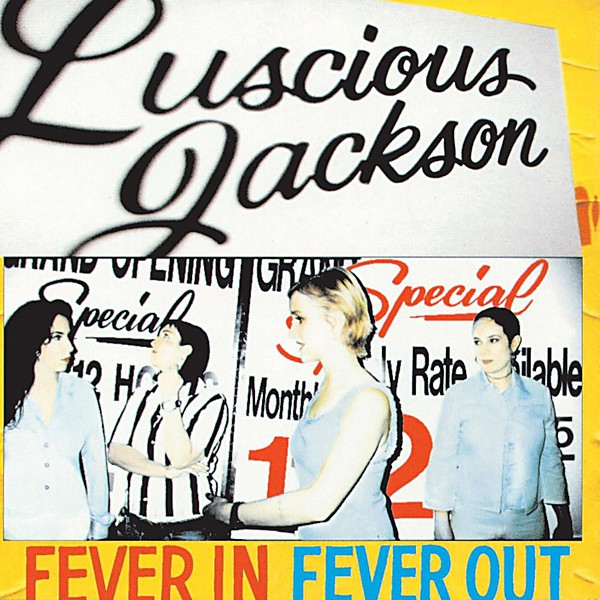

# Fever in Fever Out

By **Luscious Jackson**

## Album Data

- **Catalog:** Beets
- **Format:** Digital, Album
- **Album:** Fever in Fever Out
- **Artist:** Luscious Jackson
- **Albumartist:** Luscious Jackson
- **Genre:** Alternative Rock
- **MusicBrainz Album Artist ID:** [8be5d1de-e925-4e9f-b410-6d702cd8dcaa](https://musicbrainz.org/artist/8be5d1de-e925-4e9f-b410-6d702cd8dcaa)
- **MusicBrainz Album ID:** [c288339f-2f36-35fc-a9ab-9e5166845ef5](https://musicbrainz.org/release/c288339f-2f36-35fc-a9ab-9e5166845ef5)
- **MusicBrainz Release Group ID:** [6699ee3a-b3da-3f91-88ca-2caad58895da](https://musicbrainz.org/release-group/6699ee3a-b3da-3f91-88ca-2caad58895da)
- **Year:** 1996
- **Catalog #:** CDP 7243 8 28356 2 2
- **Label:** Grand Royal
- **Total Tracks:** 14

## Album Tracks

### Track 01 - Intro

- **Artist:** Luscious Jackson
- **Format:** MP3
- **Genre:** Funk
- **Length:** 0:05
- **MusicBrainz Track ID:** [49b7dfdd-a168-4155-8dbb-ff90c78d5afa](https://musicbrainz.org/recording/49b7dfdd-a168-4155-8dbb-ff90c78d5afa)
- **Title:** Intro
- **Track:** 01
- **Year:** 1994

### Track 02 - Citysong

- **Artist:** Luscious Jackson
- **Format:** MP3
- **Genre:** Indie Rock
- **Length:** 4:21
- **MusicBrainz Track ID:** [32d1ccf2-67c0-410f-9458-13af6a68007f](https://musicbrainz.org/recording/32d1ccf2-67c0-410f-9458-13af6a68007f)
- **Title:** Citysong
- **Track:** 02
- **Year:** 1994

### Track 03 - Deep Shag

- **Artist:** Luscious Jackson
- **Format:** MP3
- **Genre:** Indie Rock
- **Length:** 3:32
- **MusicBrainz Track ID:** [0ea47234-f7a4-4812-8512-118f6c303726](https://musicbrainz.org/recording/0ea47234-f7a4-4812-8512-118f6c303726)
- **Title:** Deep Shag
- **Track:** 03
- **Year:** 1994

### Track 04 - Angel

- **Artist:** Luscious Jackson
- **Format:** MP3
- **Genre:** Alternative Rock
- **Length:** 3:18
- **MusicBrainz Track ID:** [9e607b43-423d-4107-9afe-787dcbbdf0f1](https://musicbrainz.org/recording/9e607b43-423d-4107-9afe-787dcbbdf0f1)
- **Title:** Angel
- **Track:** 04
- **Year:** 1994

### Track 05 - Strongman

- **Artist:** Luscious Jackson
- **Format:** MP3
- **Genre:** Pop Rock
- **Length:** 4:21
- **MusicBrainz Track ID:** [9447bc45-31f3-4528-b3aa-a3f5baa20c2c](https://musicbrainz.org/recording/9447bc45-31f3-4528-b3aa-a3f5baa20c2c)
- **Title:** Strongman
- **Track:** 05
- **Year:** 1994

### Track 06 - Energy Sucker

- **Artist:** Luscious Jackson
- **Format:** MP3
- **Genre:** Rock
- **Length:** 3:33
- **MusicBrainz Track ID:** [dd7dbc38-836c-427b-8fb7-6b1d58322a81](https://musicbrainz.org/recording/dd7dbc38-836c-427b-8fb7-6b1d58322a81)
- **Title:** Energy Sucker
- **Track:** 06
- **Year:** 1994

### Track 07 - Here

- **Artist:** Luscious Jackson
- **Format:** MP3
- **Genre:** Pop Rock
- **Length:** 3:27
- **MusicBrainz Track ID:** [72a5bc89-bac0-435b-bfca-5f34169c4df0](https://musicbrainz.org/recording/72a5bc89-bac0-435b-bfca-5f34169c4df0)
- **Title:** Here
- **Track:** 07
- **Year:** 1994

### Track 08 - Intermission

- **Artist:** Luscious Jackson
- **Format:** MP3
- **Genre:** Funk
- **Length:** 0:11
- **MusicBrainz Track ID:** [51ff4727-29fb-410f-9021-4b61b53cf03d](https://musicbrainz.org/recording/51ff4727-29fb-410f-9021-4b61b53cf03d)
- **Title:** Intermission
- **Track:** 08
- **Year:** 1994

### Track 09 - Find Your Mind

- **Artist:** Luscious Jackson
- **Format:** MP3
- **Genre:** Indie Rock
- **Length:** 3:31
- **MusicBrainz Track ID:** [382455b8-6835-42bf-89aa-7014982aa2b5](https://musicbrainz.org/recording/382455b8-6835-42bf-89aa-7014982aa2b5)
- **Title:** Find Your Mind
- **Track:** 09
- **Year:** 1994

### Track 10 - Pelé Merengue

- **Artist:** Luscious Jackson
- **Format:** MP3
- **Genre:** Funk
- **Length:** 2:24
- **MusicBrainz Track ID:** [e6b104bd-6223-4c0f-b8fd-5068feca70c8](https://musicbrainz.org/recording/e6b104bd-6223-4c0f-b8fd-5068feca70c8)
- **Title:** Pelé Merengue
- **Track:** 10
- **Year:** 1994

### Track 11 - Rock Freak

- **Artist:** Luscious Jackson
- **Format:** MP3
- **Genre:** Indie Rock
- **Length:** 3:53
- **MusicBrainz Track ID:** [e1e77c05-6717-48e9-a605-9f958ccd5dc1](https://musicbrainz.org/recording/e1e77c05-6717-48e9-a605-9f958ccd5dc1)
- **Title:** Rock Freak
- **Track:** 11
- **Year:** 1994

### Track 12 - Rollin'

- **Artist:** Luscious Jackson
- **Format:** MP3
- **Genre:** Rock
- **Length:** 4:14
- **MusicBrainz Track ID:** [7302eb4f-9661-422d-b937-873224153ff8](https://musicbrainz.org/recording/7302eb4f-9661-422d-b937-873224153ff8)
- **Title:** Rollin'
- **Track:** 12
- **Year:** 1994

### Track 13 - Surprise

- **Artist:** Luscious Jackson
- **Format:** MP3
- **Genre:** Pop Rock
- **Length:** 2:46
- **MusicBrainz Track ID:** [bee2f959-1ab8-4544-8048-f8d9714707bd](https://musicbrainz.org/recording/bee2f959-1ab8-4544-8048-f8d9714707bd)
- **Title:** Surprise
- **Track:** 13
- **Year:** 1994

### Track 14 - LP Retreat

- **Artist:** Luscious Jackson
- **Format:** MP3
- **Genre:** Indie Rock
- **Length:** 5:29
- **MusicBrainz Track ID:** [3c3c1921-5179-455b-8390-d4b36880e3ba](https://musicbrainz.org/recording/3c3c1921-5179-455b-8390-d4b36880e3ba)
- **Title:** LP Retreat
- **Track:** 14
- **Year:** 1994

## See also

- [Electric Honey](Electric_Honey.md)
- [Natural Ingredients](Natural_Ingredients.md)
