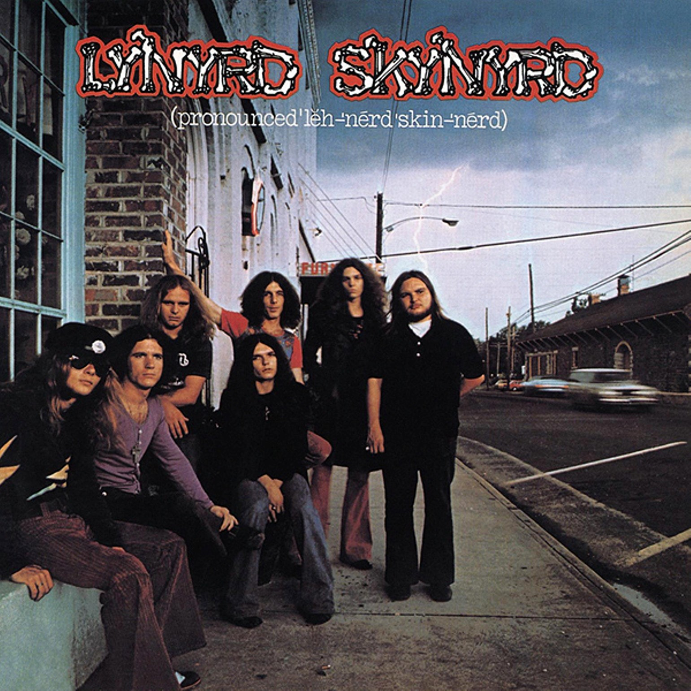

# (pronounced ’lĕh‐’nérd ’skin‐’nérd)

By **Lynyrd Skynyrd**

## Album Data

- **Catalog:** Beets
- **Format:** Digital, Album
- **Album:** (pronounced ’lĕh‐’nérd ’skin‐’nérd)
- **Artist:** Lynyrd Skynyrd
- **Albumartist:** Lynyrd Skynyrd
- **Genre:** Southern Rock
- **MusicBrainz Album Artist ID:** [c544ed4d-2390-4442-a83e-1ea2883b09c8](https://musicbrainz.org/artist/c544ed4d-2390-4442-a83e-1ea2883b09c8)
- **MusicBrainz Album ID:** [e0cb93a7-501b-39b8-bfb3-0667483a7c1d](https://musicbrainz.org/release/e0cb93a7-501b-39b8-bfb3-0667483a7c1d)
- **MusicBrainz Release Group ID:** [33446893-8c9f-30b6-aa73-d719df371430](https://musicbrainz.org/release-group/33446893-8c9f-30b6-aa73-d719df371430)
- **Year:** 1996
- **Catalog #:** 
- **Label:** Geffen Records
- **Total Tracks:** 14

## Album Tracks

### Track 01 - Sweet Home Alabama

- **Artist:** Lynyrd Skynyrd
- **Format:** ALAC
- **Genre:** Southern Rock
- **Length:** 4:45
- **MusicBrainz Track ID:** [2b2f23a7-3ee0-4fc0-991c-c0e327ffbb1e](https://musicbrainz.org/recording/2b2f23a7-3ee0-4fc0-991c-c0e327ffbb1e)
- **Title:** Sweet Home Alabama
- **Track:** 01
- **Year:** 2009

### Track 02 - Gimme Three Steps

- **Artist:** Lynyrd Skynyrd
- **Format:** ALAC
- **Genre:** Southern Rock
- **Length:** 4:31
- **MusicBrainz Track ID:** [55e1f721-a1e7-41b4-be27-5392bf9cc8f1](https://musicbrainz.org/recording/55e1f721-a1e7-41b4-be27-5392bf9cc8f1)
- **Title:** Gimme Three Steps
- **Track:** 02
- **Year:** 2009

### Track 03 - Simple Man

- **Artist:** Lynyrd Skynyrd
- **Format:** ALAC
- **Genre:** Southern Rock
- **Length:** 5:58
- **MusicBrainz Track ID:** [588d1f08-5ac3-47ff-ae31-ec601b2274c4](https://musicbrainz.org/recording/588d1f08-5ac3-47ff-ae31-ec601b2274c4)
- **Title:** Simple Man
- **Track:** 03
- **Year:** 2009

### Track 04 - Saturday Night Special

- **Artist:** Lynyrd Skynyrd
- **Format:** ALAC
- **Genre:** Southern Rock
- **Length:** 5:11
- **MusicBrainz Track ID:** [1bafa204-0d5f-431f-be9d-9d33920e1539](https://musicbrainz.org/recording/1bafa204-0d5f-431f-be9d-9d33920e1539)
- **Title:** Saturday Night Special
- **Track:** 04
- **Year:** 2009

### Track 05 - Swamp Music

- **Artist:** Lynyrd Skynyrd
- **Format:** ALAC
- **Genre:** Southern Rock
- **Length:** 3:32
- **MusicBrainz Track ID:** [445e244e-bd16-4929-8528-5944fc6d4d25](https://musicbrainz.org/recording/445e244e-bd16-4929-8528-5944fc6d4d25)
- **Title:** Swamp Music
- **Track:** 05
- **Year:** 2009

### Track 06 - The Ballad of Curtis Loew

- **Artist:** Lynyrd Skynyrd
- **Format:** ALAC
- **Genre:** Southern Rock
- **Length:** 4:52
- **MusicBrainz Track ID:** [b8d52e27-a7c8-48ff-8981-717deff58afb](https://musicbrainz.org/recording/b8d52e27-a7c8-48ff-8981-717deff58afb)
- **Title:** The Ballad of Curtis Loew
- **Track:** 06
- **Year:** 2009

### Track 07 - Call Me the Breeze

- **Artist:** Lynyrd Skynyrd
- **Format:** ALAC
- **Genre:** Southern Rock
- **Length:** 5:09
- **MusicBrainz Track ID:** [8c08aca5-cbc9-4fc6-a42f-7a635b5739d9](https://musicbrainz.org/recording/8c08aca5-cbc9-4fc6-a42f-7a635b5739d9)
- **Title:** Call Me the Breeze
- **Track:** 07
- **Year:** 2009

### Track 08 - Comin’ Home

- **Artist:** Lynyrd Skynyrd
- **Format:** ALAC
- **Genre:** Uk Garage
- **Length:** 5:32
- **MusicBrainz Track ID:** [0cbf3d7c-cb2b-4e4a-b827-8bc24479a71c](https://musicbrainz.org/recording/0cbf3d7c-cb2b-4e4a-b827-8bc24479a71c)
- **Title:** Comin’ Home
- **Track:** 08
- **Year:** 2009

### Track 09 - Gimme Back My Bullets

- **Artist:** Lynyrd Skynyrd
- **Format:** ALAC
- **Genre:** Southern Rock
- **Length:** 3:30
- **MusicBrainz Track ID:** [bc301167-30ca-415c-9e12-9c00688cd90e](https://musicbrainz.org/recording/bc301167-30ca-415c-9e12-9c00688cd90e)
- **Title:** Gimme Back My Bullets
- **Track:** 09
- **Year:** 2009

### Track 10 - What’s Your Name

- **Artist:** Lynyrd Skynyrd
- **Format:** ALAC
- **Genre:** Uk Garage
- **Length:** 3:33
- **MusicBrainz Track ID:** [c01eed85-b0af-47ce-8c4e-ec1ba068dad9](https://musicbrainz.org/recording/c01eed85-b0af-47ce-8c4e-ec1ba068dad9)
- **Title:** What’s Your Name
- **Track:** 10
- **Year:** 2009

### Track 11 - You Got That Right

- **Artist:** Lynyrd Skynyrd
- **Format:** ALAC
- **Genre:** Southern Rock
- **Length:** 3:47
- **MusicBrainz Track ID:** [9a8f1df1-667b-4e24-9fcc-d2e6e7b0bbce](https://musicbrainz.org/recording/9a8f1df1-667b-4e24-9fcc-d2e6e7b0bbce)
- **Title:** You Got That Right
- **Track:** 11
- **Year:** 2009

### Track 12 - All I Can Do Is Write About It

- **Artist:** Lynyrd Skynyrd
- **Format:** ALAC
- **Genre:** Southern Rock
- **Length:** 4:24
- **MusicBrainz Track ID:** [4fa01cf8-2850-4c36-829d-08a8b7bb6545](https://musicbrainz.org/recording/4fa01cf8-2850-4c36-829d-08a8b7bb6545)
- **Title:** All I Can Do Is Write About It
- **Track:** 12
- **Year:** 2009

### Track 13 - That Smell

- **Artist:** Lynyrd Skynyrd
- **Format:** ALAC
- **Genre:** Southern Rock
- **Length:** 5:49
- **MusicBrainz Track ID:** [c4528479-e870-4fed-bea9-b9653368bdc4](https://musicbrainz.org/recording/c4528479-e870-4fed-bea9-b9653368bdc4)
- **Title:** That Smell
- **Track:** 13
- **Year:** 2009

### Track 14 - Free Bird (live at the Fox Theater/1976)

- **Artist:** Lynyrd Skynyrd
- **Format:** ALAC
- **Genre:** Uk Garage
- **Length:** 14:23
- **MusicBrainz Track ID:** [75d58d9a-6d18-43cd-8d8e-69b40d4621a5](https://musicbrainz.org/recording/75d58d9a-6d18-43cd-8d8e-69b40d4621a5)
- **Title:** Free Bird (live at the Fox Theater/1976)
- **Track:** 14
- **Year:** 2009

## See also

- [All Time Greatest Hits](All_Time_Greatest_Hits.md)
- [Roon: (Pronounced 'Lĕh-'nérd 'Skin-'nérd)](../../Roon/Lynyrd_Skynyrd/Pronounced_Lĕh-nérd_Skin-nérd.md)
- [Vinyl: ](../../Vinyl/Lynyrd_Skynyrd/Lynyrd_Skynyrd.md)
- [Vinyl: One More For The Fans](../../Vinyl/Lynyrd_Skynyrd/One_More_For_The_Fans.md)
- [Vinyl: (Pronounced 'Lĕh-'nérd 'Skin-'nérd)](../../Vinyl/Lynyrd_Skynyrd/Pronounced_Lĕh-nérd_Skin-nérd.md)
