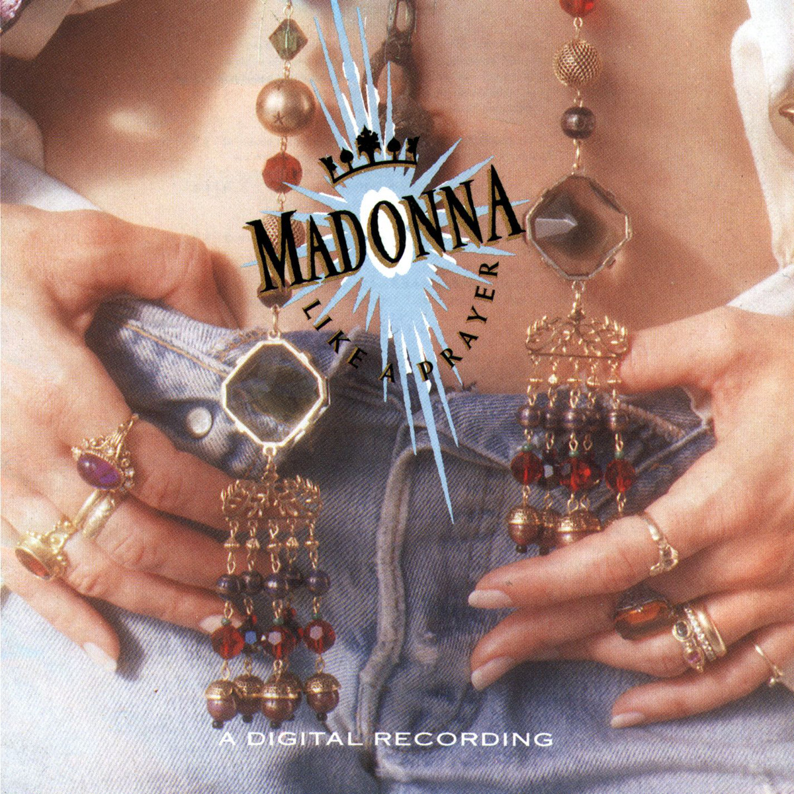

# Like a Prayer

By **Madonna**

## Album Data

- **Catalog:** Beets
- **Format:** Digital, Album
- **Album:** Like a Prayer
- **Artist:** Madonna
- **Albumartist:** Madonna
- **Genre:** Pop
- **MusicBrainz Album Artist ID:** [79239441-bfd5-4981-a70c-55c3f15c1287](https://musicbrainz.org/artist/79239441-bfd5-4981-a70c-55c3f15c1287)
- **MusicBrainz Album ID:** [c611aa09-a713-47c3-a4a3-896c6902341e](https://musicbrainz.org/release/c611aa09-a713-47c3-a4a3-896c6902341e)
- **MusicBrainz Release Group ID:** [1f75a8df-176c-3d23-8f1f-b0c8935682ec](https://musicbrainz.org/release-group/1f75a8df-176c-3d23-8f1f-b0c8935682ec)
- **Year:** 1989
- **Catalog #:** 9362-47902-2
- **Label:** Warner Bros. Records
- **Total Tracks:** 11

## Album Tracks

### Track 01 - Papa Don’t Preach

- **Artist:** Madonna
- **Format:** MP3
- **Genre:** Pop
- **Length:** 5:45
- **MusicBrainz Track ID:** [cc63a878-8663-41ea-884e-873625b6af68](https://musicbrainz.org/recording/cc63a878-8663-41ea-884e-873625b6af68)
- **Title:** Papa Don’t Preach
- **Track:** 01
- **Year:** 2001

### Track 02 - Open Your Heart

- **Artist:** Madonna
- **Format:** MP3
- **Genre:** Pop
- **Length:** 4:13
- **MusicBrainz Track ID:** [8817ed4d-e7f4-42d0-b540-49663d87343b](https://musicbrainz.org/recording/8817ed4d-e7f4-42d0-b540-49663d87343b)
- **Title:** Open Your Heart
- **Track:** 02
- **Year:** 2001

### Track 03 - White Heat

- **Artist:** Madonna
- **Format:** MP3
- **Genre:** Pop
- **Length:** 4:41
- **MusicBrainz Track ID:** [02bffafa-ab07-4fb0-9e89-70acb7dfccc7](https://musicbrainz.org/recording/02bffafa-ab07-4fb0-9e89-70acb7dfccc7)
- **Title:** White Heat
- **Track:** 03
- **Year:** 2001

### Track 04 - Live to Tell

- **Artist:** Madonna
- **Format:** MP3
- **Genre:** Pop
- **Length:** 5:53
- **MusicBrainz Track ID:** [e15ba4ea-7c42-49a3-8bc3-67f77a4b42d0](https://musicbrainz.org/recording/e15ba4ea-7c42-49a3-8bc3-67f77a4b42d0)
- **Title:** Live to Tell
- **Track:** 04
- **Year:** 2001

### Track 05 - Where’s the Party

- **Artist:** Madonna
- **Format:** MP3
- **Genre:** Pop
- **Length:** 4:20
- **MusicBrainz Track ID:** [dbad0011-d14c-4f9e-ae40-bb0c7ff9c189](https://musicbrainz.org/recording/dbad0011-d14c-4f9e-ae40-bb0c7ff9c189)
- **Title:** Where’s the Party
- **Track:** 05
- **Year:** 2001

### Track 06 - True Blue

- **Artist:** Madonna
- **Format:** MP3
- **Genre:** Pop
- **Length:** 4:18
- **MusicBrainz Track ID:** [a08faba0-a5a4-40bf-913b-cb8a8e2e27fd](https://musicbrainz.org/recording/a08faba0-a5a4-40bf-913b-cb8a8e2e27fd)
- **Title:** True Blue
- **Track:** 06
- **Year:** 2001

### Track 07 - La isla bonita

- **Artist:** Madonna
- **Format:** MP3
- **Genre:** Pop
- **Length:** 4:02
- **MusicBrainz Track ID:** [e651d138-8dc3-4bcd-8dca-c46c3c8e745b](https://musicbrainz.org/recording/e651d138-8dc3-4bcd-8dca-c46c3c8e745b)
- **Title:** La isla bonita
- **Track:** 07
- **Year:** 2001

### Track 08 - Jimmy Jimmy

- **Artist:** Madonna
- **Format:** MP3
- **Genre:** Pop
- **Length:** 3:56
- **MusicBrainz Track ID:** [b20d7a2d-44d9-4e37-839b-325b50c784ff](https://musicbrainz.org/recording/b20d7a2d-44d9-4e37-839b-325b50c784ff)
- **Title:** Jimmy Jimmy
- **Track:** 08
- **Year:** 2001

### Track 09 - Love Makes the World Go Round

- **Artist:** Madonna
- **Format:** MP3
- **Genre:** Pop
- **Length:** 4:31
- **MusicBrainz Track ID:** [837bb8b0-a9a3-4f17-b18e-7b0845c21463](https://musicbrainz.org/recording/837bb8b0-a9a3-4f17-b18e-7b0845c21463)
- **Title:** Love Makes the World Go Round
- **Track:** 09
- **Year:** 2001

### Track 10 - True Blue (The Color mix)

- **Artist:** Madonna
- **Format:** MP3
- **Genre:** Pop Rock
- **Length:** 6:40
- **MusicBrainz Track ID:** [7f11e5ba-cec2-4e4f-9d98-b3ea5c3bcad3](https://musicbrainz.org/recording/7f11e5ba-cec2-4e4f-9d98-b3ea5c3bcad3)
- **Title:** True Blue (The Color mix)
- **Track:** 10
- **Year:** 2001

### Track 11 - La isla bonita (extended remix)

- **Artist:** Madonna
- **Format:** MP3
- **Genre:** Pop Rock
- **Length:** 5:26
- **MusicBrainz Track ID:** [e52c7ea5-1f07-4624-b1ae-e2f73b29a02b](https://musicbrainz.org/recording/e52c7ea5-1f07-4624-b1ae-e2f73b29a02b)
- **Title:** La isla bonita (extended remix)
- **Track:** 11
- **Year:** 2001

## See also

- [True Blue](True_Blue.md)
- [Roon: Like A Prayer (30th Anniversary)](../../Roon/Madonna/Like_A_Prayer_30th_Anniversary.md)
- [Roon: Ray of Light (U.S. Version)](../../Roon/Madonna/Ray_of_Light_US_Version.md)
- [Roon: True Blue (Hi-Res Version)](../../Roon/Madonna/True_Blue_Hi-Res_Version.md)
- [Vinyl: Like A Prayer](../../Vinyl/Madonna/Like_A_Prayer.md)
- [Vinyl: Like A Virgin](../../Vinyl/Madonna/Like_A_Virgin.md)
- [Vinyl: ](../../Vinyl/Madonna/Madonna.md)
- [Vinyl: True Blue](../../Vinyl/Madonna/True_Blue.md)
