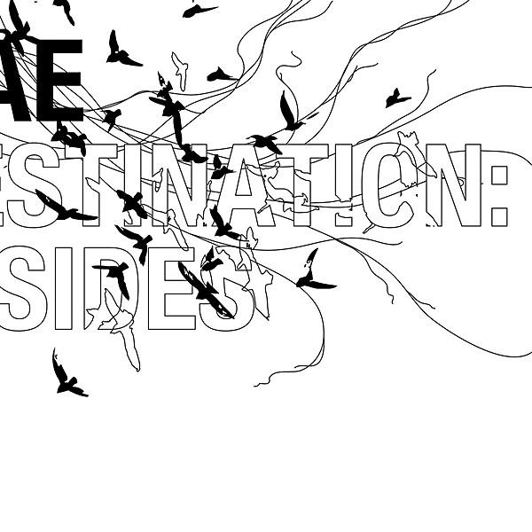

# Destination

By **Mae**

## Album Data

- **Catalog:** Beets
- **Format:** Digital, Album
- **Album:** Destination
- **Artist:** Mae
- **Albumartist:** Mae
- **Genre:** Emo
- **MusicBrainz Album Artist ID:** 
- **MusicBrainz Album ID:** 
- **MusicBrainz Release Group ID:** 
- **Year:** 2004
- **Catalog #:** 
- **Label:** 
- **Total Tracks:** 11

## Album Tracks

### Track 04 - Tisbury Lane

- **Artist:** Mae
- **Format:** AAC
- **Genre:** Emo
- **Length:** 5:45
- **MusicBrainz Track ID:** 
- **Title:** Tisbury Lane
- **Track:** 04
- **Year:** 2004

