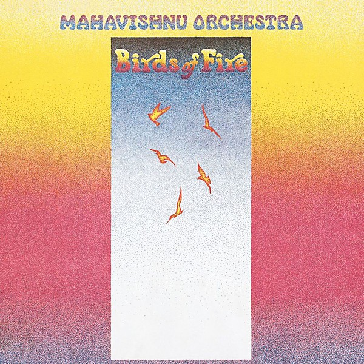

# Birds of Fire

By **Mahavishnu Orchestra**

## Album Data

- **Catalog:** Beets
- **Format:** Digital, Album
- **Album:** Birds of Fire
- **Artist:** Mahavishnu Orchestra
- **Albumartist:** Mahavishnu Orchestra
- **Genre:** Progressive Rock
- **MusicBrainz Album Artist ID:** [a2be74f5-0735-46f7-a295-7e41aab30029](https://musicbrainz.org/artist/a2be74f5-0735-46f7-a295-7e41aab30029)
- **MusicBrainz Album ID:** [78cf08c1-af1c-3e28-8ea7-33b769f1a418](https://musicbrainz.org/release/78cf08c1-af1c-3e28-8ea7-33b769f1a418)
- **MusicBrainz Release Group ID:** [c06d6702-eacb-324b-b9fd-d19c8331e178](https://musicbrainz.org/release-group/c06d6702-eacb-324b-b9fd-d19c8331e178)
- **Year:** 2000
- **Catalog #:** CK 46867
- **Label:** Columbia
- **Total Tracks:** 13

## Album Tracks

### Track 01 - Eternity’s Breath, Part 1

- **Artist:** Mahavishnu Orchestra
- **Format:** MP3
- **Genre:** Progressive Rock
- **Length:** 3:13
- **MusicBrainz Track ID:** [f3bcde67-4471-489e-a9fc-bd120382d0a8](https://musicbrainz.org/recording/f3bcde67-4471-489e-a9fc-bd120382d0a8)
- **Title:** Eternity’s Breath, Part 1
- **Track:** 01
- **Year:** 1991

### Track 02 - Eternity’s Breath, Part 2

- **Artist:** Mahavishnu Orchestra
- **Format:** MP3
- **Genre:** Progressive Rock
- **Length:** 4:38
- **MusicBrainz Track ID:** [0161a59d-ca92-4cb8-a1bf-a647a781a075](https://musicbrainz.org/recording/0161a59d-ca92-4cb8-a1bf-a647a781a075)
- **Title:** Eternity’s Breath, Part 2
- **Track:** 02
- **Year:** 1991

### Track 03 - Lila’s Dance

- **Artist:** Mahavishnu Orchestra
- **Format:** MP3
- **Genre:** Progressive Rock
- **Length:** 5:32
- **MusicBrainz Track ID:** [b01b3e7f-4e4d-470c-a270-075035ea7208](https://musicbrainz.org/recording/b01b3e7f-4e4d-470c-a270-075035ea7208)
- **Title:** Lila’s Dance
- **Track:** 03
- **Year:** 1991

### Track 04 - Can’t Stand Your Funk

- **Artist:** Mahavishnu Orchestra
- **Format:** MP3
- **Genre:** Progressive Rock
- **Length:** 2:11
- **MusicBrainz Track ID:** [a854e53f-b10c-441a-83e8-28c615297862](https://musicbrainz.org/recording/a854e53f-b10c-441a-83e8-28c615297862)
- **Title:** Can’t Stand Your Funk
- **Track:** 04
- **Year:** 1991

### Track 05 - Pastoral

- **Artist:** Mahavishnu Orchestra
- **Format:** MP3
- **Genre:** Progressive Rock
- **Length:** 3:35
- **MusicBrainz Track ID:** [9e71e582-074c-4bf9-95aa-3df5a406bb6f](https://musicbrainz.org/recording/9e71e582-074c-4bf9-95aa-3df5a406bb6f)
- **Title:** Pastoral
- **Track:** 05
- **Year:** 1991

### Track 06 - Faith

- **Artist:** Mahavishnu Orchestra
- **Format:** MP3
- **Genre:** Progressive Rock
- **Length:** 1:54
- **MusicBrainz Track ID:** [39967a80-cc9e-40a0-96ca-d3ce0b830253](https://musicbrainz.org/recording/39967a80-cc9e-40a0-96ca-d3ce0b830253)
- **Title:** Faith
- **Track:** 06
- **Year:** 1991

### Track 07 - Cosmic Strut

- **Artist:** Mahavishnu Orchestra
- **Format:** MP3
- **Genre:** Uk Garage
- **Length:** 3:26
- **MusicBrainz Track ID:** [df05a73f-746e-439c-9b43-fe2915b56ec2](https://musicbrainz.org/recording/df05a73f-746e-439c-9b43-fe2915b56ec2)
- **Title:** Cosmic Strut
- **Track:** 07
- **Year:** 1991

### Track 08 - If I Could See

- **Artist:** Mahavishnu Orchestra
- **Format:** MP3
- **Genre:** Progressive Rock
- **Length:** 4:44
- **MusicBrainz Track ID:** [0a45c7c5-291c-4e89-a0c2-1b6fb96bd1d4](https://musicbrainz.org/recording/0a45c7c5-291c-4e89-a0c2-1b6fb96bd1d4)
- **Title:** If I Could See
- **Track:** 08
- **Year:** 1991

### Track 10 - Earth Ship

- **Artist:** Mahavishnu Orchestra
- **Format:** MP3
- **Genre:** Progressive Rock
- **Length:** 3:42
- **MusicBrainz Track ID:** [e5f77bc7-ceaf-418a-8049-ebd1c83bab3e](https://musicbrainz.org/recording/e5f77bc7-ceaf-418a-8049-ebd1c83bab3e)
- **Title:** Earth Ship
- **Track:** 10
- **Year:** 1991

### Track 11 - Pegasus

- **Artist:** Mahavishnu Orchestra
- **Format:** MP3
- **Genre:** Progressive Rock
- **Length:** 1:46
- **MusicBrainz Track ID:** [cde409e9-d089-4e83-b110-07dcfba46476](https://musicbrainz.org/recording/cde409e9-d089-4e83-b110-07dcfba46476)
- **Title:** Pegasus
- **Track:** 11
- **Year:** 1991

### Track 12 - Opus 1

- **Artist:** Mahavishnu Orchestra
- **Format:** MP3
- **Genre:** Jazz Fusion
- **Length:** 0:17
- **MusicBrainz Track ID:** [05842328-756a-4647-85e1-b8414e16ebde](https://musicbrainz.org/recording/05842328-756a-4647-85e1-b8414e16ebde)
- **Title:** Opus 1
- **Track:** 12
- **Year:** 1991

### Track 13 - On the Way Home to Earth

- **Artist:** Mahavishnu Orchestra
- **Format:** MP3
- **Genre:** Progressive Rock
- **Length:** 4:44
- **MusicBrainz Track ID:** [b8dbb73e-8d18-4e91-a233-913cfdda314f](https://musicbrainz.org/recording/b8dbb73e-8d18-4e91-a233-913cfdda314f)
- **Title:** On the Way Home to Earth
- **Track:** 13
- **Year:** 1991

## See also

- [Visions of the Emerald Beyond](Visions_of_the_Emerald_Beyond.md)
