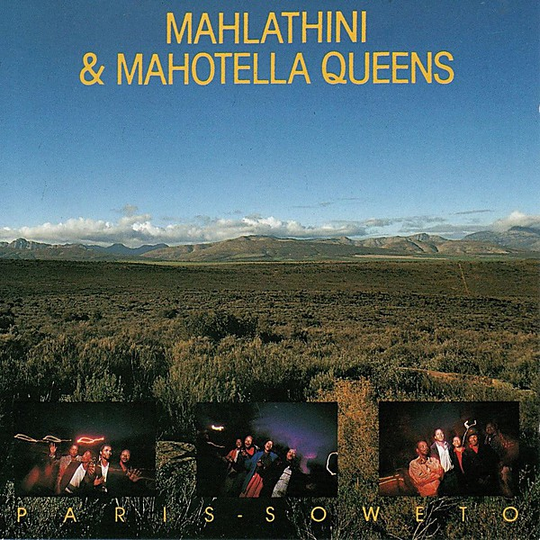

# Paris - Soweto

By **Mahlathini and the Mahotella Queens**

## Album Data

- **Catalog:** Beets
- **Format:** Digital, Album
- **Album:** Paris - Soweto
- **Artist:** Mahlathini And The Mahotella Queens
- **Albumartist:** Mahlathini and the Mahotella Queens
- **Genre:** Mbaqanga
- **MusicBrainz Album Artist ID:** [7a63191f-6d03-4b91-ae21-86dac044bec8](https://musicbrainz.org/artist/7a63191f-6d03-4b91-ae21-86dac044bec8)
- **MusicBrainz Album ID:** [638e816b-adff-48f6-acd3-a8f4c14fcf9b](https://musicbrainz.org/release/638e816b-adff-48f6-acd3-a8f4c14fcf9b)
- **MusicBrainz Release Group ID:** [321eb9fd-72b8-3c11-8e8b-2f32a2fb8ec6](https://musicbrainz.org/release-group/321eb9fd-72b8-3c11-8e8b-2f32a2fb8ec6)
- **Year:** 1989
- **Catalog #:** 839 676-2
- **Label:** Polydor
- **Total Tracks:** 10

## Album Tracks

### Track 01 - Kazet

- **Artist:** Mahlathini and the Mahotella Queens
- **Format:** ALAC
- **Genre:** Mbaqanga
- **Length:** 5:37
- **MusicBrainz Track ID:** [0b8a7a70-5b7f-491b-9cd7-b71ebe58b82a](https://musicbrainz.org/recording/0b8a7a70-5b7f-491b-9cd7-b71ebe58b82a)
- **Title:** Kazet
- **Track:** 01
- **Year:** 1989

### Track 02 - Awuthule Kancane

- **Artist:** Mahlathini and the Mahotella Queens
- **Format:** ALAC
- **Genre:** Mbaqanga
- **Length:** 5:47
- **MusicBrainz Track ID:** [87305afa-d581-4133-a6cb-0b3be9c4f557](https://musicbrainz.org/recording/87305afa-d581-4133-a6cb-0b3be9c4f557)
- **Title:** Awuthule Kancane
- **Track:** 02
- **Year:** 1989

### Track 03 - Thuntshwane Basadi

- **Artist:** Mahlathini and the Mahotella Queens
- **Format:** ALAC
- **Genre:** Mbaqanga
- **Length:** 4:41
- **MusicBrainz Track ID:** [561fea50-fe8c-4cae-b8c6-6e958a6590e8](https://musicbrainz.org/recording/561fea50-fe8c-4cae-b8c6-6e958a6590e8)
- **Title:** Thuntshwane Basadi
- **Track:** 03
- **Year:** 1989

### Track 04 - Safa Indlada

- **Artist:** Mahlathini and the Mahotella Queens
- **Format:** ALAC
- **Genre:** Mbaqanga
- **Length:** 4:32
- **MusicBrainz Track ID:** [3806ae2a-72d2-4149-97b7-131dfa7042f3](https://musicbrainz.org/recording/3806ae2a-72d2-4149-97b7-131dfa7042f3)
- **Title:** Safa Indlada
- **Track:** 04
- **Year:** 1989

### Track 05 - Yebo! (Mbaqanga Mix)

- **Artist:** Mahlathini and the Mahotella Queens
- **Format:** ALAC
- **Genre:** Mbaqanga
- **Length:** 7:11
- **MusicBrainz Track ID:** [9fac4cd8-ea34-44c5-ae49-9194e6a70eb5](https://musicbrainz.org/recording/9fac4cd8-ea34-44c5-ae49-9194e6a70eb5)
- **Title:** Yebo! (Mbaqanga Mix)
- **Track:** 05
- **Year:** 1989

### Track 06 - Melodi Ya Lla

- **Artist:** Mahlathini and the Mahotella Queens
- **Format:** ALAC
- **Genre:** Mbaqanga
- **Length:** 5:39
- **MusicBrainz Track ID:** [4060fe81-aa20-4acc-95fa-2ce9bb9be73b](https://musicbrainz.org/recording/4060fe81-aa20-4acc-95fa-2ce9bb9be73b)
- **Title:** Melodi Ya Lla
- **Track:** 06
- **Year:** 1989

### Track 07 - Re Ya Dumedisa

- **Artist:** Mahlathini and the Mahotella Queens
- **Format:** ALAC
- **Genre:** Mbaqanga
- **Length:** 4:03
- **MusicBrainz Track ID:** [cf09b8a7-142c-4061-87dd-7eeacc67c8b7](https://musicbrainz.org/recording/cf09b8a7-142c-4061-87dd-7eeacc67c8b7)
- **Title:** Re Ya Dumedisa
- **Track:** 07
- **Year:** 1989

### Track 08 - Ukhulum' Izindaba

- **Artist:** Mahlathini and the Mahotella Queens
- **Format:** ALAC
- **Genre:** Mbaqanga
- **Length:** 4:37
- **MusicBrainz Track ID:** [4bab7df0-fc88-4fb9-977a-383aeb4d07ca](https://musicbrainz.org/recording/4bab7df0-fc88-4fb9-977a-383aeb4d07ca)
- **Title:** Ukhulum' Izindaba
- **Track:** 08
- **Year:** 1989

### Track 09 - Stokfel Jive

- **Artist:** Mahlathini and the Mahotella Queens
- **Format:** ALAC
- **Genre:** Mbaqanga
- **Length:** 4:59
- **MusicBrainz Track ID:** [734b24ad-fc77-4982-92b4-21f3f4888042](https://musicbrainz.org/recording/734b24ad-fc77-4982-92b4-21f3f4888042)
- **Title:** Stokfel Jive
- **Track:** 09
- **Year:** 1989

### Track 10 - Kazet (Dance Remix)

- **Artist:** Mahlathini and the Mahotella Queens
- **Format:** ALAC
- **Genre:** Mbaqanga
- **Length:** 5:35
- **MusicBrainz Track ID:** [2875a051-a568-4131-8343-25c559b9a0a2](https://musicbrainz.org/recording/2875a051-a568-4131-8343-25c559b9a0a2)
- **Title:** Kazet (Dance Remix)
- **Track:** 10
- **Year:** 1989

