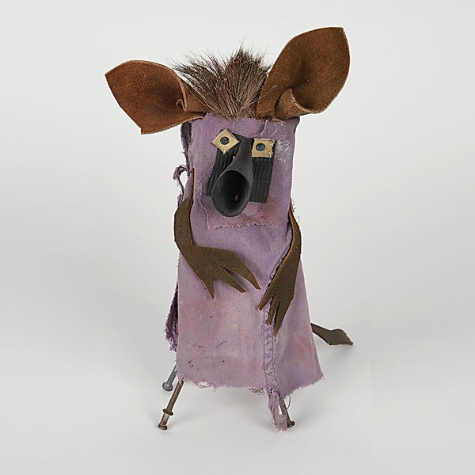

# Life Fantastic

By **Man Man**

## Album Data

- **Catalog:** Beets
- **Format:** Digital, Album
- **Album:** Life Fantastic
- **Artist:** Man Man
- **Albumartist:** Man Man
- **Genre:** Indie Rock
- **MusicBrainz Album Artist ID:** [https](https://musicbrainz.org/artist/https)
- **MusicBrainz Album ID:** [https](https://musicbrainz.org/release/https)
- **MusicBrainz Release Group ID:** 
- **Year:** 2011
- **Catalog #:** ACE 025
- **Label:** Ace Fu Records
- **Total Tracks:** 03

## Album Tracks

### Track 01 - Monster

- **Artist:** Man Man
- **Format:** AAC
- **Genre:** Post-Rock
- **Length:** 2:53
- **MusicBrainz Track ID:** [367e5fcb-0174-4660-8d44-2f2f089e74c8](https://musicbrainz.org/recording/367e5fcb-0174-4660-8d44-2f2f089e74c8)
- **Title:** Monster
- **Track:** 01
- **Year:** 2004

### Track 02 - 10lb Moustache

- **Artist:** Man Man
- **Format:** AAC
- **Genre:** Indie Pop
- **Length:** 3:38
- **MusicBrainz Track ID:** [badd194f-e5e5-4dda-b555-122c51f9973f](https://musicbrainz.org/recording/badd194f-e5e5-4dda-b555-122c51f9973f)
- **Title:** 10lb Moustache
- **Track:** 02
- **Year:** 2004

### Track 03 - Zebra

- **Artist:** Man Man
- **Format:** AAC
- **Genre:** Rock
- **Length:** 4:07
- **MusicBrainz Track ID:** [67736ec5-0901-4fa6-8d32-cbf96f9c41e6](https://musicbrainz.org/recording/67736ec5-0901-4fa6-8d32-cbf96f9c41e6)
- **Title:** Zebra
- **Track:** 03
- **Year:** 2004

## See also

- [Man Man](Man_Man.md)
- [On Oni Pond](On_Oni_Pond.md)
- [Rabbit Habits](Rabbit_Habits.md)
- [Six Demon Bag](Six_Demon_Bag.md)
- [Roon: Life Fantastic (Deluxe Edition)](../../Roon/Man_Man/Life_Fantastic_Deluxe_Edition.md)
- [Roon: Rabbit Habits](../../Roon/Man_Man/Rabbit_Habits.md)
