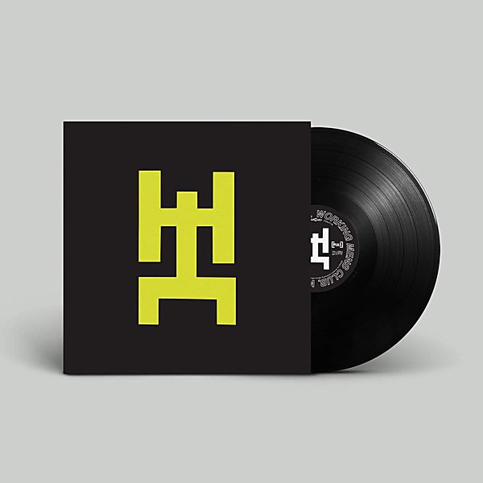

# Man Man

By **Man Man**

## Album Data

- **Catalog:** Beets
- **Format:** Digital, Album
- **Album:** Man Man
- **Artist:** Man Man
- **Albumartist:** Man Man
- **Genre:** Post-Rock
- **MusicBrainz Album Artist ID:** [4e210d41-b3e3-4e34-8c3b-3b8cc2116562](https://musicbrainz.org/artist/4e210d41-b3e3-4e34-8c3b-3b8cc2116562)
- **MusicBrainz Album ID:** [3685556f-2a68-4985-8b35-6dafd3a75038](https://musicbrainz.org/release/3685556f-2a68-4985-8b35-6dafd3a75038)
- **MusicBrainz Release Group ID:** [b6f48352-43dc-3c06-8938-9d8ea368b46e](https://musicbrainz.org/release-group/b6f48352-43dc-3c06-8938-9d8ea368b46e)
- **Year:** 2004
- **Catalog #:** 
- **Label:** Anti‐
- **Total Tracks:** 13

## Album Tracks

### Track 01 - Oni Swan

- **Artist:** Man Man
- **Format:** AAC
- **Genre:** Indie Rock
- **Length:** 0:39
- **MusicBrainz Track ID:** [94d02425-2695-4ac8-bcd1-efa972427369](https://musicbrainz.org/recording/94d02425-2695-4ac8-bcd1-efa972427369)
- **Title:** Oni Swan
- **Track:** 01
- **Year:** 2013

### Track 02 - Pink Wonton

- **Artist:** Man Man
- **Format:** AAC
- **Genre:** Indie Rock
- **Length:** 3:19
- **MusicBrainz Track ID:** [3c9a5d11-12ee-4abf-af41-5b5006c6c058](https://musicbrainz.org/recording/3c9a5d11-12ee-4abf-af41-5b5006c6c058)
- **Title:** Pink Wonton
- **Track:** 02
- **Year:** 2013

### Track 03 - End Boss

- **Artist:** Man Man
- **Format:** AAC
- **Genre:** Indie Rock
- **Length:** 4:12
- **MusicBrainz Track ID:** [f47ee8b5-667c-46e6-bed3-2a2c00933196](https://musicbrainz.org/recording/f47ee8b5-667c-46e6-bed3-2a2c00933196)
- **Title:** End Boss
- **Track:** 03
- **Year:** 2013

### Track 04 - Head On

- **Artist:** Man Man
- **Format:** AAC
- **Genre:** Indie Rock
- **Length:** 4:25
- **MusicBrainz Track ID:** [341eed02-b7a4-4f06-9259-e891730514cd](https://musicbrainz.org/recording/341eed02-b7a4-4f06-9259-e891730514cd)
- **Title:** Head On
- **Track:** 04
- **Year:** 2013

### Track 05 - King Shiv

- **Artist:** Man Man
- **Format:** AAC
- **Genre:** Indie Rock
- **Length:** 5:07
- **MusicBrainz Track ID:** [3d25af93-b42a-45f3-88fc-6d92c7224eab](https://musicbrainz.org/recording/3d25af93-b42a-45f3-88fc-6d92c7224eab)
- **Title:** King Shiv
- **Track:** 05
- **Year:** 2013

### Track 06 - Loot My Body

- **Artist:** Man Man
- **Format:** AAC
- **Genre:** Indie Rock
- **Length:** 3:25
- **MusicBrainz Track ID:** [e73201d0-85b3-46d6-9ea9-4154b31665d3](https://musicbrainz.org/recording/e73201d0-85b3-46d6-9ea9-4154b31665d3)
- **Title:** Loot My Body
- **Track:** 06
- **Year:** 2013

### Track 07 - Deep Cover

- **Artist:** Man Man
- **Format:** AAC
- **Genre:** Indie Rock
- **Length:** 3:03
- **MusicBrainz Track ID:** [80457653-80c9-4522-87a1-ee8468a95f56](https://musicbrainz.org/recording/80457653-80c9-4522-87a1-ee8468a95f56)
- **Title:** Deep Cover
- **Track:** 07
- **Year:** 2013

### Track 08 - Pyramids

- **Artist:** Man Man
- **Format:** AAC
- **Genre:** Indie Rock
- **Length:** 3:54
- **MusicBrainz Track ID:** [2fb5b584-faa1-44b7-a810-9ce95d636347](https://musicbrainz.org/recording/2fb5b584-faa1-44b7-a810-9ce95d636347)
- **Title:** Pyramids
- **Track:** 08
- **Year:** 2013

### Track 09 - Sparks

- **Artist:** Man Man
- **Format:** AAC
- **Genre:** Indie Rock
- **Length:** 3:34
- **MusicBrainz Track ID:** [ae24a428-db7f-4693-b6fd-942b43e6457a](https://musicbrainz.org/recording/ae24a428-db7f-4693-b6fd-942b43e6457a)
- **Title:** Sparks
- **Track:** 09
- **Year:** 2013

### Track 10 - Paul's Grotesque

- **Artist:** Man Man
- **Format:** AAC
- **Genre:** Indie Rock
- **Length:** 3:50
- **MusicBrainz Track ID:** [7918b3c1-e10e-409b-b674-5673096de5de](https://musicbrainz.org/recording/7918b3c1-e10e-409b-b674-5673096de5de)
- **Title:** Paul's Grotesque
- **Track:** 10
- **Year:** 2013

### Track 11 - Fangs

- **Artist:** Man Man
- **Format:** AAC
- **Genre:** Indie Rock
- **Length:** 5:37
- **MusicBrainz Track ID:** [daf9373f-9c79-4c8b-9446-e5c947848dea](https://musicbrainz.org/recording/daf9373f-9c79-4c8b-9446-e5c947848dea)
- **Title:** Fangs
- **Track:** 11
- **Year:** 2013

### Track 12 - Curtains

- **Artist:** Man Man
- **Format:** AAC
- **Genre:** Indie Rock
- **Length:** 1:03
- **MusicBrainz Track ID:** [abc5aa8e-2f23-4e73-99e4-a3e47e8a1e2a](https://musicbrainz.org/recording/abc5aa8e-2f23-4e73-99e4-a3e47e8a1e2a)
- **Title:** Curtains
- **Track:** 12
- **Year:** 2013

### Track 13 - Born Tight

- **Artist:** Man Man
- **Format:** AAC
- **Genre:** Indie Rock
- **Length:** 3:43
- **MusicBrainz Track ID:** [bcfb83ad-fe47-44c8-8384-f3a0c5f8fb12](https://musicbrainz.org/recording/bcfb83ad-fe47-44c8-8384-f3a0c5f8fb12)
- **Title:** Born Tight
- **Track:** 13
- **Year:** 2013

## See also

- [Life Fantastic](Life_Fantastic.md)
- [On Oni Pond](On_Oni_Pond.md)
- [Rabbit Habits](Rabbit_Habits.md)
- [Six Demon Bag](Six_Demon_Bag.md)
- [Roon: Life Fantastic (Deluxe Edition)](../../Roon/Man_Man/Life_Fantastic_Deluxe_Edition.md)
- [Roon: Rabbit Habits](../../Roon/Man_Man/Rabbit_Habits.md)
