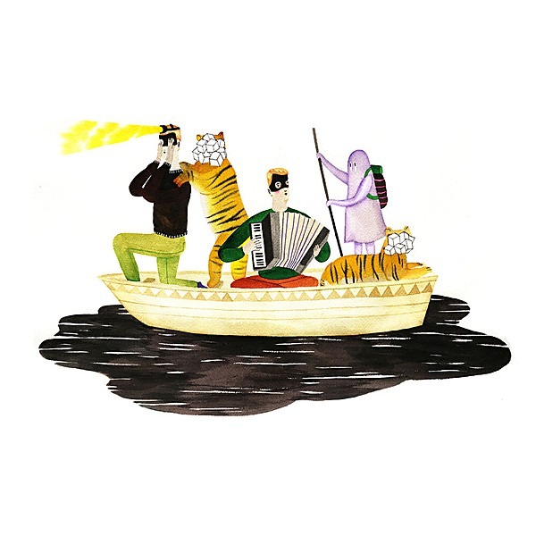

# On Oni Pond

By **Man Man**

## Album Data

- **Catalog:** Beets
- **Format:** Digital, Album
- **Album:** On Oni Pond
- **Artist:** Man Man
- **Albumartist:** Man Man
- **Genre:** Indie Rock
- **MusicBrainz Album Artist ID:** [4e210d41-b3e3-4e34-8c3b-3b8cc2116562](https://musicbrainz.org/artist/4e210d41-b3e3-4e34-8c3b-3b8cc2116562)
- **MusicBrainz Album ID:** [38f8fada-7172-46f4-ad12-e0e8abf5bc88](https://musicbrainz.org/release/38f8fada-7172-46f4-ad12-e0e8abf5bc88)
- **MusicBrainz Release Group ID:** [af512186-b1b1-4844-a93c-eaa46dea782f](https://musicbrainz.org/release-group/af512186-b1b1-4844-a93c-eaa46dea782f)
- **Year:** 2013
- **Catalog #:** 
- **Label:** 
- **Total Tracks:** 13

## Album Tracks

### Track 01 - Mister Jung Stuffed

- **Artist:** Man Man
- **Format:** MP3
- **Genre:** Indie Rock
- **Length:** 2:27
- **MusicBrainz Track ID:** 
- **Title:** Mister Jung Stuffed
- **Track:** 01
- **Year:** 2008

### Track 02 - Hurly / Burly

- **Artist:** Man Man
- **Format:** MP3
- **Genre:** Rock
- **Length:** 3:51
- **MusicBrainz Track ID:** 
- **Title:** Hurly / Burly
- **Track:** 02
- **Year:** 2008

### Track 03 - The Ballad Of Butter Beans

- **Artist:** Man Man
- **Format:** MP3
- **Genre:** Rock
- **Length:** 4:28
- **MusicBrainz Track ID:** 
- **Title:** The Ballad Of Butter Beans
- **Track:** 03
- **Year:** 2008

### Track 04 - Big Trouble

- **Artist:** Man Man
- **Format:** MP3
- **Genre:** Noise Rock
- **Length:** 5:05
- **MusicBrainz Track ID:** 
- **Title:** Big Trouble
- **Track:** 04
- **Year:** 2008

### Track 05 - Mysteries Of The Universe Unraveled

- **Artist:** Man Man
- **Format:** MP3
- **Genre:** Indie Rock
- **Length:** 0:08
- **MusicBrainz Track ID:** 
- **Title:** Mysteries Of The Universe Unraveled
- **Track:** 05
- **Year:** 2008

### Track 06 - Doo Right

- **Artist:** Man Man
- **Format:** MP3
- **Genre:** Rock
- **Length:** 1:38
- **MusicBrainz Track ID:** 
- **Title:** Doo Right
- **Track:** 06
- **Year:** 2008

### Track 07 - Easy Eats Or Dirty Doctor Galapagos

- **Artist:** Man Man
- **Format:** MP3
- **Genre:** Rock
- **Length:** 2:24
- **MusicBrainz Track ID:** 
- **Title:** Easy Eats Or Dirty Doctor Galapagos
- **Track:** 07
- **Year:** 2008

### Track 08 - Harpoon Fever (Queequeg's Playhouse)

- **Artist:** Man Man
- **Format:** MP3
- **Genre:** Rock
- **Length:** 3:19
- **MusicBrainz Track ID:** 
- **Title:** Harpoon Fever (Queequeg's Playhouse)
- **Track:** 08
- **Year:** 2008

### Track 09 - El Azteca

- **Artist:** Man Man
- **Format:** MP3
- **Genre:** Rock
- **Length:** 1:43
- **MusicBrainz Track ID:** 
- **Title:** El Azteca
- **Track:** 09
- **Year:** 2008

### Track 10 - Rabbit Habbits

- **Artist:** Man Man
- **Format:** AAC
- **Genre:** Rock
- **Length:** 2:48
- **MusicBrainz Track ID:** 
- **Title:** Rabbit Habbits
- **Track:** 10
- **Year:** 2008

### Track 10 - Rabbit Habits

- **Artist:** Man Man
- **Format:** MP3
- **Genre:** Rock
- **Length:** 2:48
- **MusicBrainz Track ID:** 
- **Title:** Rabbit Habits
- **Track:** 10
- **Year:** 2008

### Track 11 - Top Drawer

- **Artist:** Man Man
- **Format:** MP3
- **Genre:** Rock
- **Length:** 3:26
- **MusicBrainz Track ID:** 
- **Title:** Top Drawer
- **Track:** 11
- **Year:** 2008

### Track 12 - Poor Jackie

- **Artist:** Man Man
- **Format:** MP3
- **Genre:** Rock
- **Length:** 8:23
- **MusicBrainz Track ID:** 
- **Title:** Poor Jackie
- **Track:** 12
- **Year:** 2008

### Track 13 - Whalebones

- **Artist:** Man Man
- **Format:** MP3
- **Genre:** Swing
- **Length:** 7:14
- **MusicBrainz Track ID:** 
- **Title:** Whalebones
- **Track:** 13
- **Year:** 2008

## See also

- [Life Fantastic](Life_Fantastic.md)
- [Man Man](Man_Man.md)
- [Rabbit Habits](Rabbit_Habits.md)
- [Six Demon Bag](Six_Demon_Bag.md)
- [Roon: Life Fantastic (Deluxe Edition)](../../Roon/Man_Man/Life_Fantastic_Deluxe_Edition.md)
- [Roon: Rabbit Habits](../../Roon/Man_Man/Rabbit_Habits.md)
