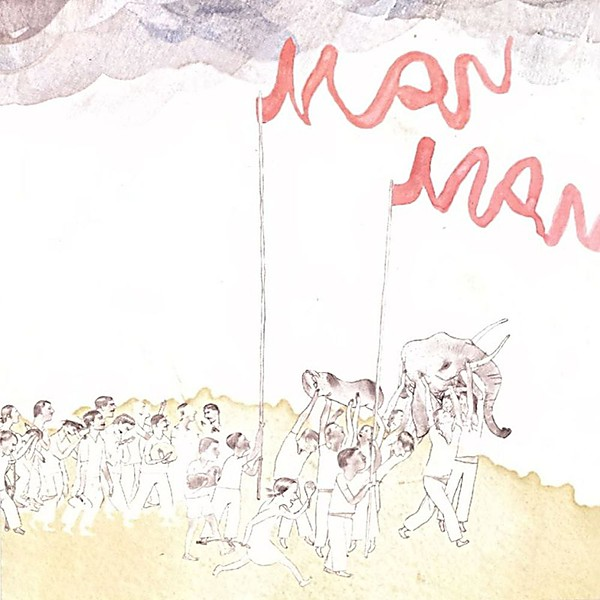

# Six Demon Bag

By **Man Man**

## Album Data

- **Catalog:** Beets
- **Format:** Digital, Album
- **Album:** Six Demon Bag
- **Artist:** Man Man
- **Albumartist:** Man Man
- **Genre:** Indie Rock
- **MusicBrainz Album Artist ID:** [4e210d41-b3e3-4e34-8c3b-3b8cc2116562](https://musicbrainz.org/artist/4e210d41-b3e3-4e34-8c3b-3b8cc2116562)
- **MusicBrainz Album ID:** [21d33df2-e2a0-410f-b27b-6e9a942707f4](https://musicbrainz.org/release/21d33df2-e2a0-410f-b27b-6e9a942707f4)
- **MusicBrainz Release Group ID:** [3fbe55f3-b650-3296-9958-28e4cacbe809](https://musicbrainz.org/release-group/3fbe55f3-b650-3296-9958-28e4cacbe809)
- **Year:** 2006
- **Catalog #:** ACE 039
- **Label:** Ace Fu Records
- **Total Tracks:** 13

## Album Tracks

### Track 01 - Feathers

- **Artist:** Man Man
- **Format:** AAC
- **Genre:** Indie Rock
- **Length:** 2:08
- **MusicBrainz Track ID:** [9a5d42ff-9c38-441a-919b-46a4b6298cb7](https://musicbrainz.org/recording/9a5d42ff-9c38-441a-919b-46a4b6298cb7)
- **Title:** Feathers
- **Track:** 01
- **Year:** 2006

### Track 02 - Engrish Bwudd

- **Artist:** Man Man
- **Format:** AAC
- **Genre:** Indie Rock
- **Length:** 3:33
- **MusicBrainz Track ID:** [cce4e8a9-d612-4fcc-a21b-3e5931c6f0c0](https://musicbrainz.org/recording/cce4e8a9-d612-4fcc-a21b-3e5931c6f0c0)
- **Title:** Engrish Bwudd
- **Track:** 02
- **Year:** 2006

### Track 03 - Banana Ghost

- **Artist:** Man Man
- **Format:** AAC
- **Genre:** Indie Rock
- **Length:** 2:54
- **MusicBrainz Track ID:** [e7dc4e87-0393-4edb-9fbd-5e47ef5f161d](https://musicbrainz.org/recording/e7dc4e87-0393-4edb-9fbd-5e47ef5f161d)
- **Title:** Banana Ghost
- **Track:** 03
- **Year:** 2006

### Track 04 - Young Einstein on the Beach

- **Artist:** Man Man
- **Format:** AAC
- **Genre:** Indie Rock
- **Length:** 0:58
- **MusicBrainz Track ID:** [38756f37-dc1f-4d88-96f3-967a932e0f9a](https://musicbrainz.org/recording/38756f37-dc1f-4d88-96f3-967a932e0f9a)
- **Title:** Young Einstein on the Beach
- **Track:** 04
- **Year:** 2006

### Track 05 - Skin Tension

- **Artist:** Man Man
- **Format:** AAC
- **Genre:** Indie Rock
- **Length:** 3:46
- **MusicBrainz Track ID:** [092033f3-ecd5-46ef-97ce-d8f03bca3dd7](https://musicbrainz.org/recording/092033f3-ecd5-46ef-97ce-d8f03bca3dd7)
- **Title:** Skin Tension
- **Track:** 05
- **Year:** 2006

### Track 06 - Black Mission Goggles

- **Artist:** Man Man
- **Format:** AAC
- **Genre:** Noise Rock
- **Length:** 4:59
- **MusicBrainz Track ID:** [330efa43-ae29-42d8-bdfe-3ed2960fdf2c](https://musicbrainz.org/recording/330efa43-ae29-42d8-bdfe-3ed2960fdf2c)
- **Title:** Black Mission Goggles
- **Track:** 06
- **Year:** 2006

### Track 07 - Hot Bat

- **Artist:** Man Man
- **Format:** AAC
- **Genre:** Indie Rock
- **Length:** 1:26
- **MusicBrainz Track ID:** [9b3db316-ea62-48ce-b587-7c95531192b4](https://musicbrainz.org/recording/9b3db316-ea62-48ce-b587-7c95531192b4)
- **Title:** Hot Bat
- **Track:** 07
- **Year:** 2006

### Track 08 - Push the Eagle's Stomach

- **Artist:** Man Man
- **Format:** AAC
- **Genre:** Indie Rock
- **Length:** 3:39
- **MusicBrainz Track ID:** [00286cef-e7e0-43aa-b9e6-783c99a8d520](https://musicbrainz.org/recording/00286cef-e7e0-43aa-b9e6-783c99a8d520)
- **Title:** Push the Eagle's Stomach
- **Track:** 08
- **Year:** 2006

### Track 09 - Spider Cider

- **Artist:** Man Man
- **Format:** AAC
- **Genre:** Indie Rock
- **Length:** 3:05
- **MusicBrainz Track ID:** [d96bd93b-75c2-431b-b9ed-eb017bb879dc](https://musicbrainz.org/recording/d96bd93b-75c2-431b-b9ed-eb017bb879dc)
- **Title:** Spider Cider
- **Track:** 09
- **Year:** 2006

### Track 10 - Van Helsing Boombox

- **Artist:** Man Man
- **Format:** AAC
- **Genre:** Indie Rock
- **Length:** 3:44
- **MusicBrainz Track ID:** [928a8218-347b-429e-ba58-faa11839fc16](https://musicbrainz.org/recording/928a8218-347b-429e-ba58-faa11839fc16)
- **Title:** Van Helsing Boombox
- **Track:** 10
- **Year:** 2006

### Track 11 - Tunneling Through the Guy

- **Artist:** Man Man
- **Format:** AAC
- **Genre:** Avant-Garde
- **Length:** 5:25
- **MusicBrainz Track ID:** [72690069-8468-44b2-b4f5-f63909ab67e6](https://musicbrainz.org/recording/72690069-8468-44b2-b4f5-f63909ab67e6)
- **Title:** Tunneling Through the Guy
- **Track:** 11
- **Year:** 2006

### Track 12 - Fishstick Gumbo

- **Artist:** Man Man
- **Format:** AAC
- **Genre:** Indie Rock
- **Length:** 0:04
- **MusicBrainz Track ID:** [08797e0e-b583-4f8d-b1d5-8e877c055c11](https://musicbrainz.org/recording/08797e0e-b583-4f8d-b1d5-8e877c055c11)
- **Title:** Fishstick Gumbo
- **Track:** 12
- **Year:** 2006

### Track 13 - Ice Dogs

- **Artist:** Man Man
- **Format:** AAC
- **Genre:** Experimental Rock
- **Length:** 4:45
- **MusicBrainz Track ID:** [c91fd84b-1c88-46e7-b91b-158c9268e6f1](https://musicbrainz.org/recording/c91fd84b-1c88-46e7-b91b-158c9268e6f1)
- **Title:** Ice Dogs
- **Track:** 13
- **Year:** 2006

## See also

- [Life Fantastic](Life_Fantastic.md)
- [Man Man](Man_Man.md)
- [On Oni Pond](On_Oni_Pond.md)
- [Rabbit Habits](Rabbit_Habits.md)
- [Roon: Life Fantastic (Deluxe Edition)](../../Roon/Man_Man/Life_Fantastic_Deluxe_Edition.md)
- [Roon: Rabbit Habits](../../Roon/Man_Man/Rabbit_Habits.md)
