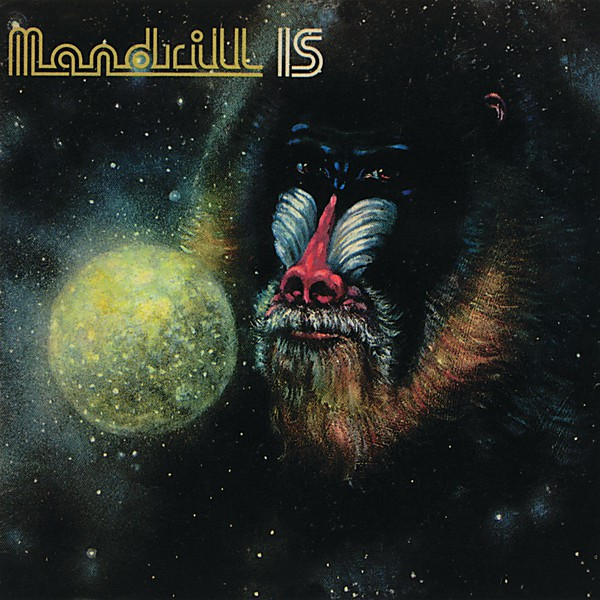

# Mandrill Is

By **Mandrill**

## Album Data

- **Catalog:** Beets
- **Format:** Digital, Album
- **Album:** Mandrill Is
- **Artist:** Mandrill
- **Albumartist:** Mandrill
- **Genre:** Soul
- **MusicBrainz Album Artist ID:** [697ea2f4-4f79-466a-8c57-29d5455b68bd](https://musicbrainz.org/artist/697ea2f4-4f79-466a-8c57-29d5455b68bd)
- **MusicBrainz Album ID:** [483820e1-2ae5-4aad-b031-167fcf30b942](https://musicbrainz.org/release/483820e1-2ae5-4aad-b031-167fcf30b942)
- **MusicBrainz Release Group ID:** [0cc31fa1-2f72-3f3d-b0fe-74989f3d9af4](https://musicbrainz.org/release-group/0cc31fa1-2f72-3f3d-b0fe-74989f3d9af4)
- **Year:** 1998
- **Catalog #:** COL 6003
- **Label:** Collectables
- **Total Tracks:** 11

## Album Tracks

### Track 01 - Ape Is High

- **Artist:** Mandrill
- **Format:** MP3
- **Genre:** Soul
- **Length:** 5:32
- **MusicBrainz Track ID:** [c3da61f2-86f8-4b0e-b94f-2e4f1c076ef4](https://musicbrainz.org/recording/c3da61f2-86f8-4b0e-b94f-2e4f1c076ef4)
- **Title:** Ape Is High
- **Track:** 01
- **Year:** 1998

### Track 02 - Cohelo

- **Artist:** Mandrill
- **Format:** MP3
- **Genre:** Soul
- **Length:** 1:42
- **MusicBrainz Track ID:** [fa1dcf5a-4a12-4c76-8376-0338d8c7f944](https://musicbrainz.org/recording/fa1dcf5a-4a12-4c76-8376-0338d8c7f944)
- **Title:** Cohelo
- **Track:** 02
- **Year:** 1998

### Track 03 - Git It All

- **Artist:** Mandrill
- **Format:** MP3
- **Genre:** Soul
- **Length:** 4:29
- **MusicBrainz Track ID:** [4917cac0-19ae-497f-a184-67915090a975](https://musicbrainz.org/recording/4917cac0-19ae-497f-a184-67915090a975)
- **Title:** Git It All
- **Track:** 03
- **Year:** 1998

### Track 04 - Children of the Sun

- **Artist:** Mandrill
- **Format:** MP3
- **Genre:** Soul
- **Length:** 4:53
- **MusicBrainz Track ID:** [126e73cf-a7a9-4d92-a9e2-160a33780ff3](https://musicbrainz.org/recording/126e73cf-a7a9-4d92-a9e2-160a33780ff3)
- **Title:** Children of the Sun
- **Track:** 04
- **Year:** 1998

### Track 05 - I Refuse to Smile

- **Artist:** Mandrill
- **Format:** MP3
- **Genre:** Soul
- **Length:** 4:04
- **MusicBrainz Track ID:** [60694906-528e-48a6-ba15-6f6daab91f2b](https://musicbrainz.org/recording/60694906-528e-48a6-ba15-6f6daab91f2b)
- **Title:** I Refuse to Smile
- **Track:** 05
- **Year:** 1998

### Track 06 - Universal Rhythms

- **Artist:** Mandrill
- **Format:** MP3
- **Genre:** Soul
- **Length:** 3:20
- **MusicBrainz Track ID:** [2e1f4d41-0002-4fcd-85b9-fb24c71a16aa](https://musicbrainz.org/recording/2e1f4d41-0002-4fcd-85b9-fb24c71a16aa)
- **Title:** Universal Rhythms
- **Track:** 06
- **Year:** 1998

### Track 07 - Lord of the Golden Baboon

- **Artist:** Mandrill
- **Format:** MP3
- **Genre:** Soul
- **Length:** 3:30
- **MusicBrainz Track ID:** [ca4ca30a-fe2b-4697-9b2b-a24060a946dd](https://musicbrainz.org/recording/ca4ca30a-fe2b-4697-9b2b-a24060a946dd)
- **Title:** Lord of the Golden Baboon
- **Track:** 07
- **Year:** 1998

### Track 08 - Central Park

- **Artist:** Mandrill
- **Format:** MP3
- **Genre:** Soul
- **Length:** 4:04
- **MusicBrainz Track ID:** [1b93ec8e-749c-4bfa-bbc6-f433e6497533](https://musicbrainz.org/recording/1b93ec8e-749c-4bfa-bbc6-f433e6497533)
- **Title:** Central Park
- **Track:** 08
- **Year:** 1998

### Track 09 - Kofijahm

- **Artist:** Mandrill
- **Format:** MP3
- **Genre:** Jazz Fusion
- **Length:** 3:35
- **MusicBrainz Track ID:** [f96d68a0-4a32-4fa3-911d-667abd2320b5](https://musicbrainz.org/recording/f96d68a0-4a32-4fa3-911d-667abd2320b5)
- **Title:** Kofijahm
- **Track:** 09
- **Year:** 1998

### Track 10 - Here Today Gone Tomorrow

- **Artist:** Mandrill
- **Format:** MP3
- **Genre:** Soul
- **Length:** 4:42
- **MusicBrainz Track ID:** [3d1c7b25-e5c5-42d2-be28-504738cb790d](https://musicbrainz.org/recording/3d1c7b25-e5c5-42d2-be28-504738cb790d)
- **Title:** Here Today Gone Tomorrow
- **Track:** 10
- **Year:** 1998

### Track 11 - The Sun Must Go Down

- **Artist:** Mandrill
- **Format:** MP3
- **Genre:** Soul
- **Length:** 2:55
- **MusicBrainz Track ID:** [f32e3b2e-2306-4766-a913-931bdd330e0d](https://musicbrainz.org/recording/f32e3b2e-2306-4766-a913-931bdd330e0d)
- **Title:** The Sun Must Go Down
- **Track:** 11
- **Year:** 1998

## See also

- [Mandrill](Mandrill.md)
- [Roon: Composite Truth](../../Roon/Mandrill/Composite_Truth.md)
- [Roon: Just Outside Of Town](../../Roon/Mandrill/Just_Outside_Of_Town.md)
- [Roon: Mandrill Is](../../Roon/Mandrill/Mandrill_Is.md)
- [Roon: Mandrill](../../Roon/Mandrill/Mandrill.md)
- [Vinyl: Mandrill Is](../../Vinyl/Mandrill/Mandrill_Is.md)
- [Vinyl: ](../../Vinyl/Mandrill/Mandrill.md)
