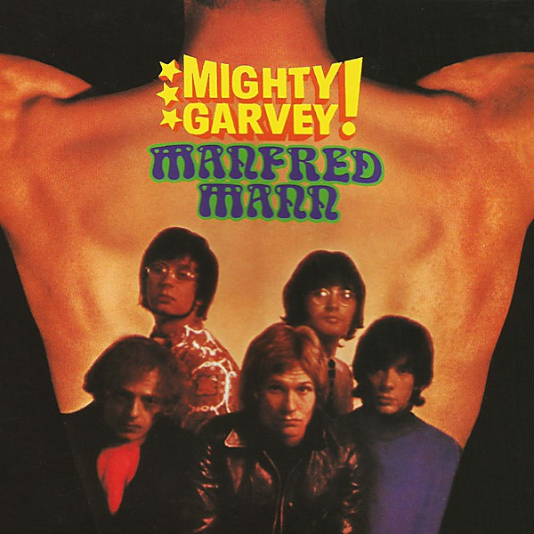

# Mighty Garvey!

By **Manfred Mann**

## Album Data

- **Catalog:** Beets
- **Format:** Digital, Album
- **Album:** Mighty Garvey!
- **Artist:** Manfred Mann
- **Albumartist:** Manfred Mann
- **Genre:** Rock
- **MusicBrainz Album Artist ID:** [06b6f280-8787-4a3d-8ab6-c6487b465320](https://musicbrainz.org/artist/06b6f280-8787-4a3d-8ab6-c6487b465320)
- **MusicBrainz Album ID:** [a753df67-aab7-4391-939e-f46d774a5cdc](https://musicbrainz.org/release/a753df67-aab7-4391-939e-f46d774a5cdc)
- **MusicBrainz Release Group ID:** [6752654c-f903-310e-ba6a-5abb404107cf](https://musicbrainz.org/release-group/6752654c-f903-310e-ba6a-5abb404107cf)
- **Year:** 2003
- **Catalog #:** UICY-9247
- **Label:** Fontana
- **Total Tracks:** 28

## Album Tracks

### Track 01 - Happy Families

- **Artist:** Manfred Mann
- **Format:** ALAC
- **Genre:** Rock
- **Length:** 2:18
- **MusicBrainz Track ID:** [432a69db-1f72-49c8-ba2c-6b6d4713419b](https://musicbrainz.org/recording/432a69db-1f72-49c8-ba2c-6b6d4713419b)
- **Title:** Happy Families
- **Track:** 01
- **Year:** 2003

### Track 02 - No Better No Worse

- **Artist:** Manfred Mann
- **Format:** ALAC
- **Genre:** Rock
- **Length:** 3:02
- **MusicBrainz Track ID:** [b4adc66e-892f-4ed7-9999-48741f439e62](https://musicbrainz.org/recording/b4adc66e-892f-4ed7-9999-48741f439e62)
- **Title:** No Better No Worse
- **Track:** 02
- **Year:** 2003

### Track 03 - Everyday Another Hair Turns Gray

- **Artist:** Manfred Mann
- **Format:** ALAC
- **Genre:** Rock
- **Length:** 2:54
- **MusicBrainz Track ID:** [98f6114a-e893-4b62-b856-4a8b28195001](https://musicbrainz.org/recording/98f6114a-e893-4b62-b856-4a8b28195001)
- **Title:** Everyday Another Hair Turns Gray
- **Track:** 03
- **Year:** 2003

### Track 04 - Country Dancing

- **Artist:** Manfred Mann
- **Format:** ALAC
- **Genre:** Rock
- **Length:** 2:53
- **MusicBrainz Track ID:** [dc219f99-448d-41a1-a59f-c1be8259436b](https://musicbrainz.org/recording/dc219f99-448d-41a1-a59f-c1be8259436b)
- **Title:** Country Dancing
- **Track:** 04
- **Year:** 2003

### Track 05 - It’s So Easy Falling

- **Artist:** Manfred Mann
- **Format:** ALAC
- **Genre:** Rock
- **Length:** 3:20
- **MusicBrainz Track ID:** [de631100-58d2-49a7-80bd-9a4a79d97117](https://musicbrainz.org/recording/de631100-58d2-49a7-80bd-9a4a79d97117)
- **Title:** It’s So Easy Falling
- **Track:** 05
- **Year:** 2003

### Track 06 - Happy Families

- **Artist:** Manfred Mann
- **Format:** ALAC
- **Genre:** Rock
- **Length:** 2:09
- **MusicBrainz Track ID:** [25050f82-a7ca-402f-a9f3-8f6119292512](https://musicbrainz.org/recording/25050f82-a7ca-402f-a9f3-8f6119292512)
- **Title:** Happy Families
- **Track:** 06
- **Year:** 2003

### Track 07 - The Mighty Quinn

- **Artist:** Manfred Mann
- **Format:** ALAC
- **Genre:** Rock
- **Length:** 2:52
- **MusicBrainz Track ID:** [eb370398-796a-438c-a0e7-2c6fef3cf746](https://musicbrainz.org/recording/eb370398-796a-438c-a0e7-2c6fef3cf746)
- **Title:** The Mighty Quinn
- **Track:** 07
- **Year:** 2003

### Track 08 - Big Betty

- **Artist:** Manfred Mann
- **Format:** ALAC
- **Genre:** Freakbeat
- **Length:** 3:06
- **MusicBrainz Track ID:** [dcc6f7a9-51a3-4214-8ccf-81de28fea504](https://musicbrainz.org/recording/dcc6f7a9-51a3-4214-8ccf-81de28fea504)
- **Title:** Big Betty
- **Track:** 08
- **Year:** 2003

### Track 09 - The Vicar’s Daughter

- **Artist:** Manfred Mann
- **Format:** ALAC
- **Genre:** Rock
- **Length:** 2:18
- **MusicBrainz Track ID:** [111a36cc-7852-48bb-a452-13a013fcf412](https://musicbrainz.org/recording/111a36cc-7852-48bb-a452-13a013fcf412)
- **Title:** The Vicar’s Daughter
- **Track:** 09
- **Year:** 2003

### Track 10 - Each and Every Day

- **Artist:** Manfred Mann
- **Format:** ALAC
- **Genre:** Rock
- **Length:** 2:47
- **MusicBrainz Track ID:** [8f7117fc-233b-439a-b979-c11593d83868](https://musicbrainz.org/recording/8f7117fc-233b-439a-b979-c11593d83868)
- **Title:** Each and Every Day
- **Track:** 10
- **Year:** 2003

### Track 11 - Cubist Town

- **Artist:** Manfred Mann
- **Format:** ALAC
- **Genre:** Rock
- **Length:** 3:21
- **MusicBrainz Track ID:** [01f3b76b-3924-4e30-8877-2a31bf0d2b8a](https://musicbrainz.org/recording/01f3b76b-3924-4e30-8877-2a31bf0d2b8a)
- **Title:** Cubist Town
- **Track:** 11
- **Year:** 2003

### Track 12 - Ha! Ha! Said the Clown

- **Artist:** Manfred Mann
- **Format:** ALAC
- **Genre:** Rock
- **Length:** 2:27
- **MusicBrainz Track ID:** [73bae214-a541-41d0-926e-903f69d25008](https://musicbrainz.org/recording/73bae214-a541-41d0-926e-903f69d25008)
- **Title:** Ha! Ha! Said the Clown
- **Track:** 12
- **Year:** 2003

### Track 13 - Harry the One-Man Band

- **Artist:** Manfred Mann
- **Format:** ALAC
- **Genre:** Rock
- **Length:** 3:11
- **MusicBrainz Track ID:** [11904a9d-1373-471c-967f-dd0f33257ab7](https://musicbrainz.org/recording/11904a9d-1373-471c-967f-dd0f33257ab7)
- **Title:** Harry the One-Man Band
- **Track:** 13
- **Year:** 2003

### Track 14 - Happy Families

- **Artist:** Manfred Mann
- **Format:** ALAC
- **Genre:** Rock
- **Length:** 2:16
- **MusicBrainz Track ID:** [fa0e6eb1-57c3-472c-9417-db2ef435e311](https://musicbrainz.org/recording/fa0e6eb1-57c3-472c-9417-db2ef435e311)
- **Title:** Happy Families
- **Track:** 14
- **Year:** 2003

### Track 15 - Happy Families

- **Artist:** Manfred Mann
- **Format:** ALAC
- **Genre:** Rock
- **Length:** 2:20
- **MusicBrainz Track ID:** [bd662d99-4666-449f-807e-e525f1884f1e](https://musicbrainz.org/recording/bd662d99-4666-449f-807e-e525f1884f1e)
- **Title:** Happy Families
- **Track:** 15
- **Year:** 2003

### Track 16 - No Better No Worse

- **Artist:** Manfred Mann
- **Format:** ALAC
- **Genre:** Rock
- **Length:** 3:07
- **MusicBrainz Track ID:** [cc817883-3e27-4039-966c-f260af248a8a](https://musicbrainz.org/recording/cc817883-3e27-4039-966c-f260af248a8a)
- **Title:** No Better No Worse
- **Track:** 16
- **Year:** 2003

### Track 17 - Everyday Another Hair Turns Gray

- **Artist:** Manfred Mann
- **Format:** ALAC
- **Genre:** Rock
- **Length:** 2:58
- **MusicBrainz Track ID:** [6ac2fec9-8c76-43c3-a8f3-13d66864049b](https://musicbrainz.org/recording/6ac2fec9-8c76-43c3-a8f3-13d66864049b)
- **Title:** Everyday Another Hair Turns Gray
- **Track:** 17
- **Year:** 2003

### Track 18 - Country Dancing

- **Artist:** Manfred Mann
- **Format:** ALAC
- **Genre:** Rock
- **Length:** 2:55
- **MusicBrainz Track ID:** [a9a2af2c-d929-4025-b861-ad308173ad73](https://musicbrainz.org/recording/a9a2af2c-d929-4025-b861-ad308173ad73)
- **Title:** Country Dancing
- **Track:** 18
- **Year:** 2003

### Track 19 - It’s So Easy Falling

- **Artist:** Manfred Mann
- **Format:** ALAC
- **Genre:** Rock
- **Length:** 3:22
- **MusicBrainz Track ID:** [f8486db2-3976-44f7-ac64-281415b171ab](https://musicbrainz.org/recording/f8486db2-3976-44f7-ac64-281415b171ab)
- **Title:** It’s So Easy Falling
- **Track:** 19
- **Year:** 2003

### Track 20 - Happy Families

- **Artist:** Manfred Mann
- **Format:** ALAC
- **Genre:** Rock
- **Length:** 2:08
- **MusicBrainz Track ID:** [76ccf0b3-caf5-4796-aaad-0b9b09ba2122](https://musicbrainz.org/recording/76ccf0b3-caf5-4796-aaad-0b9b09ba2122)
- **Title:** Happy Families
- **Track:** 20
- **Year:** 2003

### Track 21 - The Mighty Quinn

- **Artist:** Manfred Mann
- **Format:** ALAC
- **Genre:** Rock
- **Length:** 2:54
- **MusicBrainz Track ID:** [96a75857-c7db-4e21-b27d-e90389560428](https://musicbrainz.org/recording/96a75857-c7db-4e21-b27d-e90389560428)
- **Title:** The Mighty Quinn
- **Track:** 21
- **Year:** 2003

### Track 22 - Big Betty

- **Artist:** Manfred Mann
- **Format:** ALAC
- **Genre:** Freakbeat
- **Length:** 3:06
- **MusicBrainz Track ID:** [16eab480-f44c-4066-b5af-cda87392dc77](https://musicbrainz.org/recording/16eab480-f44c-4066-b5af-cda87392dc77)
- **Title:** Big Betty
- **Track:** 22
- **Year:** 2003

### Track 23 - The Vicar’s Daughter

- **Artist:** Manfred Mann
- **Format:** ALAC
- **Genre:** Rock
- **Length:** 2:18
- **MusicBrainz Track ID:** [da915bd7-d27c-42f1-84fb-2d234b6412bd](https://musicbrainz.org/recording/da915bd7-d27c-42f1-84fb-2d234b6412bd)
- **Title:** The Vicar’s Daughter
- **Track:** 23
- **Year:** 2003

### Track 24 - Each and Every Day

- **Artist:** Manfred Mann
- **Format:** ALAC
- **Genre:** Rock
- **Length:** 2:55
- **MusicBrainz Track ID:** [cfd3cedd-d1b5-467c-9216-ae69048597d7](https://musicbrainz.org/recording/cfd3cedd-d1b5-467c-9216-ae69048597d7)
- **Title:** Each and Every Day
- **Track:** 24
- **Year:** 2003

### Track 25 - Cubist Town

- **Artist:** Manfred Mann
- **Format:** ALAC
- **Genre:** Rock
- **Length:** 3:19
- **MusicBrainz Track ID:** [ca1c6748-f405-41b3-baae-7424f631399c](https://musicbrainz.org/recording/ca1c6748-f405-41b3-baae-7424f631399c)
- **Title:** Cubist Town
- **Track:** 25
- **Year:** 2003

### Track 26 - Ha! Ha! Said the Clown

- **Artist:** Manfred Mann
- **Format:** ALAC
- **Genre:** Rock
- **Length:** 2:27
- **MusicBrainz Track ID:** [73bae214-a541-41d0-926e-903f69d25008](https://musicbrainz.org/recording/73bae214-a541-41d0-926e-903f69d25008)
- **Title:** Ha! Ha! Said the Clown
- **Track:** 26
- **Year:** 2003

### Track 27 - Harry the One-Man Band

- **Artist:** Manfred Mann
- **Format:** ALAC
- **Genre:** Rock
- **Length:** 3:11
- **MusicBrainz Track ID:** [03ced0bd-0843-4405-93f5-a71968f15b26](https://musicbrainz.org/recording/03ced0bd-0843-4405-93f5-a71968f15b26)
- **Title:** Harry the One-Man Band
- **Track:** 27
- **Year:** 2003

### Track 28 - Happy Families

- **Artist:** Manfred Mann
- **Format:** ALAC
- **Genre:** Rock
- **Length:** 2:14
- **MusicBrainz Track ID:** [b45d5aa0-b42d-4d77-9a14-28fd4affab69](https://musicbrainz.org/recording/b45d5aa0-b42d-4d77-9a14-28fd4affab69)
- **Title:** Happy Families
- **Track:** 28
- **Year:** 2003

## See also

- [Roon: The Mighty Quinn](../../Roon/Manfred_Mann/The_Mighty_Quinn.md)
