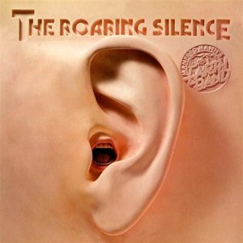

# The Roaring Silence

By **Manfred Mann’s Earth Band**

## Album Data

- **Catalog:** Beets
- **Format:** Digital, Album
- **Album:** The Roaring Silence
- **Artist:** Manfred Mann’s Earth Band
- **Albumartist:** Manfred Mann’s Earth Band
- **Genre:** Progressive Rock
- **MusicBrainz Album Artist ID:** [83e9c775-84ea-4cf6-abdf-b9ffa8c3d060](https://musicbrainz.org/artist/83e9c775-84ea-4cf6-abdf-b9ffa8c3d060)
- **MusicBrainz Album ID:** [0549463f-a34f-4b56-af90-a3a4037c370c](https://musicbrainz.org/release/0549463f-a34f-4b56-af90-a3a4037c370c)
- **MusicBrainz Release Group ID:** [1c48487e-ae95-3197-9158-dbc23a26cc5d](https://musicbrainz.org/release-group/1c48487e-ae95-3197-9158-dbc23a26cc5d)
- **Year:** 1976
- **Catalog #:** BS 2965
- **Label:** Bronze
- **Total Tracks:** 07

## Album Tracks

### Track 01 - Blinded by the Light

- **Artist:** Manfred Mann’s Earth Band
- **Format:** ALAC
- **Genre:** Progressive Rock
- **Length:** 7:09
- **MusicBrainz Track ID:** [431b3d53-2783-46fd-9bb4-e1410f2941b6](https://musicbrainz.org/recording/431b3d53-2783-46fd-9bb4-e1410f2941b6)
- **Title:** Blinded by the Light
- **Track:** 01
- **Year:** 1976

### Track 02 - Singing the Dolphin Through

- **Artist:** Manfred Mann’s Earth Band
- **Format:** ALAC
- **Genre:** Progressive Rock
- **Length:** 8:20
- **MusicBrainz Track ID:** [26af36f2-5c2d-4264-88c6-dd23748ee9a7](https://musicbrainz.org/recording/26af36f2-5c2d-4264-88c6-dd23748ee9a7)
- **Title:** Singing the Dolphin Through
- **Track:** 02
- **Year:** 1976

### Track 03 - Waiter, There's a Yawn in My Ear

- **Artist:** Manfred Mann’s Earth Band
- **Format:** ALAC
- **Genre:** Progressive Rock
- **Length:** 5:38
- **MusicBrainz Track ID:** [32886b9b-9bd8-420a-a19f-17cc672c42dd](https://musicbrainz.org/recording/32886b9b-9bd8-420a-a19f-17cc672c42dd)
- **Title:** Waiter, There's a Yawn in My Ear
- **Track:** 03
- **Year:** 1976

### Track 04 - The Road to Babylon

- **Artist:** Manfred Mann’s Earth Band
- **Format:** ALAC
- **Genre:** Progressive Rock
- **Length:** 6:54
- **MusicBrainz Track ID:** [3cdc98e8-b478-4dc3-aed6-1893fd523756](https://musicbrainz.org/recording/3cdc98e8-b478-4dc3-aed6-1893fd523756)
- **Title:** The Road to Babylon
- **Track:** 04
- **Year:** 1976

### Track 05 - This Side of Paradise

- **Artist:** Manfred Mann’s Earth Band
- **Format:** ALAC
- **Genre:** Progressive Rock
- **Length:** 4:46
- **MusicBrainz Track ID:** [3dd08674-d959-4d94-989f-e857dc0ab8a5](https://musicbrainz.org/recording/3dd08674-d959-4d94-989f-e857dc0ab8a5)
- **Title:** This Side of Paradise
- **Track:** 05
- **Year:** 1976

### Track 06 - Starbird

- **Artist:** Manfred Mann’s Earth Band
- **Format:** ALAC
- **Genre:** Progressive Rock
- **Length:** 3:08
- **MusicBrainz Track ID:** [83462e4c-2fb2-4f10-acc5-07ad1f1eaae7](https://musicbrainz.org/recording/83462e4c-2fb2-4f10-acc5-07ad1f1eaae7)
- **Title:** Starbird
- **Track:** 06
- **Year:** 1976

### Track 07 - Questions

- **Artist:** Manfred Mann’s Earth Band
- **Format:** ALAC
- **Genre:** Progressive Rock
- **Length:** 3:58
- **MusicBrainz Track ID:** [a0744f2b-4268-47aa-b847-5a41d286d259](https://musicbrainz.org/recording/a0744f2b-4268-47aa-b847-5a41d286d259)
- **Title:** Questions
- **Track:** 07
- **Year:** 1976

## See also

- [Nightingales & Bombers](Nightingales_and_Bombers.md)
- [Roon: The Roaring Silence](../../Roon/Manfred_Mann’s_Earth_Band/The_Roaring_Silence.md)
