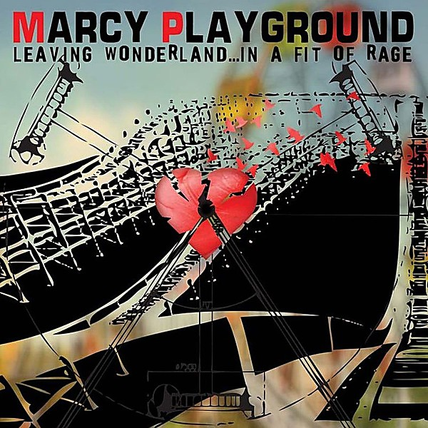

# Leaving Wonderland... In a Fit of Rage

By **Marcy Playground**

## Album Data

- **Catalog:** Beets
- **Format:** Digital, Album
- **Album:** Leaving Wonderland... In a Fit of Rage
- **Artist:** Marcy Playground
- **Albumartist:** Marcy Playground
- **Genre:** Post-Grunge
- **MusicBrainz Album Artist ID:** [64cdc08f-ba6f-41fe-94be-452dc6d5108e](https://musicbrainz.org/artist/64cdc08f-ba6f-41fe-94be-452dc6d5108e)
- **MusicBrainz Album ID:** [ca3e2846-118d-4719-b7b6-525013236724](https://musicbrainz.org/release/ca3e2846-118d-4719-b7b6-525013236724)
- **MusicBrainz Release Group ID:** [32232de9-cb48-4252-92f8-1302ce1221c2](https://musicbrainz.org/release-group/32232de9-cb48-4252-92f8-1302ce1221c2)
- **Year:** 2009
- **Catalog #:** 50999‐705787‐20
- **Label:** Capitol Records
- **Total Tracks:** 19

## Album Tracks

### Track 01 - Shapeshifter

- **Artist:** Marcy Playground
- **Format:** AAC
- **Genre:** Post-Grunge
- **Length:** 3:27
- **MusicBrainz Track ID:** [b4c04070-0941-429d-ad05-72be9a0bb980](https://musicbrainz.org/recording/b4c04070-0941-429d-ad05-72be9a0bb980)
- **Title:** Shapeshifter
- **Track:** 01
- **Year:** 2012

### Track 02 - Black Eyed Sue

- **Artist:** Marcy Playground
- **Format:** AAC
- **Genre:** Post-Grunge
- **Length:** 3:03
- **MusicBrainz Track ID:** [affa5ff4-a7df-481a-a37d-1d78f263e736](https://musicbrainz.org/recording/affa5ff4-a7df-481a-a37d-1d78f263e736)
- **Title:** Black Eyed Sue
- **Track:** 02
- **Year:** 2012

### Track 03 - Whiter Shade of Pale

- **Artist:** Marcy Playground
- **Format:** AAC
- **Genre:** Post-Grunge
- **Length:** 4:16
- **MusicBrainz Track ID:** [7726d442-816e-4af2-a971-d0c00951df6e](https://musicbrainz.org/recording/7726d442-816e-4af2-a971-d0c00951df6e)
- **Title:** Whiter Shade of Pale
- **Track:** 03
- **Year:** 2012

### Track 05 - Bang Bang Bang

- **Artist:** Marcy Playground
- **Format:** AAC
- **Genre:** Post-Grunge
- **Length:** 3:23
- **MusicBrainz Track ID:** [3903ad1f-de14-45e3-90da-8af65b1936e4](https://musicbrainz.org/recording/3903ad1f-de14-45e3-90da-8af65b1936e4)
- **Title:** Bang Bang Bang
- **Track:** 05
- **Year:** 2012

### Track 06 - Comin’ Up From Behind

- **Artist:** Marcy Playground
- **Format:** AAC
- **Genre:** Post-Grunge
- **Length:** 3:43
- **MusicBrainz Track ID:** [fdeffb84-0deb-411c-ae0c-382fe5061e92](https://musicbrainz.org/recording/fdeffb84-0deb-411c-ae0c-382fe5061e92)
- **Title:** Comin’ Up From Behind
- **Track:** 06
- **Year:** 2012

### Track 07 - Hallelujah (acoustic version)

- **Artist:** Marcy Playground
- **Format:** AAC
- **Genre:** Post-Grunge
- **Length:** 3:48
- **MusicBrainz Track ID:** [9087b973-6944-44e3-bed3-bafc816f4dcc](https://musicbrainz.org/recording/9087b973-6944-44e3-bed3-bafc816f4dcc)
- **Title:** Hallelujah (acoustic version)
- **Track:** 07
- **Year:** 2012

### Track 08 - Mr. Fisher

- **Artist:** Marcy Playground
- **Format:** AAC
- **Genre:** Post-Grunge
- **Length:** 2:46
- **MusicBrainz Track ID:** [44fd3f9a-036c-443f-99ed-aaa58db3e898](https://musicbrainz.org/recording/44fd3f9a-036c-443f-99ed-aaa58db3e898)
- **Title:** Mr. Fisher
- **Track:** 08
- **Year:** 2012

### Track 09 - Sex and Candy

- **Artist:** Marcy Playground
- **Format:** AAC
- **Genre:** Post-Grunge
- **Length:** 2:52
- **MusicBrainz Track ID:** [5c1bc116-d8d4-409d-bd81-8cbda2e14dbe](https://musicbrainz.org/recording/5c1bc116-d8d4-409d-bd81-8cbda2e14dbe)
- **Title:** Sex and Candy
- **Track:** 09
- **Year:** 2012

### Track 10 - Bye Bye

- **Artist:** Marcy Playground
- **Format:** AAC
- **Genre:** Post-Grunge
- **Length:** 2:50
- **MusicBrainz Track ID:** [30fe781a-10ce-4ad2-a7b0-314e4dcffaef](https://musicbrainz.org/recording/30fe781a-10ce-4ad2-a7b0-314e4dcffaef)
- **Title:** Bye Bye
- **Track:** 10
- **Year:** 2012

### Track 11 - Crazy Katy Nicotine and Her Red Jet Air Balloon

- **Artist:** Marcy Playground
- **Format:** AAC
- **Genre:** Post-Grunge
- **Length:** 1:59
- **MusicBrainz Track ID:** [00475f14-fefa-49e4-9b86-d8c6a8c5dcfc](https://musicbrainz.org/recording/00475f14-fefa-49e4-9b86-d8c6a8c5dcfc)
- **Title:** Crazy Katy Nicotine and Her Red Jet Air Balloon
- **Track:** 11
- **Year:** 2012

### Track 12 - Up and Down

- **Artist:** Marcy Playground
- **Format:** AAC
- **Genre:** Post-Grunge
- **Length:** 3:10
- **MusicBrainz Track ID:** [f5666574-c0be-4c90-b5fb-32a540c22e95](https://musicbrainz.org/recording/f5666574-c0be-4c90-b5fb-32a540c22e95)
- **Title:** Up and Down
- **Track:** 12
- **Year:** 2012

### Track 13 - The Plant Song

- **Artist:** Marcy Playground
- **Format:** AAC
- **Genre:** Post-Grunge
- **Length:** 1:05
- **MusicBrainz Track ID:** [abdc43f8-a916-4bc6-aa7a-92f71270259d](https://musicbrainz.org/recording/abdc43f8-a916-4bc6-aa7a-92f71270259d)
- **Title:** The Plant Song
- **Track:** 13
- **Year:** 2012

### Track 14 - Special

- **Artist:** Marcy Playground
- **Format:** AAC
- **Genre:** Post-Grunge
- **Length:** 3:14
- **MusicBrainz Track ID:** [da8b530f-8591-432c-b6f9-76cbb212d62b](https://musicbrainz.org/recording/da8b530f-8591-432c-b6f9-76cbb212d62b)
- **Title:** Special
- **Track:** 14
- **Year:** 2012

### Track 15 - Rosey Risin’

- **Artist:** Marcy Playground
- **Format:** AAC
- **Genre:** Post-Grunge
- **Length:** 2:51
- **MusicBrainz Track ID:** [8c2b8f53-04bc-4357-8873-be36450b961a](https://musicbrainz.org/recording/8c2b8f53-04bc-4357-8873-be36450b961a)
- **Title:** Rosey Risin’
- **Track:** 15
- **Year:** 2012

### Track 16 - The Ballad of Aslan

- **Artist:** Marcy Playground
- **Format:** AAC
- **Genre:** Post-Grunge
- **Length:** 3:38
- **MusicBrainz Track ID:** [4c34faac-e77c-420e-afdb-ca03157e3aa8](https://musicbrainz.org/recording/4c34faac-e77c-420e-afdb-ca03157e3aa8)
- **Title:** The Ballad of Aslan
- **Track:** 16
- **Year:** 2012

### Track 17 - The Needle and the Damage Done (acoustic version)

- **Artist:** Marcy Playground
- **Format:** AAC
- **Genre:** Post-Grunge
- **Length:** 2:10
- **MusicBrainz Track ID:** [c02e1627-d97d-4abb-b70d-f3ef7bd411cd](https://musicbrainz.org/recording/c02e1627-d97d-4abb-b70d-f3ef7bd411cd)
- **Title:** The Needle and the Damage Done (acoustic version)
- **Track:** 17
- **Year:** 2012

### Track 18 - The Angel of the Forever Sleep

- **Artist:** Marcy Playground
- **Format:** AAC
- **Genre:** Alternative Rock
- **Length:** 4:51
- **MusicBrainz Track ID:** [78b4aac9-1b7d-4714-937d-fb8066716a27](https://musicbrainz.org/recording/78b4aac9-1b7d-4714-937d-fb8066716a27)
- **Title:** The Angel of the Forever Sleep
- **Track:** 18
- **Year:** 2012

### Track 19 - Sex and Candy (disco Superfly remix)

- **Artist:** Marcy Playground
- **Format:** AAC
- **Genre:** Post-Grunge
- **Length:** 4:09
- **MusicBrainz Track ID:** [dda4a1d7-6ef2-4e40-8ab7-f666b093feb0](https://musicbrainz.org/recording/dda4a1d7-6ef2-4e40-8ab7-f666b093feb0)
- **Title:** Sex and Candy (disco Superfly remix)
- **Track:** 19
- **Year:** 2012

### Track 04 - Brand New Day

- **Artist:** Marcy Playground feat. Jesse Dryfhout
- **Format:** AAC
- **Genre:** Post-Grunge
- **Length:** 3:36
- **MusicBrainz Track ID:** [804deda2-c02d-4372-a897-0ff68ef41c65](https://musicbrainz.org/recording/804deda2-c02d-4372-a897-0ff68ef41c65)
- **Title:** Brand New Day
- **Track:** 04
- **Year:** 2012

## See also

- [Indaba Remixes From Wonderland](Indaba_Remixes_From_Wonderland.md)
- [Lunch, Recess & Detention [+digital booklet]](Lunch__Recess_and_Detention_[+digital_booklet].md)
- [Lunch, Recess & Detention](Lunch__Recess_and_Detention.md)
- [Marcy Playground](Marcy_Playground.md)
- [MP3](MP3.md)
- [Shapeshifter](Shapeshifter.md)
- [Unreleased](Unreleased.md)
- [CD: Indaba Remixes From Wonderland](../../CD/Marcy_Playground/Indaba_Remixes_From_Wonderland.md)
- [CD: "Lunch, Recess & Detention"](../../CD/Marcy_Playground/Lunch__Recess_and_Detention.md)
- [CD: ](../../CD/Marcy_Playground/Marcy_Playground_index.md)
- [CD: Marcy Playground](../../CD/Marcy_Playground/Marcy_Playground.md)
- [CD: Shapeshifter](../../CD/Marcy_Playground/Shapeshifter.md)
- [Roon: From the Marcy Playground](../../Roon/Marcy_Playground/From_the_Marcy_Playground.md)
- [Roon: Indaba Remixes From Wonderland](../../Roon/Marcy_Playground/Indaba_Remixes_From_Wonderland.md)
- [Roon: Leaving Wonderland...In A Fit Of Rage](../../Roon/Marcy_Playground/Leaving_WonderlandIn_A_Fit_Of_Rage.md)
- [Roon: Lunch, Recess & Detention](../../Roon/Marcy_Playground/Lunch__Recess_and_Detention.md)
- [Roon: Marcy Playground](../../Roon/Marcy_Playground/Marcy_Playground.md)
- [Roon: MP3](../../Roon/Marcy_Playground/MP3.md)
- [Roon: Shapeshifter](../../Roon/Marcy_Playground/Shapeshifter.md)
- [Vinyl: ](../../Vinyl/Marcy_Playground/Marcy_Playground_index.md)
- [Vinyl: Marcy Playground](../../Vinyl/Marcy_Playground/Marcy_Playground.md)
