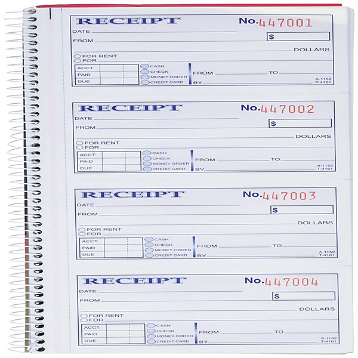

# Lunch, Recess & Detention [+digital booklet]

By **Marcy Playground**

## Album Data

- **Catalog:** Beets
- **Format:** Digital, Album
- **Album:** Lunch, Recess & Detention [+digital booklet]
- **Artist:** Marcy Playground
- **Albumartist:** Marcy Playground
- **Genre:** Post-Grunge
- **MusicBrainz Album Artist ID:** 
- **MusicBrainz Album ID:** 
- **MusicBrainz Release Group ID:** 
- **Year:** 2012
- **Catalog #:** CDP 7243 8 53569 2 6
- **Label:** Capitol Records
- **Total Tracks:** 12

## Album Tracks

### Track 01 - Poppies

- **Artist:** Marcy Playground
- **Format:** ALAC
- **Genre:** Post-Grunge
- **Length:** 2:49
- **MusicBrainz Track ID:** [c0bffa5e-fb72-4370-bfe0-a33ccc20ecdf](https://musicbrainz.org/recording/c0bffa5e-fb72-4370-bfe0-a33ccc20ecdf)
- **Title:** Poppies
- **Track:** 01
- **Year:** 1997

### Track 02 - Sex and Candy

- **Artist:** Marcy Playground
- **Format:** ALAC
- **Genre:** Post-Grunge
- **Length:** 2:53
- **MusicBrainz Track ID:** [5c1bc116-d8d4-409d-bd81-8cbda2e14dbe](https://musicbrainz.org/recording/5c1bc116-d8d4-409d-bd81-8cbda2e14dbe)
- **Title:** Sex and Candy
- **Track:** 02
- **Year:** 1997

### Track 03 - Ancient Walls of Flowers

- **Artist:** Marcy Playground
- **Format:** ALAC
- **Genre:** Post-Grunge
- **Length:** 3:16
- **MusicBrainz Track ID:** [7a58f6cc-3f7e-4867-b314-7c43a11446b1](https://musicbrainz.org/recording/7a58f6cc-3f7e-4867-b314-7c43a11446b1)
- **Title:** Ancient Walls of Flowers
- **Track:** 03
- **Year:** 1997

### Track 04 - Saint Joe on the School Bus

- **Artist:** Marcy Playground
- **Format:** ALAC
- **Genre:** Post-Grunge
- **Length:** 3:20
- **MusicBrainz Track ID:** [27b512b8-223f-48ac-b492-11e6eee6d04a](https://musicbrainz.org/recording/27b512b8-223f-48ac-b492-11e6eee6d04a)
- **Title:** Saint Joe on the School Bus
- **Track:** 04
- **Year:** 1997

### Track 05 - A Cloak of Elvenkind

- **Artist:** Marcy Playground
- **Format:** ALAC
- **Genre:** Post-Grunge
- **Length:** 2:59
- **MusicBrainz Track ID:** [50858f78-6ff2-4262-a580-301e78da29c3](https://musicbrainz.org/recording/50858f78-6ff2-4262-a580-301e78da29c3)
- **Title:** A Cloak of Elvenkind
- **Track:** 05
- **Year:** 1997

### Track 06 - Sherry Fraser

- **Artist:** Marcy Playground
- **Format:** ALAC
- **Genre:** Post-Grunge
- **Length:** 2:50
- **MusicBrainz Track ID:** [ed35dcad-2b27-4fc7-b325-4b13479e9206](https://musicbrainz.org/recording/ed35dcad-2b27-4fc7-b325-4b13479e9206)
- **Title:** Sherry Fraser
- **Track:** 06
- **Year:** 1997

### Track 07 - Gone Crazy

- **Artist:** Marcy Playground
- **Format:** ALAC
- **Genre:** Post-Grunge
- **Length:** 2:45
- **MusicBrainz Track ID:** [a74eec8c-32b8-4107-a650-6dd1ad266e67](https://musicbrainz.org/recording/a74eec8c-32b8-4107-a650-6dd1ad266e67)
- **Title:** Gone Crazy
- **Track:** 07
- **Year:** 1997

### Track 08 - Opium

- **Artist:** Marcy Playground
- **Format:** ALAC
- **Genre:** Post-Grunge
- **Length:** 3:07
- **MusicBrainz Track ID:** [09fbaf5e-1b7c-4dc9-a170-cb7ea1bbab24](https://musicbrainz.org/recording/09fbaf5e-1b7c-4dc9-a170-cb7ea1bbab24)
- **Title:** Opium
- **Track:** 08
- **Year:** 1997

### Track 09 - One More Suicide

- **Artist:** Marcy Playground
- **Format:** ALAC
- **Genre:** Post-Grunge
- **Length:** 2:39
- **MusicBrainz Track ID:** [d4b99f23-e355-444e-bdef-f55b54df8a89](https://musicbrainz.org/recording/d4b99f23-e355-444e-bdef-f55b54df8a89)
- **Title:** One More Suicide
- **Track:** 09
- **Year:** 1997

### Track 10 - Dog and His Master

- **Artist:** Marcy Playground
- **Format:** ALAC
- **Genre:** Post-Grunge
- **Length:** 2:12
- **MusicBrainz Track ID:** [0fa27b1b-2537-4d3f-92df-ac76aecbfdff](https://musicbrainz.org/recording/0fa27b1b-2537-4d3f-92df-ac76aecbfdff)
- **Title:** Dog and His Master
- **Track:** 10
- **Year:** 1997

### Track 11 - The Shadow of Seattle

- **Artist:** Marcy Playground
- **Format:** ALAC
- **Genre:** Post-Grunge
- **Length:** 2:48
- **MusicBrainz Track ID:** [8a1adf7c-a53d-4280-baed-fb26bac5d831](https://musicbrainz.org/recording/8a1adf7c-a53d-4280-baed-fb26bac5d831)
- **Title:** The Shadow of Seattle
- **Track:** 11
- **Year:** 1997

### Track 12 - The Vampires of New York

- **Artist:** Marcy Playground
- **Format:** ALAC
- **Genre:** Post-Grunge
- **Length:** 2:55
- **MusicBrainz Track ID:** [5360ce7a-8fee-44d2-9dca-ede9461c4a8d](https://musicbrainz.org/recording/5360ce7a-8fee-44d2-9dca-ede9461c4a8d)
- **Title:** The Vampires of New York
- **Track:** 12
- **Year:** 1997

## See also

- [Indaba Remixes From Wonderland](Indaba_Remixes_From_Wonderland.md)
- [Leaving Wonderland... In a Fit of Rage](Leaving_Wonderland_In_a_Fit_of_Rage.md)
- [Lunch, Recess & Detention](Lunch__Recess_and_Detention.md)
- [Marcy Playground](Marcy_Playground.md)
- [MP3](MP3.md)
- [Shapeshifter](Shapeshifter.md)
- [Unreleased](Unreleased.md)
- [CD: Indaba Remixes From Wonderland](../../CD/Marcy_Playground/Indaba_Remixes_From_Wonderland.md)
- [CD: "Lunch, Recess & Detention"](../../CD/Marcy_Playground/Lunch__Recess_and_Detention.md)
- [CD: ](../../CD/Marcy_Playground/Marcy_Playground_index.md)
- [CD: Marcy Playground](../../CD/Marcy_Playground/Marcy_Playground.md)
- [CD: Shapeshifter](../../CD/Marcy_Playground/Shapeshifter.md)
- [Roon: From the Marcy Playground](../../Roon/Marcy_Playground/From_the_Marcy_Playground.md)
- [Roon: Indaba Remixes From Wonderland](../../Roon/Marcy_Playground/Indaba_Remixes_From_Wonderland.md)
- [Roon: Leaving Wonderland...In A Fit Of Rage](../../Roon/Marcy_Playground/Leaving_WonderlandIn_A_Fit_Of_Rage.md)
- [Roon: Lunch, Recess & Detention](../../Roon/Marcy_Playground/Lunch__Recess_and_Detention.md)
- [Roon: Marcy Playground](../../Roon/Marcy_Playground/Marcy_Playground.md)
- [Roon: MP3](../../Roon/Marcy_Playground/MP3.md)
- [Roon: Shapeshifter](../../Roon/Marcy_Playground/Shapeshifter.md)
- [Vinyl: ](../../Vinyl/Marcy_Playground/Marcy_Playground_index.md)
- [Vinyl: Marcy Playground](../../Vinyl/Marcy_Playground/Marcy_Playground.md)
