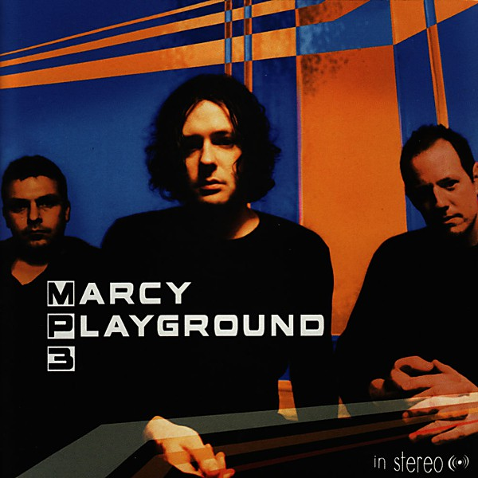

# MP3

By **Marcy Playground**

## Album Data

- **Catalog:** Beets
- **Format:** Digital, Album
- **Album:** MP3
- **Artist:** Marcy Playground
- **Albumartist:** Marcy Playground
- **Genre:** Post-Grunge
- **MusicBrainz Album Artist ID:** 
- **MusicBrainz Album ID:** 
- **MusicBrainz Release Group ID:** 
- **Year:** 2003
- **Catalog #:** CDP 523142
- **Label:** Capitol Records
- **Total Tracks:** 12

## Album Tracks

### Track 01 - It’s Saturday

- **Artist:** Marcy Playground
- **Format:** ALAC
- **Genre:** Post-Grunge
- **Length:** 3:15
- **MusicBrainz Track ID:** [b040cea8-6426-4de8-b04c-3325b3d08298](https://musicbrainz.org/recording/b040cea8-6426-4de8-b04c-3325b3d08298)
- **Title:** It’s Saturday
- **Track:** 01
- **Year:** 1999

### Track 02 - America

- **Artist:** Marcy Playground
- **Format:** ALAC
- **Genre:** Post-Grunge
- **Length:** 3:46
- **MusicBrainz Track ID:** [ac019c14-b66a-4156-a94a-81e3ff67118f](https://musicbrainz.org/recording/ac019c14-b66a-4156-a94a-81e3ff67118f)
- **Title:** America
- **Track:** 02
- **Year:** 1999

### Track 03 - Bye Bye

- **Artist:** Marcy Playground
- **Format:** ALAC
- **Genre:** Post-Grunge
- **Length:** 2:51
- **MusicBrainz Track ID:** [67991082-dbb0-4262-91ca-20c7c5cc998d](https://musicbrainz.org/recording/67991082-dbb0-4262-91ca-20c7c5cc998d)
- **Title:** Bye Bye
- **Track:** 03
- **Year:** 1999

### Track 04 - All the Lights Went Out

- **Artist:** Marcy Playground
- **Format:** ALAC
- **Genre:** Post-Grunge
- **Length:** 4:54
- **MusicBrainz Track ID:** [59704242-fad0-42bc-bd1e-0bf92086fb51](https://musicbrainz.org/recording/59704242-fad0-42bc-bd1e-0bf92086fb51)
- **Title:** All the Lights Went Out
- **Track:** 04
- **Year:** 1999

### Track 05 - Secret Squirrel

- **Artist:** Marcy Playground
- **Format:** ALAC
- **Genre:** Post-Grunge
- **Length:** 2:58
- **MusicBrainz Track ID:** [ce84fbfe-d575-4133-9571-e6a2a98b86a0](https://musicbrainz.org/recording/ce84fbfe-d575-4133-9571-e6a2a98b86a0)
- **Title:** Secret Squirrel
- **Track:** 05
- **Year:** 1999

### Track 06 - Wave Motion Gun

- **Artist:** Marcy Playground
- **Format:** ALAC
- **Genre:** Screamo
- **Length:** 3:45
- **MusicBrainz Track ID:** [57c477f2-13c0-45c3-b13e-22031c463267](https://musicbrainz.org/recording/57c477f2-13c0-45c3-b13e-22031c463267)
- **Title:** Wave Motion Gun
- **Track:** 06
- **Year:** 1999

### Track 07 - Rebel Sodville

- **Artist:** Marcy Playground
- **Format:** ALAC
- **Genre:** Alternative Rock
- **Length:** 5:00
- **MusicBrainz Track ID:** [f739e3ec-730d-4e51-b866-90ef21d63982](https://musicbrainz.org/recording/f739e3ec-730d-4e51-b866-90ef21d63982)
- **Title:** Rebel Sodville
- **Track:** 07
- **Year:** 1999

### Track 08 - Sunday Mail

- **Artist:** Marcy Playground
- **Format:** ALAC
- **Genre:** Post-Grunge
- **Length:** 2:49
- **MusicBrainz Track ID:** [458e2e2e-589d-4635-978c-752bfaca231d](https://musicbrainz.org/recording/458e2e2e-589d-4635-978c-752bfaca231d)
- **Title:** Sunday Mail
- **Track:** 08
- **Year:** 1999

### Track 09 - Pigeon Farm

- **Artist:** Marcy Playground
- **Format:** ALAC
- **Genre:** Post-Grunge
- **Length:** 2:30
- **MusicBrainz Track ID:** [bcd70297-e6ed-497a-a631-549e1aad36e2](https://musicbrainz.org/recording/bcd70297-e6ed-497a-a631-549e1aad36e2)
- **Title:** Pigeon Farm
- **Track:** 09
- **Year:** 1999

### Track 10 - Never

- **Artist:** Marcy Playground
- **Format:** ALAC
- **Genre:** Emo
- **Length:** 3:51
- **MusicBrainz Track ID:** [451b76fd-7d75-4e1d-b4d5-a588b85b7a3f](https://musicbrainz.org/recording/451b76fd-7d75-4e1d-b4d5-a588b85b7a3f)
- **Title:** Never
- **Track:** 10
- **Year:** 1999

### Track 11 - Love Bug

- **Artist:** Marcy Playground
- **Format:** ALAC
- **Genre:** Post-Grunge
- **Length:** 4:12
- **MusicBrainz Track ID:** [95c418e1-b986-46d2-8064-26f9f9f9f146](https://musicbrainz.org/recording/95c418e1-b986-46d2-8064-26f9f9f9f146)
- **Title:** Love Bug
- **Track:** 11
- **Year:** 1999

### Track 12 - Our Generation

- **Artist:** Marcy Playground
- **Format:** ALAC
- **Genre:** Post-Grunge
- **Length:** 8:13
- **MusicBrainz Track ID:** [02b00564-91b2-4b0b-8003-7f8a16323d30](https://musicbrainz.org/recording/02b00564-91b2-4b0b-8003-7f8a16323d30)
- **Title:** Our Generation
- **Track:** 12
- **Year:** 1999

## See also

- [Indaba Remixes From Wonderland](Indaba_Remixes_From_Wonderland.md)
- [Leaving Wonderland... In a Fit of Rage](Leaving_Wonderland_In_a_Fit_of_Rage.md)
- [Lunch, Recess & Detention [+digital booklet]](Lunch__Recess_and_Detention_[+digital_booklet].md)
- [Lunch, Recess & Detention](Lunch__Recess_and_Detention.md)
- [Marcy Playground](Marcy_Playground.md)
- [Shapeshifter](Shapeshifter.md)
- [Unreleased](Unreleased.md)
- [CD: Indaba Remixes From Wonderland](../../CD/Marcy_Playground/Indaba_Remixes_From_Wonderland.md)
- [CD: "Lunch, Recess & Detention"](../../CD/Marcy_Playground/Lunch__Recess_and_Detention.md)
- [CD: ](../../CD/Marcy_Playground/Marcy_Playground_index.md)
- [CD: Marcy Playground](../../CD/Marcy_Playground/Marcy_Playground.md)
- [CD: Shapeshifter](../../CD/Marcy_Playground/Shapeshifter.md)
- [Roon: From the Marcy Playground](../../Roon/Marcy_Playground/From_the_Marcy_Playground.md)
- [Roon: Indaba Remixes From Wonderland](../../Roon/Marcy_Playground/Indaba_Remixes_From_Wonderland.md)
- [Roon: Leaving Wonderland...In A Fit Of Rage](../../Roon/Marcy_Playground/Leaving_WonderlandIn_A_Fit_Of_Rage.md)
- [Roon: Lunch, Recess & Detention](../../Roon/Marcy_Playground/Lunch__Recess_and_Detention.md)
- [Roon: Marcy Playground](../../Roon/Marcy_Playground/Marcy_Playground.md)
- [Roon: MP3](../../Roon/Marcy_Playground/MP3.md)
- [Roon: Shapeshifter](../../Roon/Marcy_Playground/Shapeshifter.md)
- [Vinyl: ](../../Vinyl/Marcy_Playground/Marcy_Playground_index.md)
- [Vinyl: Marcy Playground](../../Vinyl/Marcy_Playground/Marcy_Playground.md)
