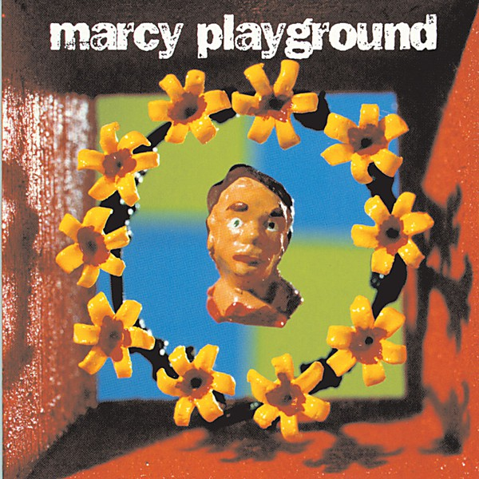

# Marcy Playground

By **Marcy Playground**

## Album Data

- **Catalog:** Beets
- **Format:** Digital, Album
- **Album:** Marcy Playground
- **Artist:** Marcy Playground
- **Albumartist:** Marcy Playground
- **Genre:** Post-Grunge
- **MusicBrainz Album Artist ID:** [64cdc08f-ba6f-41fe-94be-452dc6d5108e](https://musicbrainz.org/artist/64cdc08f-ba6f-41fe-94be-452dc6d5108e)
- **MusicBrainz Album ID:** [536ef0d0-8084-3c58-90eb-9e76900cabe4](https://musicbrainz.org/release/536ef0d0-8084-3c58-90eb-9e76900cabe4)
- **MusicBrainz Release Group ID:** [6446003b-6bfe-3be5-ad98-1a8e50c7fc0e](https://musicbrainz.org/release-group/6446003b-6bfe-3be5-ad98-1a8e50c7fc0e)
- **Year:** 1997
- **Catalog #:** 
- **Label:** 
- **Total Tracks:** 22

## Album Tracks

### Track 03 - Punk Rock Superstar

- **Artist:** Marcy Playground
- **Format:** AAC
- **Genre:** Alternative Rock
- **Length:** 2:54
- **MusicBrainz Track ID:** 
- **Title:** Punk Rock Superstar
- **Track:** 03
- **Year:** 2003

### Track 01 - Spoonfed

- **Artist:** Marcy Playground
- **Format:** ALAC
- **Genre:** Post-Grunge
- **Length:** 4:08
- **MusicBrainz Track ID:** 
- **Title:** Spoonfed
- **Track:** 01
- **Year:** 2003

### Track 02 - Blood In Alphabet Soup

- **Artist:** Marcy Playground
- **Format:** ALAC
- **Genre:** Screamo
- **Length:** 2:19
- **MusicBrainz Track ID:** 
- **Title:** Blood In Alphabet Soup
- **Track:** 02
- **Year:** 2003

### Track 03 - No One's Boy

- **Artist:** Marcy Playground
- **Format:** ALAC
- **Genre:** Emo
- **Length:** 2:51
- **MusicBrainz Track ID:** 
- **Title:** No One's Boy
- **Track:** 03
- **Year:** 2003

### Track 04 - Hotter Than The Sun

- **Artist:** Marcy Playground
- **Format:** ALAC
- **Genre:** Post-Grunge
- **Length:** 4:19
- **MusicBrainz Track ID:** 
- **Title:** Hotter Than The Sun
- **Track:** 04
- **Year:** 2003

### Track 05 - Rock And Roll Heroes

- **Artist:** Marcy Playground
- **Format:** ALAC
- **Genre:** Post-Grunge
- **Length:** 2:55
- **MusicBrainz Track ID:** 
- **Title:** Rock And Roll Heroes
- **Track:** 05
- **Year:** 2003

### Track 06 - Jesse Went To War

- **Artist:** Marcy Playground
- **Format:** ALAC
- **Genre:** Rock
- **Length:** 3:37
- **MusicBrainz Track ID:** 
- **Title:** Jesse Went To War
- **Track:** 06
- **Year:** 2003

### Track 07 - Flag And Finger

- **Artist:** Marcy Playground
- **Format:** ALAC
- **Genre:** Post-Grunge
- **Length:** 3:26
- **MusicBrainz Track ID:** 
- **Title:** Flag And Finger
- **Track:** 07
- **Year:** 2003

### Track 08 - Deadly Handsome Man

- **Artist:** Marcy Playground
- **Format:** ALAC
- **Genre:** Post-Grunge
- **Length:** 3:31
- **MusicBrainz Track ID:** 
- **Title:** Deadly Handsome Man
- **Track:** 08
- **Year:** 2003

### Track 09 - Punk Rock Superstar

- **Artist:** Marcy Playground
- **Format:** ALAC
- **Genre:** Alternative Rock
- **Length:** 2:54
- **MusicBrainz Track ID:** 
- **Title:** Punk Rock Superstar
- **Track:** 09
- **Year:** 2003

### Track 10 - Paper Dolls

- **Artist:** Marcy Playground
- **Format:** ALAC
- **Genre:** Post-Grunge
- **Length:** 2:35
- **MusicBrainz Track ID:** 
- **Title:** Paper Dolls
- **Track:** 10
- **Year:** 2003

### Track 11 - Death Of A Cheerleader

- **Artist:** Marcy Playground
- **Format:** ALAC
- **Genre:** Post-Grunge
- **Length:** 4:45
- **MusicBrainz Track ID:** 
- **Title:** Death Of A Cheerleader
- **Track:** 11
- **Year:** 2003

### Track 12 - Brand New Day

- **Artist:** Marcy Playground
- **Format:** ALAC
- **Genre:** Post-Grunge
- **Length:** 3:36
- **MusicBrainz Track ID:** 
- **Title:** Brand New Day
- **Track:** 12
- **Year:** 2003

### Track 13 - Sleepy Eyes

- **Artist:** Marcy Playground
- **Format:** ALAC
- **Genre:** Post-Grunge
- **Length:** 3:52
- **MusicBrainz Track ID:** 
- **Title:** Sleepy Eyes
- **Track:** 13
- **Year:** 2003

### Track 14 - Barfly

- **Artist:** Marcy Playground
- **Format:** ALAC
- **Genre:** Rock
- **Length:** 5:17
- **MusicBrainz Track ID:** 
- **Title:** Barfly
- **Track:** 14
- **Year:** 2003

## See also

- [Indaba Remixes From Wonderland](Indaba_Remixes_From_Wonderland.md)
- [Leaving Wonderland... In a Fit of Rage](Leaving_Wonderland_In_a_Fit_of_Rage.md)
- [Lunch, Recess & Detention [+digital booklet]](Lunch__Recess_and_Detention_[+digital_booklet].md)
- [Lunch, Recess & Detention](Lunch__Recess_and_Detention.md)
- [MP3](MP3.md)
- [Shapeshifter](Shapeshifter.md)
- [Unreleased](Unreleased.md)
- [CD: Indaba Remixes From Wonderland](../../CD/Marcy_Playground/Indaba_Remixes_From_Wonderland.md)
- [CD: "Lunch, Recess & Detention"](../../CD/Marcy_Playground/Lunch__Recess_and_Detention.md)
- [CD: ](../../CD/Marcy_Playground/Marcy_Playground_index.md)
- [CD: Marcy Playground](../../CD/Marcy_Playground/Marcy_Playground.md)
- [CD: Shapeshifter](../../CD/Marcy_Playground/Shapeshifter.md)
- [Roon: From the Marcy Playground](../../Roon/Marcy_Playground/From_the_Marcy_Playground.md)
- [Roon: Indaba Remixes From Wonderland](../../Roon/Marcy_Playground/Indaba_Remixes_From_Wonderland.md)
- [Roon: Leaving Wonderland...In A Fit Of Rage](../../Roon/Marcy_Playground/Leaving_WonderlandIn_A_Fit_Of_Rage.md)
- [Roon: Lunch, Recess & Detention](../../Roon/Marcy_Playground/Lunch__Recess_and_Detention.md)
- [Roon: Marcy Playground](../../Roon/Marcy_Playground/Marcy_Playground.md)
- [Roon: MP3](../../Roon/Marcy_Playground/MP3.md)
- [Roon: Shapeshifter](../../Roon/Marcy_Playground/Shapeshifter.md)
- [Vinyl: ](../../Vinyl/Marcy_Playground/Marcy_Playground_index.md)
- [Vinyl: Marcy Playground](../../Vinyl/Marcy_Playground/Marcy_Playground.md)
