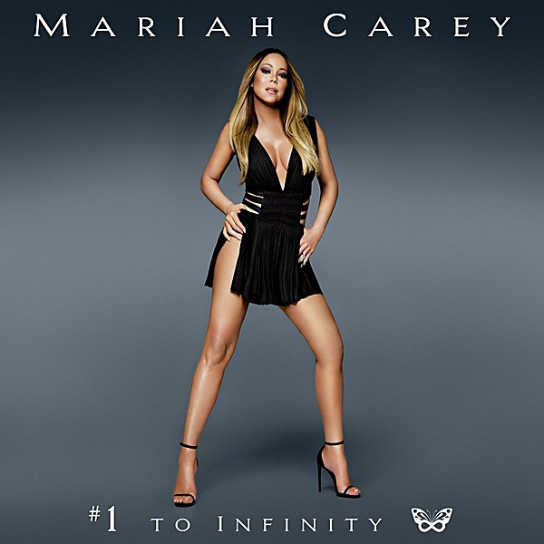

# #1 to Infinity

By **Mariah Carey**

## Album Data

- **Catalog:** Beets
- **Format:** Digital, Album
- **Album:** #1 to Infinity
- **Artist:** Mariah Carey
- **Albumartist:** Mariah Carey
- **Genre:** Soul
- **MusicBrainz Album Artist ID:** [494e8d09-f85b-4543-892f-a5096aed1cd4](https://musicbrainz.org/artist/494e8d09-f85b-4543-892f-a5096aed1cd4)
- **MusicBrainz Album ID:** [97197675-ef5e-4eb1-b2ee-8d1027520cb8](https://musicbrainz.org/release/97197675-ef5e-4eb1-b2ee-8d1027520cb8)
- **MusicBrainz Release Group ID:** [d75a09f9-4146-4f81-bfe1-0f51f0902dae](https://musicbrainz.org/release-group/d75a09f9-4146-4f81-bfe1-0f51f0902dae)
- **Year:** 2015
- **Catalog #:** 
- **Label:** 
- **Total Tracks:** 19

## Album Tracks

### Track 01 - Vision of Love

- **Artist:** Mariah Carey
- **Format:** MP3
- **Genre:** Soul
- **Length:** 3:29
- **MusicBrainz Track ID:** [8c4b22b3-222b-4cb7-a204-763a9eb9a8bb](https://musicbrainz.org/recording/8c4b22b3-222b-4cb7-a204-763a9eb9a8bb)
- **Title:** Vision of Love
- **Track:** 01
- **Year:** 2015

### Track 02 - Love Takes Time

- **Artist:** Mariah Carey
- **Format:** MP3
- **Genre:** Soul
- **Length:** 3:48
- **MusicBrainz Track ID:** [3cb61777-572e-4b6f-8662-cfd972d05a35](https://musicbrainz.org/recording/3cb61777-572e-4b6f-8662-cfd972d05a35)
- **Title:** Love Takes Time
- **Track:** 02
- **Year:** 2015

### Track 03 - Someday (MTV Unplugged)

- **Artist:** Mariah Carey
- **Format:** MP3
- **Genre:** Soul
- **Length:** 4:01
- **MusicBrainz Track ID:** [94a04b9f-6926-488c-9b72-f49f4210e39c](https://musicbrainz.org/recording/94a04b9f-6926-488c-9b72-f49f4210e39c)
- **Title:** Someday (MTV Unplugged)
- **Track:** 03
- **Year:** 2015

### Track 04 - I Don't Wanna Cry

- **Artist:** Mariah Carey
- **Format:** MP3
- **Genre:** Soul
- **Length:** 4:49
- **MusicBrainz Track ID:** [21966676-5bf0-4f89-88af-ffc462d88125](https://musicbrainz.org/recording/21966676-5bf0-4f89-88af-ffc462d88125)
- **Title:** I Don't Wanna Cry
- **Track:** 04
- **Year:** 2015

### Track 05 - Emotions

- **Artist:** Mariah Carey
- **Format:** MP3
- **Genre:** Soul
- **Length:** 4:09
- **MusicBrainz Track ID:** [84371413-9190-4986-bc6b-2131a3c97d2f](https://musicbrainz.org/recording/84371413-9190-4986-bc6b-2131a3c97d2f)
- **Title:** Emotions
- **Track:** 05
- **Year:** 2015

### Track 07 - Dreamlover

- **Artist:** Mariah Carey
- **Format:** MP3
- **Genre:** Pop
- **Length:** 3:53
- **MusicBrainz Track ID:** [bd6b5638-d6c7-4e63-ae67-51f6a17a5aaf](https://musicbrainz.org/recording/bd6b5638-d6c7-4e63-ae67-51f6a17a5aaf)
- **Title:** Dreamlover
- **Track:** 07
- **Year:** 2015

### Track 08 - Hero

- **Artist:** Mariah Carey
- **Format:** MP3
- **Genre:** Soul
- **Length:** 4:18
- **MusicBrainz Track ID:** [64e0d0e7-fe8c-406d-863f-17e9efeef5df](https://musicbrainz.org/recording/64e0d0e7-fe8c-406d-863f-17e9efeef5df)
- **Title:** Hero
- **Track:** 08
- **Year:** 2015

### Track 11 - Always Be My Baby

- **Artist:** Mariah Carey
- **Format:** MP3
- **Genre:** Soul
- **Length:** 4:18
- **MusicBrainz Track ID:** [a9c15481-2329-45e1-a1d8-01e61838a60b](https://musicbrainz.org/recording/a9c15481-2329-45e1-a1d8-01e61838a60b)
- **Title:** Always Be My Baby
- **Track:** 11
- **Year:** 2015

### Track 12 - Honey

- **Artist:** Mariah Carey
- **Format:** MP3
- **Genre:** Soul
- **Length:** 4:59
- **MusicBrainz Track ID:** [815a7c6e-b713-40a1-9bcf-fddc0ef064e0](https://musicbrainz.org/recording/815a7c6e-b713-40a1-9bcf-fddc0ef064e0)
- **Title:** Honey
- **Track:** 12
- **Year:** 2015

### Track 13 - My All

- **Artist:** Mariah Carey
- **Format:** MP3
- **Genre:** Soul
- **Length:** 3:50
- **MusicBrainz Track ID:** [5f1da130-862d-4151-af7f-feb813e14794](https://musicbrainz.org/recording/5f1da130-862d-4151-af7f-feb813e14794)
- **Title:** My All
- **Track:** 13
- **Year:** 2015

### Track 16 - We Belong Together

- **Artist:** Mariah Carey
- **Format:** MP3
- **Genre:** Soul
- **Length:** 3:21
- **MusicBrainz Track ID:** [1dfdf2b6-a5c5-463a-a8a6-3d70cb661793](https://musicbrainz.org/recording/1dfdf2b6-a5c5-463a-a8a6-3d70cb661793)
- **Title:** We Belong Together
- **Track:** 16
- **Year:** 2015

### Track 17 - Don't Forget About Us (Radio Edit)

- **Artist:** Mariah Carey
- **Format:** MP3
- **Genre:** Soul
- **Length:** 3:53
- **MusicBrainz Track ID:** [93fb3cb8-a801-4560-952c-e7634e9a6ce0](https://musicbrainz.org/recording/93fb3cb8-a801-4560-952c-e7634e9a6ce0)
- **Title:** Don't Forget About Us (Radio Edit)
- **Track:** 17
- **Year:** 2015

### Track 18 - Touch My Body

- **Artist:** Mariah Carey
- **Format:** MP3
- **Genre:** Soul
- **Length:** 3:25
- **MusicBrainz Track ID:** [43ef1add-f017-401c-a943-5ed8ed23c63c](https://musicbrainz.org/recording/43ef1add-f017-401c-a943-5ed8ed23c63c)
- **Title:** Touch My Body
- **Track:** 18
- **Year:** 2015

### Track 19 - Infinity

- **Artist:** Mariah Carey
- **Format:** MP3
- **Genre:** Soul
- **Length:** 3:59
- **MusicBrainz Track ID:** [4343a328-056d-4d19-a60a-2cc52f9bfab7](https://musicbrainz.org/recording/4343a328-056d-4d19-a60a-2cc52f9bfab7)
- **Title:** Infinity
- **Track:** 19
- **Year:** 2015

### Track 10 - One Sweet Day

- **Artist:** Mariah Carey feat. Boyz II Men
- **Format:** MP3
- **Genre:** Soul
- **Length:** 4:41
- **MusicBrainz Track ID:** [f6ff1fa0-4d8b-4990-ae22-7ca0f7829398](https://musicbrainz.org/recording/f6ff1fa0-4d8b-4990-ae22-7ca0f7829398)
- **Title:** One Sweet Day
- **Track:** 10
- **Year:** 2015

### Track 14 - Heartbreaker

- **Artist:** Mariah Carey feat. JAY‐Z
- **Format:** MP3
- **Genre:** Pop
- **Length:** 4:45
- **MusicBrainz Track ID:** [6d2b89bf-2045-40e6-99d3-c1c1d45da9fb](https://musicbrainz.org/recording/6d2b89bf-2045-40e6-99d3-c1c1d45da9fb)
- **Title:** Heartbreaker
- **Track:** 14
- **Year:** 2015

### Track 15 - Thank God I Found You

- **Artist:** Mariah Carey feat. Joe & 98°
- **Format:** MP3
- **Genre:** Soul
- **Length:** 4:17
- **MusicBrainz Track ID:** [4c13fcab-5ada-4a9c-969a-076c03a9c4e9](https://musicbrainz.org/recording/4c13fcab-5ada-4a9c-969a-076c03a9c4e9)
- **Title:** Thank God I Found You
- **Track:** 15
- **Year:** 2015

### Track 06 - I'll Be There

- **Artist:** Mariah Carey feat. Trey Lorenz
- **Format:** MP3
- **Genre:** Soul
- **Length:** 4:24
- **MusicBrainz Track ID:** [0070562f-5f23-4ed6-883d-ec8a1e8c38b3](https://musicbrainz.org/recording/0070562f-5f23-4ed6-883d-ec8a1e8c38b3)
- **Title:** I'll Be There
- **Track:** 06
- **Year:** 2015

### Track 09 - Fantasy

- **Artist:** Mariah Carey feat. Ol’ Dirty Bastard
- **Format:** MP3
- **Genre:** Soul
- **Length:** 4:50
- **MusicBrainz Track ID:** [310bbab4-915f-46a7-81d6-c510a69c8a06](https://musicbrainz.org/recording/310bbab4-915f-46a7-81d6-c510a69c8a06)
- **Title:** Fantasy
- **Track:** 09
- **Year:** 2015

## See also

- [Roon: #1 to Infinity](../../Roon/Mariah_Carey/1_to_Infinity.md)
- [Roon: Daydream](../../Roon/Mariah_Carey/Daydream.md)
- [Vinyl: #1 To Infinity](../../Vinyl/Mariah_Carey/1_To_Infinity.md)
- [Vinyl: ](../../Vinyl/Mariah_Carey/Mariah_Carey.md)
