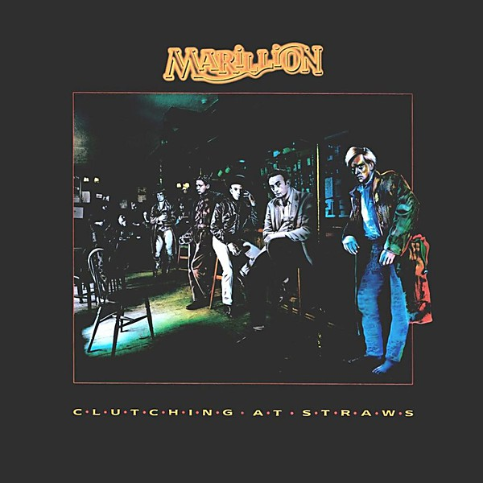

# Clutching at Straws

By **Marillion**

## Album Data

- **Catalog:** Beets
- **Format:** Digital, Album
- **Album:** Clutching at Straws
- **Artist:** Marillion
- **Albumartist:** Marillion
- **Genre:** Progressive Rock
- **MusicBrainz Album Artist ID:** [1932f5b6-0b7b-4050-b1df-833ca89e5f44](https://musicbrainz.org/artist/1932f5b6-0b7b-4050-b1df-833ca89e5f44)
- **MusicBrainz Album ID:** [b24ddae2-7533-4537-8c14-80d6b112c591](https://musicbrainz.org/release/b24ddae2-7533-4537-8c14-80d6b112c591)
- **MusicBrainz Release Group ID:** [7c7afb4c-565b-3057-958c-a78285d483f3](https://musicbrainz.org/release-group/7c7afb4c-565b-3057-958c-a78285d483f3)
- **Year:** 1987
- **Catalog #:** C2 46160
- **Label:** Capitol Records
- **Total Tracks:** 10

## Album Tracks

### Track 01 - Pseudo Silk Kimono

- **Artist:** Marillion
- **Format:** MP3
- **Genre:** Progressive Rock
- **Length:** 2:15
- **MusicBrainz Track ID:** [f18f7ca2-2347-4a4a-a96a-54e49eb57235](https://musicbrainz.org/recording/f18f7ca2-2347-4a4a-a96a-54e49eb57235)
- **Title:** Pseudo Silk Kimono
- **Track:** 01
- **Year:** 1985

### Track 02 - Kayleigh

- **Artist:** Marillion
- **Format:** MP3
- **Genre:** Progressive Rock
- **Length:** 4:04
- **MusicBrainz Track ID:** [f99a7c76-96d1-45cd-9155-afd24a791e04](https://musicbrainz.org/recording/f99a7c76-96d1-45cd-9155-afd24a791e04)
- **Title:** Kayleigh
- **Track:** 02
- **Year:** 1985

### Track 03 - Lavender

- **Artist:** Marillion
- **Format:** MP3
- **Genre:** Progressive Rock
- **Length:** 2:26
- **MusicBrainz Track ID:** [4e0f5c5a-5315-4ec6-8ada-012faf6eb288](https://musicbrainz.org/recording/4e0f5c5a-5315-4ec6-8ada-012faf6eb288)
- **Title:** Lavender
- **Track:** 03
- **Year:** 1985

### Track 04 - Bitter Suite

- **Artist:** Marillion
- **Format:** AAC
- **Genre:** Progressive Rock
- **Length:** 7:56
- **MusicBrainz Track ID:** [9557e58a-163c-40da-b0f3-53d0efef346f](https://musicbrainz.org/recording/9557e58a-163c-40da-b0f3-53d0efef346f)
- **Title:** Bitter Suite
- **Track:** 04
- **Year:** 1985

### Track 05 - Heart of Lothian

- **Artist:** Marillion
- **Format:** AAC
- **Genre:** Progressive Rock
- **Length:** 4:02
- **MusicBrainz Track ID:** [3ed0533b-fc96-4fdd-a94c-4c362e3dda59](https://musicbrainz.org/recording/3ed0533b-fc96-4fdd-a94c-4c362e3dda59)
- **Title:** Heart of Lothian
- **Track:** 05
- **Year:** 1985

### Track 06 - Waterhole (Expresso Bongo)

- **Artist:** Marillion
- **Format:** MP3
- **Genre:** Progressive Rock
- **Length:** 2:10
- **MusicBrainz Track ID:** [1b249ec1-bec9-418f-a0dc-c95d1883832b](https://musicbrainz.org/recording/1b249ec1-bec9-418f-a0dc-c95d1883832b)
- **Title:** Waterhole (Expresso Bongo)
- **Track:** 06
- **Year:** 1985

### Track 07 - Lords of the Backstage

- **Artist:** Marillion
- **Format:** MP3
- **Genre:** Progressive Rock
- **Length:** 1:58
- **MusicBrainz Track ID:** [f0edb792-8f1c-45ae-bf7f-a862be310155](https://musicbrainz.org/recording/f0edb792-8f1c-45ae-bf7f-a862be310155)
- **Title:** Lords of the Backstage
- **Track:** 07
- **Year:** 1985

### Track 08 - Blind Curve

- **Artist:** Marillion
- **Format:** AAC
- **Genre:** Progressive Rock
- **Length:** 9:29
- **MusicBrainz Track ID:** [ebe8f3a5-f6f1-4628-8d6f-533ebbe15d87](https://musicbrainz.org/recording/ebe8f3a5-f6f1-4628-8d6f-533ebbe15d87)
- **Title:** Blind Curve
- **Track:** 08
- **Year:** 1985

### Track 09 - Childhoods End?

- **Artist:** Marillion
- **Format:** AAC
- **Genre:** Progressive Rock
- **Length:** 4:33
- **MusicBrainz Track ID:** [f30ace6d-560c-4ba0-9ca3-8e116c5f43d1](https://musicbrainz.org/recording/f30ace6d-560c-4ba0-9ca3-8e116c5f43d1)
- **Title:** Childhoods End?
- **Track:** 09
- **Year:** 1985

### Track 10 - White Feather

- **Artist:** Marillion
- **Format:** MP3
- **Genre:** Progressive Rock
- **Length:** 2:23
- **MusicBrainz Track ID:** [0ceae339-6232-409a-bacd-6491d35f0836](https://musicbrainz.org/recording/0ceae339-6232-409a-bacd-6491d35f0836)
- **Title:** White Feather
- **Track:** 10
- **Year:** 1985

## See also

- [Misplaced Childhood (2017 vinyl remaster)](Misplaced_Childhood_2017_vinyl_remaster.md)
- [Misplaced Childhood](Misplaced_Childhood.md)
- [Roon: Brave (Deluxe Edition)](../../Roon/Marillion/Brave_Deluxe_Edition.md)
- [Roon: Misplaced Childhood](../../Roon/Marillion/Misplaced_Childhood.md)
- [Vinyl: ](../../Vinyl/Marillion/Marillion.md)
- [Vinyl: Misplaced Childhood](../../Vinyl/Marillion/Misplaced_Childhood.md)
