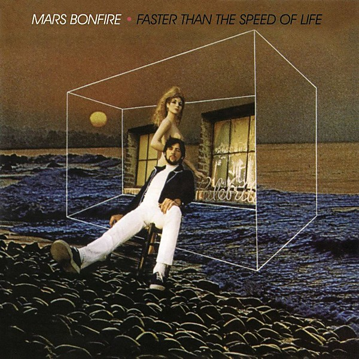

# Faster Than the Speed of Life

By **Mars Bonfire**

## Album Data

- **Catalog:** Beets
- **Format:** Digital, Album
- **Album:** Faster Than the Speed of Life
- **Artist:** Mars Bonfire
- **Albumartist:** Mars Bonfire
- **Genre:** Psychedelic Rock
- **MusicBrainz Album Artist ID:** [9fa4bdcc-f8b2-489c-bb03-e7f725bbbc62](https://musicbrainz.org/artist/9fa4bdcc-f8b2-489c-bb03-e7f725bbbc62)
- **MusicBrainz Album ID:** [fd029e0c-70d6-40e8-bf59-5b25ca2bcacf](https://musicbrainz.org/release/fd029e0c-70d6-40e8-bf59-5b25ca2bcacf)
- **MusicBrainz Release Group ID:** [749ff13f-e809-441d-8a3b-07b431462f44](https://musicbrainz.org/release-group/749ff13f-e809-441d-8a3b-07b431462f44)
- **Year:** 1969
- **Catalog #:** CS 9834
- **Label:** Columbia
- **Total Tracks:** 11

## Album Tracks

### Track 01 - Faster Than the Speed of Life

- **Artist:** Mars Bonfire
- **Format:** AAC
- **Genre:** Psychedelic Rock
- **Length:** 2:59
- **MusicBrainz Track ID:** [7400900b-87f2-4243-8c2d-c50f123ad19a](https://musicbrainz.org/recording/7400900b-87f2-4243-8c2d-c50f123ad19a)
- **Title:** Faster Than the Speed of Life
- **Track:** 01
- **Year:** 1969

### Track 02 - Born to Be Wild

- **Artist:** Mars Bonfire
- **Format:** AAC
- **Genre:** Psychedelic Rock
- **Length:** 2:59
- **MusicBrainz Track ID:** [86dcd0f6-fc59-40c3-ae67-e813574199eb](https://musicbrainz.org/recording/86dcd0f6-fc59-40c3-ae67-e813574199eb)
- **Title:** Born to Be Wild
- **Track:** 02
- **Year:** 1969

### Track 03 - Sad Eyes

- **Artist:** Mars Bonfire
- **Format:** AAC
- **Genre:** Psychedelic Rock
- **Length:** 2:19
- **MusicBrainz Track ID:** [d0b45687-68d9-4160-8e31-e0fc1c3d6f61](https://musicbrainz.org/recording/d0b45687-68d9-4160-8e31-e0fc1c3d6f61)
- **Title:** Sad Eyes
- **Track:** 03
- **Year:** 1969

### Track 04 - Lady Moon Walker

- **Artist:** Mars Bonfire
- **Format:** AAC
- **Genre:** Psychedelic Rock
- **Length:** 2:39
- **MusicBrainz Track ID:** [1ebe7df8-74ee-43a4-8ebd-fd5d4652fdc8](https://musicbrainz.org/recording/1ebe7df8-74ee-43a4-8ebd-fd5d4652fdc8)
- **Title:** Lady Moon Walker
- **Track:** 04
- **Year:** 1969

### Track 05 - Tenderness

- **Artist:** Mars Bonfire
- **Format:** AAC
- **Genre:** Psychedelic Rock
- **Length:** 4:26
- **MusicBrainz Track ID:** [6f64f455-add8-4909-b8cc-3c567a305c87](https://musicbrainz.org/recording/6f64f455-add8-4909-b8cc-3c567a305c87)
- **Title:** Tenderness
- **Track:** 05
- **Year:** 1969

### Track 06 - She

- **Artist:** Mars Bonfire
- **Format:** AAC
- **Genre:** Psychedelic Rock
- **Length:** 2:54
- **MusicBrainz Track ID:** [6a8c40ac-74f0-434a-92d7-2bd82c67a429](https://musicbrainz.org/recording/6a8c40ac-74f0-434a-92d7-2bd82c67a429)
- **Title:** She
- **Track:** 06
- **Year:** 1969

### Track 07 - Ride With Me, Baby

- **Artist:** Mars Bonfire
- **Format:** AAC
- **Genre:** Psychedelic Rock
- **Length:** 6:01
- **MusicBrainz Track ID:** [a92e34be-ebee-42c5-a68f-0d9bd77bf94a](https://musicbrainz.org/recording/a92e34be-ebee-42c5-a68f-0d9bd77bf94a)
- **Title:** Ride With Me, Baby
- **Track:** 07
- **Year:** 1969

### Track 08 - How Much Older Will We Grow

- **Artist:** Mars Bonfire
- **Format:** AAC
- **Genre:** Psychedelic Rock
- **Length:** 5:48
- **MusicBrainz Track ID:** [9516e5f9-20f0-49ff-a99d-a51f3a9e7973](https://musicbrainz.org/recording/9516e5f9-20f0-49ff-a99d-a51f3a9e7973)
- **Title:** How Much Older Will We Grow
- **Track:** 08
- **Year:** 1969

### Track 09 - So Alive With Love

- **Artist:** Mars Bonfire
- **Format:** AAC
- **Genre:** Psychedelic Rock
- **Length:** 2:40
- **MusicBrainz Track ID:** [ab2c7af2-e3c3-4da6-b6c0-551b1f8d6c05](https://musicbrainz.org/recording/ab2c7af2-e3c3-4da6-b6c0-551b1f8d6c05)
- **Title:** So Alive With Love
- **Track:** 09
- **Year:** 1969

### Track 10 - In Christina's Arms

- **Artist:** Mars Bonfire
- **Format:** AAC
- **Genre:** Psychedelic Rock
- **Length:** 3:11
- **MusicBrainz Track ID:** [343240ef-eca3-4bab-8dc4-24fdef18fd0e](https://musicbrainz.org/recording/343240ef-eca3-4bab-8dc4-24fdef18fd0e)
- **Title:** In Christina's Arms
- **Track:** 10
- **Year:** 1969

### Track 11 - Night Time's for You

- **Artist:** Mars Bonfire
- **Format:** AAC
- **Genre:** Psychedelic Rock
- **Length:** 2:16
- **MusicBrainz Track ID:** [b6958af2-9d37-450b-a12a-35218a1a32ba](https://musicbrainz.org/recording/b6958af2-9d37-450b-a12a-35218a1a32ba)
- **Title:** Night Time's for You
- **Track:** 11
- **Year:** 1969

