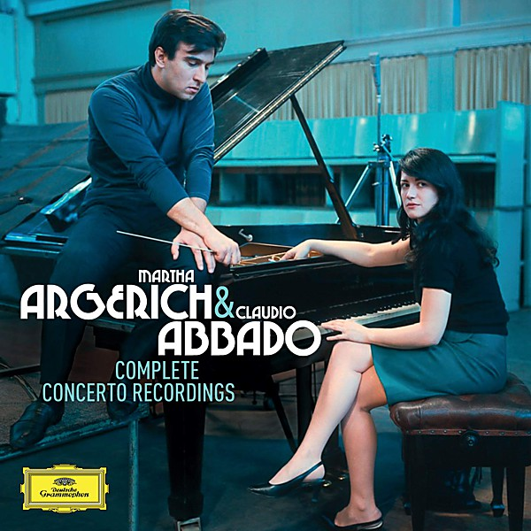

# Martha Argerich & Claudio Abbado - Complete Concerto Recordings

By **Martha Argerich, Claudio Abbado**

## Album Data

- **Catalog:** Beets
- **Format:** Digital, Album
- **Album:** Martha Argerich & Claudio Abbado - Complete Concerto Recordings
- **Artist:** Martha Argerich, Claudio Abbado
- **Albumartist:** Martha Argerich, Claudio Abbado
- **Genre:** Classical
- **MusicBrainz Album Artist ID:** 
- **MusicBrainz Album ID:** 
- **MusicBrainz Release Group ID:** 
- **Year:** 2015
- **Catalog #:** 
- **Label:** 
- **Total Tracks:** 03

## Album Tracks

### Track 01 - Prokofiev

- **Artist:** Martha Argerich, Berliner Philharmoniker, Claudio Abbado
- **Format:** MP3
- **Genre:** Orchestra
- **Length:** 9:01
- **MusicBrainz Track ID:** 
- **Title:** Prokofiev
- **Track:** 01
- **Year:** 1967

### Track 02 - 2. Tema con variazione

- **Artist:** Martha Argerich, Berliner Philharmoniker, Claudio Abbado
- **Format:** MP3
- **Genre:** Orchestra
- **Length:** 9:03
- **MusicBrainz Track ID:** 
- **Title:** 2. Tema con variazione
- **Track:** 02
- **Year:** 2015

### Track 02 - Ravel

- **Artist:** Martha Argerich, Berliner Philharmoniker, Claudio Abbado
- **Format:** MP3
- **Genre:** Orchestra
- **Length:** 9:02
- **MusicBrainz Track ID:** 
- **Title:** Ravel
- **Track:** 02
- **Year:** 1967

### Track 03 - 3. Allegro ma non troppo

- **Artist:** Martha Argerich, Berliner Philharmoniker, Claudio Abbado
- **Format:** MP3
- **Genre:** Orchestra
- **Length:** 9:00
- **MusicBrainz Track ID:** 
- **Title:** 3. Allegro ma non troppo
- **Track:** 03
- **Year:** 2015

### Track 04 - 1. Allegramente

- **Artist:** Martha Argerich, Berliner Philharmoniker, Claudio Abbado
- **Format:** MP3
- **Genre:** Orchestra
- **Length:** 8:05
- **MusicBrainz Track ID:** 
- **Title:** 1. Allegramente
- **Track:** 04
- **Year:** 2015

### Track 06 - 3. Presto

- **Artist:** Martha Argerich, Berliner Philharmoniker, Claudio Abbado
- **Format:** MP3
- **Genre:** Orchestra
- **Length:** 3:52
- **MusicBrainz Track ID:** 
- **Title:** 3. Presto
- **Track:** 06
- **Year:** 2015

### Track 01 - 1. Allegro non troppo e molto maestoso - Allegro con spirito

- **Artist:** Martha Argerich, Berliner Philharmoniker, Claudio Abbado
- **Format:** MP3
- **Genre:** Orchestra
- **Length:** 19:12
- **MusicBrainz Track ID:** 
- **Title:** 1. Allegro non troppo e molto maestoso - Allegro con spirito
- **Track:** 01
- **Year:** 2015

### Track 02 - 2. Andantino semplice - Prestissimo - Tempo I

- **Artist:** Martha Argerich, Berliner Philharmoniker, Claudio Abbado
- **Format:** MP3
- **Genre:** Orchestra
- **Length:** 6:30
- **MusicBrainz Track ID:** 
- **Title:** 2. Andantino semplice - Prestissimo - Tempo I
- **Track:** 02
- **Year:** 2015

### Track 03 - 3. Allegro con fuoco

- **Artist:** Martha Argerich, Berliner Philharmoniker, Claudio Abbado
- **Format:** MP3
- **Genre:** Orchestra
- **Length:** 6:18
- **MusicBrainz Track ID:** 
- **Title:** 3. Allegro con fuoco
- **Track:** 03
- **Year:** 2015

### Track 01 - Ravel

- **Artist:** Martha Argerich, Claudio Abbado
- **Format:** MP3
- **Genre:** Classical
- **Length:** 6:20
- **MusicBrainz Track ID:** 
- **Title:** Ravel
- **Track:** 01
- **Year:** 1974

### Track 02 - Ravel

- **Artist:** Martha Argerich, Claudio Abbado
- **Format:** MP3
- **Genre:** Classical
- **Length:** 6:41
- **MusicBrainz Track ID:** 
- **Title:** Ravel
- **Track:** 02
- **Year:** 1974

### Track 03 - Ravel

- **Artist:** Martha Argerich, Claudio Abbado
- **Format:** MP3
- **Genre:** Classical
- **Length:** 9:22
- **MusicBrainz Track ID:** 
- **Title:** Ravel
- **Track:** 03
- **Year:** 1974

### Track 01 - 1. Allegro maestoso

- **Artist:** Martha Argerich, London Symphony Orchestra, Claudio Abbado
- **Format:** MP3
- **Genre:** Classical
- **Length:** 18:57
- **MusicBrainz Track ID:** 
- **Title:** 1. Allegro maestoso
- **Track:** 01
- **Year:** 2015

### Track 02 - 2. Romance (Larghetto)

- **Artist:** Martha Argerich, London Symphony Orchestra, Claudio Abbado
- **Format:** MP3
- **Genre:** Classical
- **Length:** 9:58
- **MusicBrainz Track ID:** 
- **Title:** 2. Romance (Larghetto)
- **Track:** 02
- **Year:** 2015

### Track 03 - 3. Rondo (Vivace)

- **Artist:** Martha Argerich, London Symphony Orchestra, Claudio Abbado
- **Format:** MP3
- **Genre:** Classical
- **Length:** 9:02
- **MusicBrainz Track ID:** 
- **Title:** 3. Rondo (Vivace)
- **Track:** 03
- **Year:** 2015

### Track 04 - 1. Allegro maestoso

- **Artist:** Martha Argerich, London Symphony Orchestra, Claudio Abbado
- **Format:** MP3
- **Genre:** Classical
- **Length:** 5:08
- **MusicBrainz Track ID:** 
- **Title:** 1. Allegro maestoso
- **Track:** 04
- **Year:** 2015

### Track 04 - Liszt

- **Artist:** Martha Argerich, London Symphony Orchestra, Claudio Abbado
- **Format:** MP3
- **Genre:** Classical
- **Length:** 4:05
- **MusicBrainz Track ID:** 
- **Title:** Liszt
- **Track:** 04
- **Year:** 1968

### Track 05 - 2. Quasi adagio - Allegretto vivace - Allegro animato

- **Artist:** Martha Argerich, London Symphony Orchestra, Claudio Abbado
- **Format:** MP3
- **Genre:** Classical
- **Length:** 8:25
- **MusicBrainz Track ID:** 
- **Title:** 2. Quasi adagio - Allegretto vivace - Allegro animato
- **Track:** 05
- **Year:** 2015

### Track 07 - 1. Allegramente

- **Artist:** Martha Argerich, London Symphony Orchestra, Claudio Abbado
- **Format:** MP3
- **Genre:** Classical
- **Length:** 8:41
- **MusicBrainz Track ID:** 
- **Title:** 1. Allegramente
- **Track:** 07
- **Year:** 2015

### Track 08 - 2. Adagio assai

- **Artist:** Martha Argerich, London Symphony Orchestra, Claudio Abbado
- **Format:** MP3
- **Genre:** Classical
- **Length:** 9:33
- **MusicBrainz Track ID:** 
- **Title:** 2. Adagio assai
- **Track:** 08
- **Year:** 2015

### Track 09 - 3. Presto

- **Artist:** Martha Argerich, London Symphony Orchestra, Claudio Abbado
- **Format:** MP3
- **Genre:** Classical
- **Length:** 3:53
- **MusicBrainz Track ID:** 
- **Title:** 3. Presto
- **Track:** 09
- **Year:** 2015

### Track 01 - 1. Allegro con brio - Cadenza

- **Artist:** Martha Argerich, Mahler Chamber Orchestra, Claudio Abbado
- **Format:** MP3
- **Genre:** Classical
- **Length:** 16:11
- **MusicBrainz Track ID:** 
- **Title:** 1. Allegro con brio - Cadenza
- **Track:** 01
- **Year:** 2015

### Track 02 - 2. Largo

- **Artist:** Martha Argerich, Mahler Chamber Orchestra, Claudio Abbado
- **Format:** MP3
- **Genre:** Classical
- **Length:** 10:20
- **MusicBrainz Track ID:** 
- **Title:** 2. Largo
- **Track:** 02
- **Year:** 2015

### Track 03 - 3. Rondo (Allegro)

- **Artist:** Martha Argerich, Mahler Chamber Orchestra, Claudio Abbado
- **Format:** MP3
- **Genre:** Classical
- **Length:** 9:10
- **MusicBrainz Track ID:** 
- **Title:** 3. Rondo (Allegro)
- **Track:** 03
- **Year:** 2015

### Track 04 - 1. Allegro con brio - Cadenza

- **Artist:** Martha Argerich, Mahler Chamber Orchestra, Claudio Abbado
- **Format:** MP3
- **Genre:** Classical
- **Length:** 13:20
- **MusicBrainz Track ID:** 
- **Title:** 1. Allegro con brio - Cadenza
- **Track:** 04
- **Year:** 2015

### Track 05 - 2. Adagio

- **Artist:** Martha Argerich, Mahler Chamber Orchestra, Claudio Abbado
- **Format:** MP3
- **Genre:** Classical
- **Length:** 8:48
- **MusicBrainz Track ID:** 
- **Title:** 2. Adagio
- **Track:** 05
- **Year:** 2015

### Track 06 - 3. Rondo (Molto allegro)

- **Artist:** Martha Argerich, Mahler Chamber Orchestra, Claudio Abbado
- **Format:** MP3
- **Genre:** Classical
- **Length:** 6:03
- **MusicBrainz Track ID:** 
- **Title:** 3. Rondo (Molto allegro)
- **Track:** 06
- **Year:** 2015

### Track 01 - 1. Allegro maestoso - Cadenza

- **Artist:** Martha Argerich, Orchestra Mozart, Claudio Abbado
- **Format:** MP3
- **Genre:** Classical
- **Length:** 14:18
- **MusicBrainz Track ID:** 
- **Title:** 1. Allegro maestoso - Cadenza
- **Track:** 01
- **Year:** 2015

### Track 02 - 2. Andante

- **Artist:** Martha Argerich, Orchestra Mozart, Claudio Abbado
- **Format:** MP3
- **Genre:** Classical
- **Length:** 7:01
- **MusicBrainz Track ID:** 
- **Title:** 2. Andante
- **Track:** 02
- **Year:** 2015

### Track 03 - 3. Allegretto

- **Artist:** Martha Argerich, Orchestra Mozart, Claudio Abbado
- **Format:** MP3
- **Genre:** Classical
- **Length:** 9:23
- **MusicBrainz Track ID:** 
- **Title:** 3. Allegretto
- **Track:** 03
- **Year:** 2015

### Track 04 - 1. Allegro

- **Artist:** Martha Argerich, Orchestra Mozart, Claudio Abbado
- **Format:** MP3
- **Genre:** Classical
- **Length:** 14:05
- **MusicBrainz Track ID:** 
- **Title:** 1. Allegro
- **Track:** 04
- **Year:** 2015

### Track 05 - 2. Romance

- **Artist:** Martha Argerich, Orchestra Mozart, Claudio Abbado
- **Format:** MP3
- **Genre:** Classical
- **Length:** 9:02
- **MusicBrainz Track ID:** 
- **Title:** 2. Romance
- **Track:** 05
- **Year:** 2015

### Track 06 - 3. Rondo (Allegro assai)

- **Artist:** Martha Argerich, Orchestra Mozart, Claudio Abbado
- **Format:** MP3
- **Genre:** Classical
- **Length:** 7:50
- **MusicBrainz Track ID:** 
- **Title:** 3. Rondo (Allegro assai)
- **Track:** 06
- **Year:** 2015

