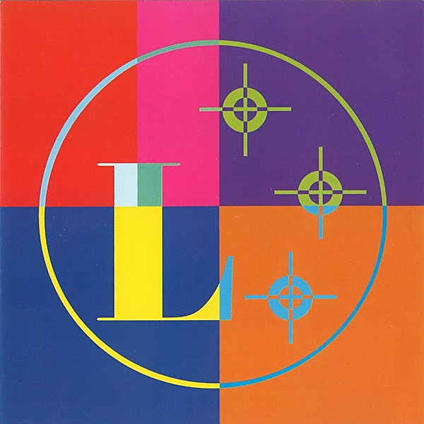

# Music for a World Without Limitations

By **Martin Luther Lennon**

## Album Data

- **Catalog:** Beets
- **Format:** Digital, Album
- **Album:** Music for a World Without Limitations
- **Artist:** Martin Luther Lennon
- **Albumartist:** Martin Luther Lennon
- **Genre:** Power Pop
- **MusicBrainz Album Artist ID:** [6767f71e-ef75-477b-8f0b-cda688b478ff](https://musicbrainz.org/artist/6767f71e-ef75-477b-8f0b-cda688b478ff)
- **MusicBrainz Album ID:** [f96588b1-3981-4e3d-8181-422533da5d9e](https://musicbrainz.org/release/f96588b1-3981-4e3d-8181-422533da5d9e)
- **MusicBrainz Release Group ID:** [d9b3a7c7-59bd-3238-a917-39c8f2e4d1a4](https://musicbrainz.org/release-group/d9b3a7c7-59bd-3238-a917-39c8f2e4d1a4)
- **Year:** 1996
- **Catalog #:** NL-039
- **Label:** Not Lame Recordings
- **Total Tracks:** 12

## Album Tracks

### Track 01 - Kill, Kill, Kill

- **Artist:** Martin Luther Lennon
- **Format:** MP3
- **Genre:** Power Pop
- **Length:** 1:38
- **MusicBrainz Track ID:** [cb77916f-92eb-4a98-9d66-fb1afa75bd08](https://musicbrainz.org/recording/cb77916f-92eb-4a98-9d66-fb1afa75bd08)
- **Title:** Kill, Kill, Kill
- **Track:** 01
- **Year:** 1996

### Track 02 - Nobody I Know

- **Artist:** Martin Luther Lennon
- **Format:** MP3
- **Genre:** Pop Rock
- **Length:** 3:44
- **MusicBrainz Track ID:** [3dd3342b-3eab-406b-930a-d64e7d5adb16](https://musicbrainz.org/recording/3dd3342b-3eab-406b-930a-d64e7d5adb16)
- **Title:** Nobody I Know
- **Track:** 02
- **Year:** 1996

### Track 03 - Tabernacle o' Clay

- **Artist:** Martin Luther Lennon
- **Format:** MP3
- **Genre:** Power Pop
- **Length:** 2:41
- **MusicBrainz Track ID:** [931a7b64-e974-46f9-ae9a-7ea0f6b89f37](https://musicbrainz.org/recording/931a7b64-e974-46f9-ae9a-7ea0f6b89f37)
- **Title:** Tabernacle o' Clay
- **Track:** 03
- **Year:** 1996

### Track 04 - Brenda Revisited

- **Artist:** Martin Luther Lennon
- **Format:** MP3
- **Genre:** Power Pop
- **Length:** 3:10
- **MusicBrainz Track ID:** [e2527e0a-c99b-4ee6-8b1f-79686dc49438](https://musicbrainz.org/recording/e2527e0a-c99b-4ee6-8b1f-79686dc49438)
- **Title:** Brenda Revisited
- **Track:** 04
- **Year:** 1996

### Track 05 - Gun Heaven

- **Artist:** Martin Luther Lennon
- **Format:** MP3
- **Genre:** Power Pop
- **Length:** 2:12
- **MusicBrainz Track ID:** [daa10423-4c6a-48b1-8ef0-aa56e6e341dc](https://musicbrainz.org/recording/daa10423-4c6a-48b1-8ef0-aa56e6e341dc)
- **Title:** Gun Heaven
- **Track:** 05
- **Year:** 1996

### Track 06 - Hologram Sam

- **Artist:** Martin Luther Lennon
- **Format:** MP3
- **Genre:** Power Pop
- **Length:** 3:38
- **MusicBrainz Track ID:** [0cc39941-d19c-4f12-8f46-67717177c478](https://musicbrainz.org/recording/0cc39941-d19c-4f12-8f46-67717177c478)
- **Title:** Hologram Sam
- **Track:** 06
- **Year:** 1996

### Track 07 - Happygirl

- **Artist:** Martin Luther Lennon
- **Format:** MP3
- **Genre:** Power Pop
- **Length:** 3:39
- **MusicBrainz Track ID:** [72241663-c0d7-4771-a0bb-bc633a09df7d](https://musicbrainz.org/recording/72241663-c0d7-4771-a0bb-bc633a09df7d)
- **Title:** Happygirl
- **Track:** 07
- **Year:** 1996

### Track 08 - No Waiting

- **Artist:** Martin Luther Lennon
- **Format:** MP3
- **Genre:** Power Pop
- **Length:** 1:53
- **MusicBrainz Track ID:** [a0e677b5-b22f-43ca-9cef-3d70e269293c](https://musicbrainz.org/recording/a0e677b5-b22f-43ca-9cef-3d70e269293c)
- **Title:** No Waiting
- **Track:** 08
- **Year:** 1996

### Track 09 - Dr. Nu

- **Artist:** Martin Luther Lennon
- **Format:** MP3
- **Genre:** Power Pop
- **Length:** 2:13
- **MusicBrainz Track ID:** [0656799e-5376-4c8e-8032-b3c0f00df8f9](https://musicbrainz.org/recording/0656799e-5376-4c8e-8032-b3c0f00df8f9)
- **Title:** Dr. Nu
- **Track:** 09
- **Year:** 1996

### Track 10 - I'm Just an Elephant

- **Artist:** Martin Luther Lennon
- **Format:** MP3
- **Genre:** Power Pop
- **Length:** 3:20
- **MusicBrainz Track ID:** [3561502b-80e9-46e7-8133-aa9f8531d70a](https://musicbrainz.org/recording/3561502b-80e9-46e7-8133-aa9f8531d70a)
- **Title:** I'm Just an Elephant
- **Track:** 10
- **Year:** 1996

### Track 11 - No Junkies in West Hills

- **Artist:** Martin Luther Lennon
- **Format:** MP3
- **Genre:** Power Pop
- **Length:** 3:23
- **MusicBrainz Track ID:** [a9726ac1-c83e-4da7-beda-6ed43d8b7154](https://musicbrainz.org/recording/a9726ac1-c83e-4da7-beda-6ed43d8b7154)
- **Title:** No Junkies in West Hills
- **Track:** 11
- **Year:** 1996

### Track 12 - Wonderful Us

- **Artist:** Martin Luther Lennon
- **Format:** MP3
- **Genre:** Power Pop
- **Length:** 5:24
- **MusicBrainz Track ID:** [193aafe7-d056-4e9d-bc6e-0fb70b5d6bd1](https://musicbrainz.org/recording/193aafe7-d056-4e9d-bc6e-0fb70b5d6bd1)
- **Title:** Wonderful Us
- **Track:** 12
- **Year:** 1996

