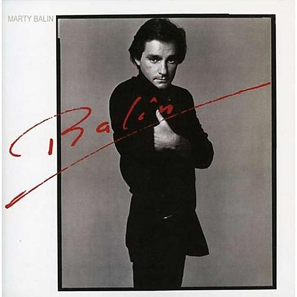

# Balin

By **Marty Balin**

## Album Data

- **Catalog:** Beets
- **Format:** Digital, Album
- **Album:** Balin
- **Artist:** Marty Balin
- **Albumartist:** Marty Balin
- **Genre:** Soul
- **MusicBrainz Album Artist ID:** [dd0fffb5-de0e-4a4a-a279-e4c52a76f516](https://musicbrainz.org/artist/dd0fffb5-de0e-4a4a-a279-e4c52a76f516)
- **MusicBrainz Album ID:** [c982bea0-942f-4ee9-b2ee-3584bc0967c7](https://musicbrainz.org/release/c982bea0-942f-4ee9-b2ee-3584bc0967c7)
- **MusicBrainz Release Group ID:** [bc7378a1-3cb5-3c75-984c-b96c840524a3](https://musicbrainz.org/release-group/bc7378a1-3cb5-3c75-984c-b96c840524a3)
- **Year:** 2008
- **Catalog #:** 24692
- **Label:** American Beat Records
- **Total Tracks:** 09

## Album Tracks

### Track 01 - Hearts

- **Artist:** Marty Balin
- **Format:** AAC
- **Genre:** Soft Rock
- **Length:** 4:36
- **MusicBrainz Track ID:** [23e6ec9b-deca-438b-8dbd-0d0cbe60ae0a](https://musicbrainz.org/recording/23e6ec9b-deca-438b-8dbd-0d0cbe60ae0a)
- **Title:** Hearts
- **Track:** 01
- **Year:** 2008

### Track 02 - You Left Your Mark on Me

- **Artist:** Marty Balin
- **Format:** AAC
- **Genre:** Soul
- **Length:** 4:48
- **MusicBrainz Track ID:** [05d94c9d-d4af-4aa2-8819-432f728e9b1d](https://musicbrainz.org/recording/05d94c9d-d4af-4aa2-8819-432f728e9b1d)
- **Title:** You Left Your Mark on Me
- **Track:** 02
- **Year:** 2008

### Track 03 - Lydia!

- **Artist:** Marty Balin
- **Format:** AAC
- **Genre:** Soul
- **Length:** 4:01
- **MusicBrainz Track ID:** [b13a7883-fe16-488d-9459-05ee751cdff1](https://musicbrainz.org/recording/b13a7883-fe16-488d-9459-05ee751cdff1)
- **Title:** Lydia!
- **Track:** 03
- **Year:** 2008

### Track 04 - Atlanta Lady

- **Artist:** Marty Balin
- **Format:** AAC
- **Genre:** Soul
- **Length:** 3:56
- **MusicBrainz Track ID:** [09f10ab9-67bd-4f60-829f-e62762c0d707](https://musicbrainz.org/recording/09f10ab9-67bd-4f60-829f-e62762c0d707)
- **Title:** Atlanta Lady
- **Track:** 04
- **Year:** 2008

### Track 05 - Spotlight

- **Artist:** Marty Balin
- **Format:** AAC
- **Genre:** Soul
- **Length:** 3:30
- **MusicBrainz Track ID:** [13d470fd-e400-4bc7-876b-d31047c69b45](https://musicbrainz.org/recording/13d470fd-e400-4bc7-876b-d31047c69b45)
- **Title:** Spotlight
- **Track:** 05
- **Year:** 2008

### Track 06 - I Do Believe in You

- **Artist:** Marty Balin
- **Format:** AAC
- **Genre:** Soul
- **Length:** 4:29
- **MusicBrainz Track ID:** [1391b071-437b-4b56-8b29-bc16b56a616f](https://musicbrainz.org/recording/1391b071-437b-4b56-8b29-bc16b56a616f)
- **Title:** I Do Believe in You
- **Track:** 06
- **Year:** 2008

### Track 07 - Elvis and Marilyn

- **Artist:** Marty Balin
- **Format:** AAC
- **Genre:** Soul
- **Length:** 3:11
- **MusicBrainz Track ID:** [d4264272-c919-49f9-a64b-aa66f8371f0d](https://musicbrainz.org/recording/d4264272-c919-49f9-a64b-aa66f8371f0d)
- **Title:** Elvis and Marilyn
- **Track:** 07
- **Year:** 2008

### Track 08 - Tell Me More

- **Artist:** Marty Balin
- **Format:** AAC
- **Genre:** Soul
- **Length:** 3:47
- **MusicBrainz Track ID:** [f850fc02-6443-4f8d-ae93-20ff8d4475e9](https://musicbrainz.org/recording/f850fc02-6443-4f8d-ae93-20ff8d4475e9)
- **Title:** Tell Me More
- **Track:** 08
- **Year:** 2008

### Track 09 - Music Is the Light

- **Artist:** Marty Balin
- **Format:** AAC
- **Genre:** Soul
- **Length:** 4:28
- **MusicBrainz Track ID:** [048731c7-cde5-466f-bfa9-f6e06348c1b4](https://musicbrainz.org/recording/048731c7-cde5-466f-bfa9-f6e06348c1b4)
- **Title:** Music Is the Light
- **Track:** 09
- **Year:** 2008

## See also

- [Roon: Balin](../../Roon/Marty_Balin/Balin.md)
- [Roon: Count On Me](../../Roon/Marty_Balin/Count_On_Me.md)
