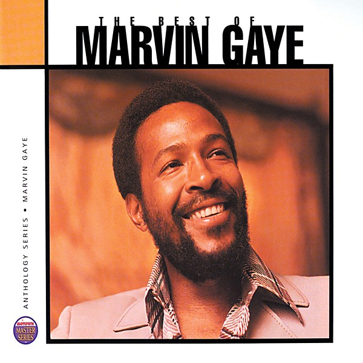

# Anthology

By **Marvin Gaye**

## Album Data

- **Catalog:** Beets
- **Format:** Digital, Album
- **Album:** Anthology
- **Artist:** Marvin Gaye
- **Albumartist:** Marvin Gaye
- **Genre:** Uk Garage
- **MusicBrainz Album Artist ID:** [afdb7919-059d-43c1-b668-ba1d265e7e42](https://musicbrainz.org/artist/afdb7919-059d-43c1-b668-ba1d265e7e42)
- **MusicBrainz Album ID:** [ee2920a1-a30f-407d-83d9-4da844897d10](https://musicbrainz.org/release/ee2920a1-a30f-407d-83d9-4da844897d10)
- **MusicBrainz Release Group ID:** [52195e19-f547-343b-a6af-33160265a480](https://musicbrainz.org/release-group/52195e19-f547-343b-a6af-33160265a480)
- **Year:** 1974
- **Catalog #:** 
- **Label:** 
- **Total Tracks:** 00

## Album Tracks

### Track 03 - Let's Get It On

- **Artist:** Marvin Gaye
- **Format:** AAC
- **Genre:** Soul
- **Length:** 5:25
- **MusicBrainz Track ID:** 
- **Title:** Let's Get It On
- **Track:** 03
- **Year:** 1973

## See also

- [Lets Get It On (Live)](Lets_Get_It_On_Live.md)
- [What's Going On - 40th Anniversary [Super Deluxe] [Disc 1]](Whats_Going_On_-_40th_Anniversary_[Super_Deluxe]_[Disc_1].md)
- [What's Going On - 40th Anniversary [Super Deluxe] [Disc 2]](Whats_Going_On_-_40th_Anniversary_[Super_Deluxe]_[Disc_2].md)
- [Roon: What's Going On](../../Roon/Marvin_Gaye/Whats_Going_On.md)
- [Vinyl: ](../../Vinyl/Marvin_Gaye/Marvin_Gaye.md)
- [Vinyl: What's Going On](../../Vinyl/Marvin_Gaye/Whats_Going_On.md)
