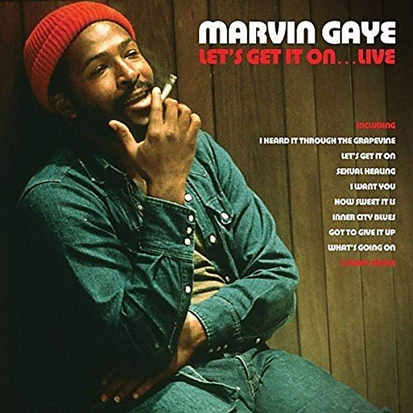

# Lets Get It On (Live)

By **Marvin Gaye**

## Album Data

- **Catalog:** Beets
- **Format:** Digital, Album
- **Album:** Lets Get It On (Live)
- **Artist:** Marvin Gaye
- **Albumartist:** Marvin Gaye
- **Genre:** Soul
- **MusicBrainz Album Artist ID:** 
- **MusicBrainz Album ID:** 
- **MusicBrainz Release Group ID:** 
- **Year:** 1973
- **Catalog #:** 
- **Label:** 
- **Total Tracks:** 19

## Album Tracks

### Track 01 - What's Going On

- **Artist:** Marvin Gaye
- **Format:** ALAC
- **Genre:** Soul
- **Length:** 3:52
- **MusicBrainz Track ID:** 
- **Title:** What's Going On
- **Track:** 01
- **Year:** 2011

### Track 02 - What's Happening Brother

- **Artist:** Marvin Gaye
- **Format:** ALAC
- **Genre:** Soul
- **Length:** 2:43
- **MusicBrainz Track ID:** 
- **Title:** What's Happening Brother
- **Track:** 02
- **Year:** 2011

### Track 03 - Flyin' High (In The Friendly Sky)

- **Artist:** Marvin Gaye
- **Format:** ALAC
- **Genre:** Soul
- **Length:** 3:49
- **MusicBrainz Track ID:** 
- **Title:** Flyin' High (In The Friendly Sky)
- **Track:** 03
- **Year:** 2011

### Track 04 - Save The Children

- **Artist:** Marvin Gaye
- **Format:** ALAC
- **Genre:** Soul
- **Length:** 4:02
- **MusicBrainz Track ID:** 
- **Title:** Save The Children
- **Track:** 04
- **Year:** 2011

### Track 05 - God Is Love

- **Artist:** Marvin Gaye
- **Format:** ALAC
- **Genre:** Soul
- **Length:** 1:41
- **MusicBrainz Track ID:** 
- **Title:** God Is Love
- **Track:** 05
- **Year:** 2011

### Track 06 - Mercy Mercy Me (The Ecology)

- **Artist:** Marvin Gaye
- **Format:** ALAC
- **Genre:** Soul
- **Length:** 3:16
- **MusicBrainz Track ID:** 
- **Title:** Mercy Mercy Me (The Ecology)
- **Track:** 06
- **Year:** 2011

### Track 07 - Right On

- **Artist:** Marvin Gaye
- **Format:** ALAC
- **Genre:** Soul
- **Length:** 7:31
- **MusicBrainz Track ID:** 
- **Title:** Right On
- **Track:** 07
- **Year:** 2011

### Track 08 - Wholy Holy

- **Artist:** Marvin Gaye
- **Format:** ALAC
- **Genre:** Soul
- **Length:** 3:07
- **MusicBrainz Track ID:** 
- **Title:** Wholy Holy
- **Track:** 08
- **Year:** 2011

### Track 09 - Inner City Blues (Make Me Wanna Holler)

- **Artist:** Marvin Gaye
- **Format:** ALAC
- **Genre:** Soul
- **Length:** 5:31
- **MusicBrainz Track ID:** 
- **Title:** Inner City Blues (Make Me Wanna Holler)
- **Track:** 09
- **Year:** 2011

### Track 10 - What's Going On (Original Single Mix)

- **Artist:** Marvin Gaye
- **Format:** ALAC
- **Genre:** Soul
- **Length:** 3:48
- **MusicBrainz Track ID:** 
- **Title:** What's Going On (Original Single Mix)
- **Track:** 10
- **Year:** 2011

### Track 11 - Head Title aka Distant Lover (Demo Version)

- **Artist:** Marvin Gaye
- **Format:** ALAC
- **Genre:** Soul
- **Length:** 4:48
- **MusicBrainz Track ID:** 
- **Title:** Head Title aka Distant Lover (Demo Version)
- **Track:** 11
- **Year:** 2011

### Track 12 - Symphony (Demo Version)

- **Artist:** Marvin Gaye
- **Format:** ALAC
- **Genre:** Soul
- **Length:** 2:52
- **MusicBrainz Track ID:** 
- **Title:** Symphony (Demo Version)
- **Track:** 12
- **Year:** 2011

### Track 13 - I Love The Ground You Walk On (Instrumental)

- **Artist:** Marvin Gaye
- **Format:** ALAC
- **Genre:** Soul
- **Length:** 2:29
- **MusicBrainz Track ID:** 
- **Title:** I Love The Ground You Walk On (Instrumental)
- **Track:** 13
- **Year:** 2011

### Track 14 - What's Going On (Mono Single Version)

- **Artist:** Marvin Gaye
- **Format:** ALAC
- **Genre:** Soul
- **Length:** 3:57
- **MusicBrainz Track ID:** 
- **Title:** What's Going On (Mono Single Version)
- **Track:** 14
- **Year:** 2011

### Track 15 - God Is Love (Mono Single Version)

- **Artist:** Marvin Gaye
- **Format:** ALAC
- **Genre:** Soul
- **Length:** 2:51
- **MusicBrainz Track ID:** 
- **Title:** God Is Love (Mono Single Version)
- **Track:** 15
- **Year:** 2011

### Track 16 - Mercy Mercy Me (The Ecology) (Single Version (Mono))

- **Artist:** Marvin Gaye
- **Format:** ALAC
- **Genre:** Soul
- **Length:** 2:32
- **MusicBrainz Track ID:** 
- **Title:** Mercy Mercy Me (The Ecology) (Single Version (Mono))
- **Track:** 16
- **Year:** 2011

### Track 17 - Sad Tomorrows (Mono Single Version)

- **Artist:** Marvin Gaye
- **Format:** ALAC
- **Genre:** Soul
- **Length:** 2:25
- **MusicBrainz Track ID:** 
- **Title:** Sad Tomorrows (Mono Single Version)
- **Track:** 17
- **Year:** 2011

### Track 18 - Inner City Blues (Make Me Wanna Holler) (Mono Single Version)

- **Artist:** Marvin Gaye
- **Format:** ALAC
- **Genre:** Soul
- **Length:** 2:59
- **MusicBrainz Track ID:** 
- **Title:** Inner City Blues (Make Me Wanna Holler) (Mono Single Version)
- **Track:** 18
- **Year:** 2011

### Track 19 - Wholy Holy (Mono Single Version)

- **Artist:** Marvin Gaye
- **Format:** ALAC
- **Genre:** Soul
- **Length:** 3:08
- **MusicBrainz Track ID:** 
- **Title:** Wholy Holy (Mono Single Version)
- **Track:** 19
- **Year:** 2011

## See also

- [Anthology](Anthology.md)
- [What's Going On - 40th Anniversary [Super Deluxe] [Disc 1]](Whats_Going_On_-_40th_Anniversary_[Super_Deluxe]_[Disc_1].md)
- [What's Going On - 40th Anniversary [Super Deluxe] [Disc 2]](Whats_Going_On_-_40th_Anniversary_[Super_Deluxe]_[Disc_2].md)
- [Roon: What's Going On](../../Roon/Marvin_Gaye/Whats_Going_On.md)
- [Vinyl: ](../../Vinyl/Marvin_Gaye/Marvin_Gaye.md)
- [Vinyl: What's Going On](../../Vinyl/Marvin_Gaye/Whats_Going_On.md)
