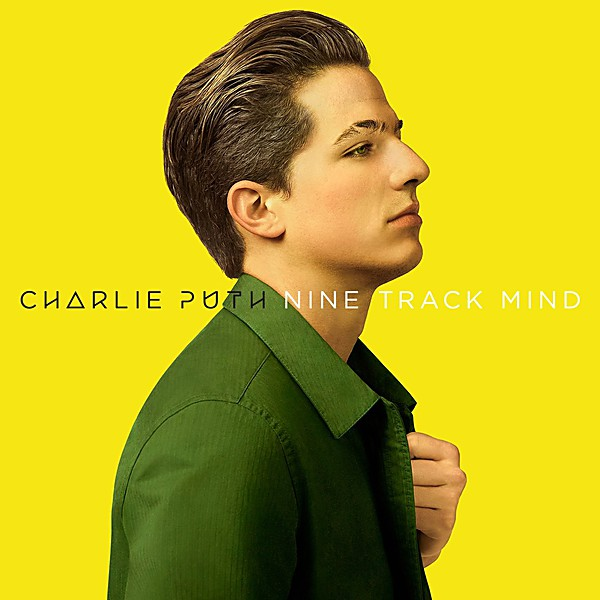

# What's Going On - 40th Anniversary [Super Deluxe] [Disc 1]

By **Marvin Gaye**

## Album Data

- **Catalog:** Beets
- **Format:** Digital, Album
- **Album:** What's Going On - 40th Anniversary [Super Deluxe] [Disc 1]
- **Artist:** Marvin Gaye
- **Albumartist:** Marvin Gaye
- **Genre:** Soul
- **MusicBrainz Album Artist ID:** 
- **MusicBrainz Album ID:** 
- **MusicBrainz Release Group ID:** 
- **Year:** 2011
- **Catalog #:** 
- **Label:** 
- **Total Tracks:** 18

## Album Tracks

### Track 01 - Checking Out (Double Clutch)

- **Artist:** Marvin Gaye
- **Format:** ALAC
- **Genre:** Uk Garage
- **Length:** 4:54
- **MusicBrainz Track ID:** 
- **Title:** Checking Out (Double Clutch)
- **Track:** 01
- **Year:** 2011

### Track 02 - Chained

- **Artist:** Marvin Gaye
- **Format:** ALAC
- **Genre:** Soul
- **Length:** 2:56
- **MusicBrainz Track ID:** 
- **Title:** Chained
- **Track:** 02
- **Year:** 2011

### Track 03 - Country Stud

- **Artist:** Marvin Gaye
- **Format:** ALAC
- **Genre:** Soul
- **Length:** 1:57
- **MusicBrainz Track ID:** 
- **Title:** Country Stud
- **Track:** 03
- **Year:** 2011

### Track 04 - Help The People

- **Artist:** Marvin Gaye
- **Format:** ALAC
- **Genre:** Soul
- **Length:** 2:18
- **MusicBrainz Track ID:** 
- **Title:** Help The People
- **Track:** 04
- **Year:** 2011

### Track 05 - Running From Love (Version 1)

- **Artist:** Marvin Gaye
- **Format:** ALAC
- **Genre:** Soul
- **Length:** 3:09
- **MusicBrainz Track ID:** 
- **Title:** Running From Love (Version 1)
- **Track:** 05
- **Year:** 2011

### Track 06 - Daybreak

- **Artist:** Marvin Gaye
- **Format:** ALAC
- **Genre:** Soul
- **Length:** 2:05
- **MusicBrainz Track ID:** 
- **Title:** Daybreak
- **Track:** 06
- **Year:** 2011

### Track 07 - Doing My Thing

- **Artist:** Marvin Gaye
- **Format:** ALAC
- **Genre:** Soul
- **Length:** 2:06
- **MusicBrainz Track ID:** 
- **Title:** Doing My Thing
- **Track:** 07
- **Year:** 2011

### Track 08 - "T" Stands For Time

- **Artist:** Marvin Gaye
- **Format:** ALAC
- **Genre:** Soul
- **Length:** 2:41
- **MusicBrainz Track ID:** 
- **Title:** "T" Stands For Time
- **Track:** 08
- **Year:** 2011

### Track 09 - Jesus Is Our Love Song

- **Artist:** Marvin Gaye
- **Format:** ALAC
- **Genre:** Soul
- **Length:** 3:08
- **MusicBrainz Track ID:** 
- **Title:** Jesus Is Our Love Song
- **Track:** 09
- **Year:** 2011

### Track 10 - Funky Nation

- **Artist:** Marvin Gaye
- **Format:** ALAC
- **Genre:** Soul
- **Length:** 3:03
- **MusicBrainz Track ID:** 
- **Title:** Funky Nation
- **Track:** 10
- **Year:** 2011

### Track 11 - Infinity

- **Artist:** Marvin Gaye
- **Format:** ALAC
- **Genre:** Soul
- **Length:** 2:40
- **MusicBrainz Track ID:** 
- **Title:** Infinity
- **Track:** 11
- **Year:** 2011

### Track 12 - Mandota

- **Artist:** Marvin Gaye
- **Format:** ALAC
- **Genre:** Soul
- **Length:** 3:24
- **MusicBrainz Track ID:** 
- **Title:** Mandota
- **Track:** 12
- **Year:** 2011

### Track 13 - Struttin' The Blues

- **Artist:** Marvin Gaye
- **Format:** ALAC
- **Genre:** Soul
- **Length:** 3:49
- **MusicBrainz Track ID:** 
- **Title:** Struttin' The Blues
- **Track:** 13
- **Year:** 2011

### Track 14 - Running From Love (Version 2 (with strings))

- **Artist:** Marvin Gaye
- **Format:** ALAC
- **Genre:** Soul
- **Length:** 5:07
- **MusicBrainz Track ID:** 
- **Title:** Running From Love (Version 2 (with strings))
- **Track:** 14
- **Year:** 2011

### Track 15 - I'm Going Home (Move)

- **Artist:** Marvin Gaye
- **Format:** ALAC
- **Genre:** Soul
- **Length:** 4:40
- **MusicBrainz Track ID:** 
- **Title:** I'm Going Home (Move)
- **Track:** 15
- **Year:** 2011

### Track 16 - You're The Man - Pts. I & II (Original Mono Single Version)

- **Artist:** Marvin Gaye
- **Format:** ALAC
- **Genre:** Soul
- **Length:** 5:47
- **MusicBrainz Track ID:** 
- **Title:** You're The Man - Pts. I & II (Original Mono Single Version)
- **Track:** 16
- **Year:** 2011

### Track 17 - You're The Man (Alternate Version 1)

- **Artist:** Marvin Gaye
- **Format:** ALAC
- **Genre:** Soul
- **Length:** 7:23
- **MusicBrainz Track ID:** 
- **Title:** You're The Man (Alternate Version 1)
- **Track:** 17
- **Year:** 2011

### Track 18 - You're The Man (Alternate Version 2)

- **Artist:** Marvin Gaye
- **Format:** ALAC
- **Genre:** Soul
- **Length:** 4:40
- **MusicBrainz Track ID:** 
- **Title:** You're The Man (Alternate Version 2)
- **Track:** 18
- **Year:** 2011

## See also

- [Anthology](Anthology.md)
- [Lets Get It On (Live)](Lets_Get_It_On_Live.md)
- [What's Going On - 40th Anniversary [Super Deluxe] [Disc 2]](Whats_Going_On_-_40th_Anniversary_[Super_Deluxe]_[Disc_2].md)
- [Roon: What's Going On](../../Roon/Marvin_Gaye/Whats_Going_On.md)
- [Vinyl: ](../../Vinyl/Marvin_Gaye/Marvin_Gaye.md)
- [Vinyl: What's Going On](../../Vinyl/Marvin_Gaye/Whats_Going_On.md)
