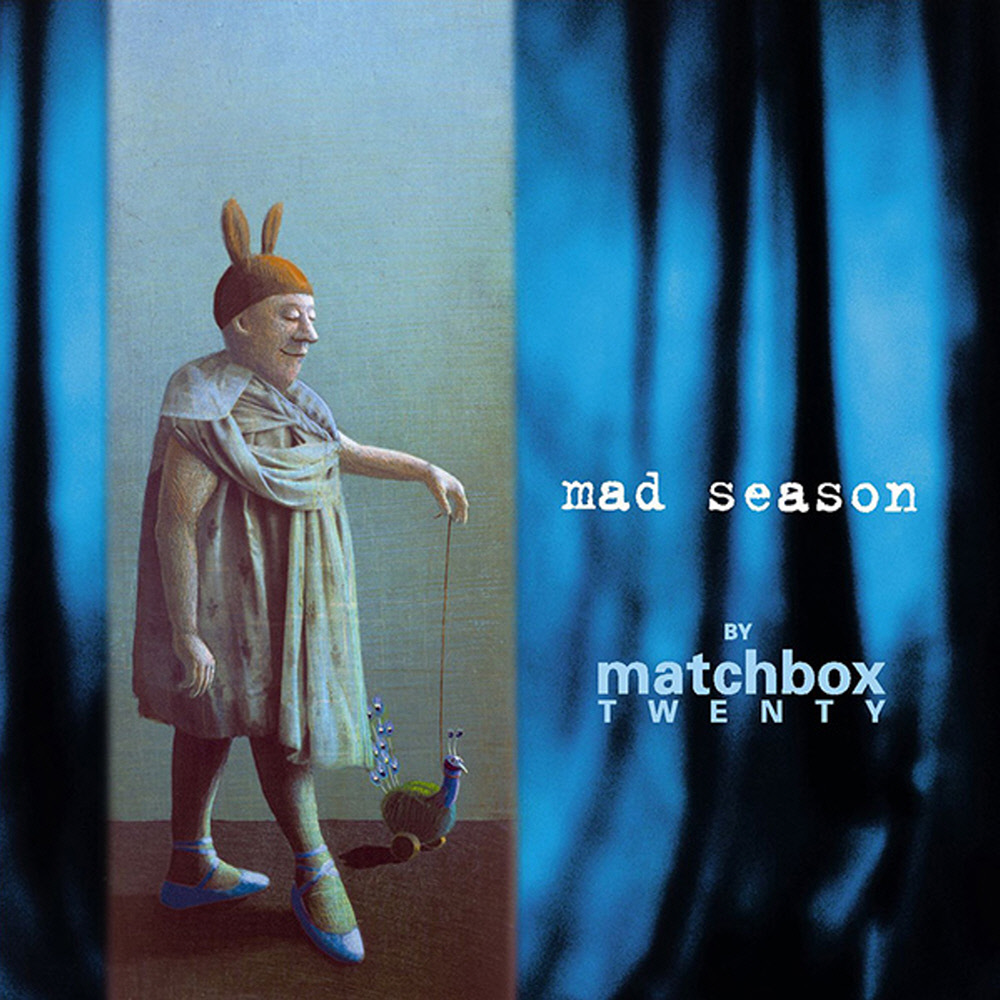

# Mad Season

By **Matchbox Twenty**

## Album Data

- **Catalog:** Beets
- **Format:** Digital, Album
- **Album:** Mad Season
- **Artist:** Matchbox Twenty
- **Albumartist:** Matchbox Twenty
- **Genre:** Pop Rock
- **MusicBrainz Album Artist ID:** [75af9d25-cf32-49c0-9192-60bd8e9784e6](https://musicbrainz.org/artist/75af9d25-cf32-49c0-9192-60bd8e9784e6)
- **MusicBrainz Album ID:** [367861d4-3d67-4cb3-bffe-d749ef697a60](https://musicbrainz.org/release/367861d4-3d67-4cb3-bffe-d749ef697a60)
- **MusicBrainz Release Group ID:** [8eda03d5-8934-3657-bebe-9b231380b299](https://musicbrainz.org/release-group/8eda03d5-8934-3657-bebe-9b231380b299)
- **Year:** 2000
- **Catalog #:** 
- **Label:** Atlantic
- **Total Tracks:** 14

## Album Tracks

### Track 01 - Angry

- **Artist:** Matchbox Twenty
- **Format:** ALAC
- **Genre:** Pop Rock
- **Length:** 3:44
- **MusicBrainz Track ID:** [bcb1ac2c-e401-4051-b8f8-d11a995b4142](https://musicbrainz.org/recording/bcb1ac2c-e401-4051-b8f8-d11a995b4142)
- **Title:** Angry
- **Track:** 01
- **Year:** 2000

### Track 02 - Black & White People

- **Artist:** Matchbox Twenty
- **Format:** ALAC
- **Genre:** Alternative Rock
- **Length:** 3:45
- **MusicBrainz Track ID:** [f0c48ad8-91c9-4aac-b2fc-b41601bd5da5](https://musicbrainz.org/recording/f0c48ad8-91c9-4aac-b2fc-b41601bd5da5)
- **Title:** Black & White People
- **Track:** 02
- **Year:** 2000

### Track 03 - Crutch

- **Artist:** Matchbox Twenty
- **Format:** ALAC
- **Genre:** Pop Rock
- **Length:** 3:25
- **MusicBrainz Track ID:** [a62d8e7e-9e56-48b8-9c61-3016948511d8](https://musicbrainz.org/recording/a62d8e7e-9e56-48b8-9c61-3016948511d8)
- **Title:** Crutch
- **Track:** 03
- **Year:** 2000

### Track 04 - Last Beautiful Girl

- **Artist:** Matchbox Twenty
- **Format:** ALAC
- **Genre:** Pop Rock
- **Length:** 4:03
- **MusicBrainz Track ID:** [a94caf56-77a5-4afa-9c1c-7af97dde602a](https://musicbrainz.org/recording/a94caf56-77a5-4afa-9c1c-7af97dde602a)
- **Title:** Last Beautiful Girl
- **Track:** 04
- **Year:** 2000

### Track 05 - If You’re Gone

- **Artist:** Matchbox Twenty
- **Format:** ALAC
- **Genre:** Pop Rock
- **Length:** 4:34
- **MusicBrainz Track ID:** [9d18ec48-7961-4a40-838f-6879f36d7890](https://musicbrainz.org/recording/9d18ec48-7961-4a40-838f-6879f36d7890)
- **Title:** If You’re Gone
- **Track:** 05
- **Year:** 2000

### Track 06 - Mad Season

- **Artist:** Matchbox Twenty
- **Format:** ALAC
- **Genre:** Pop Rock
- **Length:** 5:02
- **MusicBrainz Track ID:** [9d336215-3dbd-4143-8516-07f0ee073bf1](https://musicbrainz.org/recording/9d336215-3dbd-4143-8516-07f0ee073bf1)
- **Title:** Mad Season
- **Track:** 06
- **Year:** 2000

### Track 07 - Rest Stop

- **Artist:** Matchbox Twenty
- **Format:** ALAC
- **Genre:** Alternative Rock
- **Length:** 4:29
- **MusicBrainz Track ID:** [935d43bb-53ec-45fd-a701-11ec957f93c4](https://musicbrainz.org/recording/935d43bb-53ec-45fd-a701-11ec957f93c4)
- **Title:** Rest Stop
- **Track:** 07
- **Year:** 2000

### Track 08 - The Burn

- **Artist:** Matchbox Twenty
- **Format:** ALAC
- **Genre:** Post-Grunge
- **Length:** 3:27
- **MusicBrainz Track ID:** [78fa0858-f3bb-4c3d-9949-1c8af50c0108](https://musicbrainz.org/recording/78fa0858-f3bb-4c3d-9949-1c8af50c0108)
- **Title:** The Burn
- **Track:** 08
- **Year:** 2000

### Track 09 - Bent

- **Artist:** Matchbox Twenty
- **Format:** ALAC
- **Genre:** Pop Rock
- **Length:** 4:16
- **MusicBrainz Track ID:** [a90342c2-b2e3-4b05-9dac-d79c0393ca9d](https://musicbrainz.org/recording/a90342c2-b2e3-4b05-9dac-d79c0393ca9d)
- **Title:** Bent
- **Track:** 09
- **Year:** 2000

### Track 10 - Bed of Lies

- **Artist:** Matchbox Twenty
- **Format:** ALAC
- **Genre:** Pop Rock
- **Length:** 5:22
- **MusicBrainz Track ID:** [7f3c4177-1d92-4586-bda8-aa78ef4709fb](https://musicbrainz.org/recording/7f3c4177-1d92-4586-bda8-aa78ef4709fb)
- **Title:** Bed of Lies
- **Track:** 10
- **Year:** 2000

### Track 11 - Leave

- **Artist:** Matchbox Twenty
- **Format:** ALAC
- **Genre:** Indie Rock
- **Length:** 4:33
- **MusicBrainz Track ID:** [9a66c228-5226-463b-bbaa-365adc34980f](https://musicbrainz.org/recording/9a66c228-5226-463b-bbaa-365adc34980f)
- **Title:** Leave
- **Track:** 11
- **Year:** 2000

### Track 12 - Stop

- **Artist:** Matchbox Twenty
- **Format:** ALAC
- **Genre:** Alternative Rock
- **Length:** 3:49
- **MusicBrainz Track ID:** [4845b0be-e3e0-4e5a-80a6-004e02ad90ec](https://musicbrainz.org/recording/4845b0be-e3e0-4e5a-80a6-004e02ad90ec)
- **Title:** Stop
- **Track:** 12
- **Year:** 2000

### Track 13 - You Won’t Be Mine

- **Artist:** Matchbox Twenty
- **Format:** ALAC
- **Genre:** Pop Rock
- **Length:** 9:52
- **MusicBrainz Track ID:** [24002a94-0ff9-460c-8556-d62b6c59bf48](https://musicbrainz.org/recording/24002a94-0ff9-460c-8556-d62b6c59bf48)
- **Title:** You Won’t Be Mine
- **Track:** 13
- **Year:** 2000

### Track 14 - [unknown]

- **Artist:** Matchbox Twenty
- **Format:** MP3
- **Genre:** Pop Rock
- **Length:** 5:20
- **MusicBrainz Track ID:** [a1e94b86-34c4-4d3d-a88f-9aa05e3cacd9](https://musicbrainz.org/recording/a1e94b86-34c4-4d3d-a88f-9aa05e3cacd9)
- **Title:** [unknown]
- **Track:** 14
- **Year:** 2000

## See also

- [Roon: Mad Season (Deluxe) (Édition StudioMasters) (Deluxe Edition)](../../Roon/Matchbox_Twenty/Mad_Season_Deluxe_Édition_StudioMasters_Deluxe_Edition.md)
- [Roon: The Matchbox Twenty Collection](../../Roon/Matchbox_Twenty/The_Matchbox_Twenty_Collection.md)
