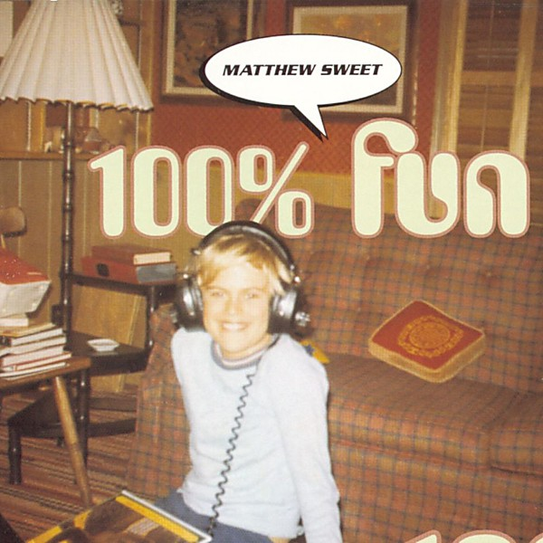

# 100% Fun

By **Matthew Sweet**

## Album Data

- **Catalog:** Beets
- **Format:** Digital, Album
- **Album:** 100% Fun
- **Artist:** Matthew Sweet
- **Albumartist:** Matthew Sweet
- **Genre:** Indie Pop
- **MusicBrainz Album Artist ID:** [3fbcd2d3-3d78-470f-9e47-8f4d66da2474](https://musicbrainz.org/artist/3fbcd2d3-3d78-470f-9e47-8f4d66da2474)
- **MusicBrainz Album ID:** [af5975e1-32f2-4f88-bd8e-f6b181762514](https://musicbrainz.org/release/af5975e1-32f2-4f88-bd8e-f6b181762514)
- **MusicBrainz Release Group ID:** [86ae05a7-ba8e-39fb-b793-f88a9a8d7774](https://musicbrainz.org/release-group/86ae05a7-ba8e-39fb-b793-f88a9a8d7774)
- **Year:** 1995
- **Catalog #:** 72445-11050-2
- **Label:** Zoo Entertainment
- **Total Tracks:** 15

## Album Tracks

### Track 01 - Dinosaur Act

- **Artist:** Matthew Sweet
- **Format:** MP3
- **Genre:** Alternative Rock
- **Length:** 4:05
- **MusicBrainz Track ID:** [dd8b464e-d430-4e9b-af33-05ffee64e030](https://musicbrainz.org/recording/dd8b464e-d430-4e9b-af33-05ffee64e030)
- **Title:** Dinosaur Act
- **Track:** 01
- **Year:** 1993

### Track 02 - Devil With the Green Eyes

- **Artist:** Matthew Sweet
- **Format:** MP3
- **Genre:** Indie Pop
- **Length:** 4:42
- **MusicBrainz Track ID:** [c9b44d56-7627-4bfa-a75c-eb7cfe5f7ae6](https://musicbrainz.org/recording/c9b44d56-7627-4bfa-a75c-eb7cfe5f7ae6)
- **Title:** Devil With the Green Eyes
- **Track:** 02
- **Year:** 1993

### Track 03 - The Ugly Truth

- **Artist:** Matthew Sweet
- **Format:** MP3
- **Genre:** Surf Rock
- **Length:** 3:18
- **MusicBrainz Track ID:** [73844994-124c-4e81-a487-2021177f224f](https://musicbrainz.org/recording/73844994-124c-4e81-a487-2021177f224f)
- **Title:** The Ugly Truth
- **Track:** 03
- **Year:** 1993

### Track 04 - Time Capsule

- **Artist:** Matthew Sweet
- **Format:** MP3
- **Genre:** Indie Rock
- **Length:** 3:55
- **MusicBrainz Track ID:** [24332bda-f382-4780-b0ac-c116a54e6362](https://musicbrainz.org/recording/24332bda-f382-4780-b0ac-c116a54e6362)
- **Title:** Time Capsule
- **Track:** 04
- **Year:** 1993

### Track 05 - Someone to Pull the Trigger

- **Artist:** Matthew Sweet
- **Format:** MP3
- **Genre:** Alternative Rock
- **Length:** 3:55
- **MusicBrainz Track ID:** [6e42f495-dfbf-4d77-8d40-38712e83338c](https://musicbrainz.org/recording/6e42f495-dfbf-4d77-8d40-38712e83338c)
- **Title:** Someone to Pull the Trigger
- **Track:** 05
- **Year:** 1993

### Track 06 - Knowing People

- **Artist:** Matthew Sweet
- **Format:** MP3
- **Genre:** Surf Rock
- **Length:** 4:25
- **MusicBrainz Track ID:** [26424d30-c968-4f4d-81f6-27373cf18136](https://musicbrainz.org/recording/26424d30-c968-4f4d-81f6-27373cf18136)
- **Title:** Knowing People
- **Track:** 06
- **Year:** 1993

### Track 07 - Life Without You

- **Artist:** Matthew Sweet
- **Format:** MP3
- **Genre:** Alternative Rock
- **Length:** 2:18
- **MusicBrainz Track ID:** [3b3d51b0-11e8-4e76-b82e-6cece122a0ec](https://musicbrainz.org/recording/3b3d51b0-11e8-4e76-b82e-6cece122a0ec)
- **Title:** Life Without You
- **Track:** 07
- **Year:** 1993

### Track 08 - Intro

- **Artist:** Matthew Sweet
- **Format:** MP3
- **Genre:** Surf Rock
- **Length:** 1:11
- **MusicBrainz Track ID:** [74d1cd7f-c208-4990-aff6-8ff75a82682a](https://musicbrainz.org/recording/74d1cd7f-c208-4990-aff6-8ff75a82682a)
- **Title:** Intro
- **Track:** 08
- **Year:** 1993

### Track 09 - Ugly Truth Rock

- **Artist:** Matthew Sweet
- **Format:** MP3
- **Genre:** Surf Rock
- **Length:** 2:57
- **MusicBrainz Track ID:** [b74b183d-8f39-4d6b-8cae-9c6bb784228b](https://musicbrainz.org/recording/b74b183d-8f39-4d6b-8cae-9c6bb784228b)
- **Title:** Ugly Truth Rock
- **Track:** 09
- **Year:** 1993

### Track 10 - Do It Again

- **Artist:** Matthew Sweet
- **Format:** MP3
- **Genre:** Rock
- **Length:** 3:32
- **MusicBrainz Track ID:** [1cfaaea5-77b2-4106-8f74-a98fda3d7f52](https://musicbrainz.org/recording/1cfaaea5-77b2-4106-8f74-a98fda3d7f52)
- **Title:** Do It Again
- **Track:** 10
- **Year:** 1993

### Track 11 - In Too Deep

- **Artist:** Matthew Sweet
- **Format:** MP3
- **Genre:** Surf Rock
- **Length:** 3:54
- **MusicBrainz Track ID:** [2517c4c7-59c9-48fe-b2ca-cb3809a4dd5a](https://musicbrainz.org/recording/2517c4c7-59c9-48fe-b2ca-cb3809a4dd5a)
- **Title:** In Too Deep
- **Track:** 11
- **Year:** 1993

### Track 12 - Reaching Out

- **Artist:** Matthew Sweet
- **Format:** MP3
- **Genre:** Surf Rock
- **Length:** 4:01
- **MusicBrainz Track ID:** [b36e55a1-9a1b-4771-8c40-6bc0db83b051](https://musicbrainz.org/recording/b36e55a1-9a1b-4771-8c40-6bc0db83b051)
- **Title:** Reaching Out
- **Track:** 12
- **Year:** 1993

### Track 13 - Falling

- **Artist:** Matthew Sweet
- **Format:** MP3
- **Genre:** Surf Rock
- **Length:** 4:50
- **MusicBrainz Track ID:** [1c3c286e-411f-45a0-b66c-1d0e025b0beb](https://musicbrainz.org/recording/1c3c286e-411f-45a0-b66c-1d0e025b0beb)
- **Title:** Falling
- **Track:** 13
- **Year:** 1993

### Track 14 - What Do You Know?

- **Artist:** Matthew Sweet
- **Format:** MP3
- **Genre:** Garage Rock
- **Length:** 4:29
- **MusicBrainz Track ID:** [d24220a6-cfd2-4cb9-88be-5849f82c261c](https://musicbrainz.org/recording/d24220a6-cfd2-4cb9-88be-5849f82c261c)
- **Title:** What Do You Know?
- **Track:** 14
- **Year:** 1993

### Track 15 - Evergreen

- **Artist:** Matthew Sweet
- **Format:** MP3
- **Genre:** Power Pop
- **Length:** 5:49
- **MusicBrainz Track ID:** [6ad6e27d-4d5c-4ad4-b2a6-e71cbf429f41](https://musicbrainz.org/recording/6ad6e27d-4d5c-4ad4-b2a6-e71cbf429f41)
- **Title:** Evergreen
- **Track:** 15
- **Year:** 1993

## See also

- [Altered Beast](Altered_Beast.md)
- [Blue Sky on Mars](Blue_Sky_on_Mars.md)
- [Son of Altered Beast](Son_of_Altered_Beast.md)
- [Roon: Girlfriend (Legacy Edition)](../../Roon/Matthew_Sweet/Girlfriend_Legacy_Edition.md)
