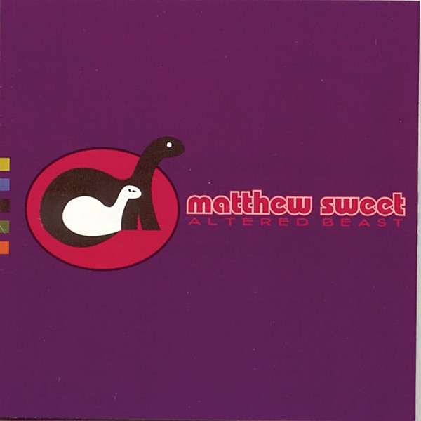

# Altered Beast

By **Matthew Sweet**

## Album Data

- **Catalog:** Beets
- **Format:** Digital, Album
- **Album:** Altered Beast
- **Artist:** Matthew Sweet
- **Albumartist:** Matthew Sweet
- **Genre:** Surf Rock
- **MusicBrainz Album Artist ID:** [3fbcd2d3-3d78-470f-9e47-8f4d66da2474](https://musicbrainz.org/artist/3fbcd2d3-3d78-470f-9e47-8f4d66da2474)
- **MusicBrainz Album ID:** [830364b0-4a3d-4f8e-b51b-f535535b8a66](https://musicbrainz.org/release/830364b0-4a3d-4f8e-b51b-f535535b8a66)
- **MusicBrainz Release Group ID:** [165a7061-093b-30d4-89b4-a1a56c002a5b](https://musicbrainz.org/release-group/165a7061-093b-30d4-89b4-a1a56c002a5b)
- **Year:** 1993
- **Catalog #:** 61422 31130 2
- **Label:** Zoo Entertainment
- **Total Tracks:** 12

## Album Tracks

### Track 01 - Come to California

- **Artist:** Matthew Sweet
- **Format:** MP3
- **Genre:** Surf Rock
- **Length:** 3:30
- **MusicBrainz Track ID:** [24236a97-8f34-4a8e-9400-79de598affa0](https://musicbrainz.org/recording/24236a97-8f34-4a8e-9400-79de598affa0)
- **Title:** Come to California
- **Track:** 01
- **Year:** 1997

### Track 02 - Back to You

- **Artist:** Matthew Sweet
- **Format:** MP3
- **Genre:** Jangle Pop
- **Length:** 3:09
- **MusicBrainz Track ID:** [c7275618-b2f9-4cf5-9f2e-8d8545390d96](https://musicbrainz.org/recording/c7275618-b2f9-4cf5-9f2e-8d8545390d96)
- **Title:** Back to You
- **Track:** 02
- **Year:** 1997

### Track 03 - Where You Get Love

- **Artist:** Matthew Sweet
- **Format:** MP3
- **Genre:** Surf Rock
- **Length:** 3:36
- **MusicBrainz Track ID:** [0b5ae5b9-297d-41c3-954f-066fb28f14ea](https://musicbrainz.org/recording/0b5ae5b9-297d-41c3-954f-066fb28f14ea)
- **Title:** Where You Get Love
- **Track:** 03
- **Year:** 1997

### Track 04 - Hollow

- **Artist:** Matthew Sweet
- **Format:** MP3
- **Genre:** Power Pop
- **Length:** 4:02
- **MusicBrainz Track ID:** [94f9236f-aef3-4f17-9b77-186e88194298](https://musicbrainz.org/recording/94f9236f-aef3-4f17-9b77-186e88194298)
- **Title:** Hollow
- **Track:** 04
- **Year:** 1997

### Track 05 - Behind the Smile

- **Artist:** Matthew Sweet
- **Format:** MP3
- **Genre:** Indie Rock
- **Length:** 2:23
- **MusicBrainz Track ID:** [c5531cb5-afa1-4c69-bb98-4a20f98f99e5](https://musicbrainz.org/recording/c5531cb5-afa1-4c69-bb98-4a20f98f99e5)
- **Title:** Behind the Smile
- **Track:** 05
- **Year:** 1997

### Track 06 - Until You Break

- **Artist:** Matthew Sweet
- **Format:** MP3
- **Genre:** Pop
- **Length:** 4:52
- **MusicBrainz Track ID:** [f555eee2-b9b7-4bbf-82d8-fc6594731264](https://musicbrainz.org/recording/f555eee2-b9b7-4bbf-82d8-fc6594731264)
- **Title:** Until You Break
- **Track:** 06
- **Year:** 1997

### Track 07 - Over It

- **Artist:** Matthew Sweet
- **Format:** MP3
- **Genre:** Pop
- **Length:** 1:34
- **MusicBrainz Track ID:** [bf280d93-18e9-4b5d-b639-1c2f16b5b77f](https://musicbrainz.org/recording/bf280d93-18e9-4b5d-b639-1c2f16b5b77f)
- **Title:** Over It
- **Track:** 07
- **Year:** 1997

### Track 08 - Heaven and Earth

- **Artist:** Matthew Sweet
- **Format:** MP3
- **Genre:** Pop
- **Length:** 2:31
- **MusicBrainz Track ID:** [dfff2ed7-efef-46a7-8f15-f11c29b8b31c](https://musicbrainz.org/recording/dfff2ed7-efef-46a7-8f15-f11c29b8b31c)
- **Title:** Heaven and Earth
- **Track:** 08
- **Year:** 1997

### Track 09 - All Over My Head

- **Artist:** Matthew Sweet
- **Format:** MP3
- **Genre:** Pop
- **Length:** 3:03
- **MusicBrainz Track ID:** [0ff6b787-a488-4fb4-b388-98f9a507f386](https://musicbrainz.org/recording/0ff6b787-a488-4fb4-b388-98f9a507f386)
- **Title:** All Over My Head
- **Track:** 09
- **Year:** 1997

### Track 10 - Into Your Drug

- **Artist:** Matthew Sweet
- **Format:** MP3
- **Genre:** Pop
- **Length:** 2:39
- **MusicBrainz Track ID:** [04299ab6-d911-4415-a96c-99dcb3ac397c](https://musicbrainz.org/recording/04299ab6-d911-4415-a96c-99dcb3ac397c)
- **Title:** Into Your Drug
- **Track:** 10
- **Year:** 1997

### Track 11 - Make Believe

- **Artist:** Matthew Sweet
- **Format:** MP3
- **Genre:** Pop
- **Length:** 1:51
- **MusicBrainz Track ID:** [86b0ff8f-d658-4d52-b72e-54a2d41d0e5c](https://musicbrainz.org/recording/86b0ff8f-d658-4d52-b72e-54a2d41d0e5c)
- **Title:** Make Believe
- **Track:** 11
- **Year:** 1997

### Track 12 - Missing Time

- **Artist:** Matthew Sweet
- **Format:** MP3
- **Genre:** Pop
- **Length:** 3:17
- **MusicBrainz Track ID:** [15b51458-9605-4d85-93a8-8559a65b4302](https://musicbrainz.org/recording/15b51458-9605-4d85-93a8-8559a65b4302)
- **Title:** Missing Time
- **Track:** 12
- **Year:** 1997

## See also

- [100% Fun](100%_Fun.md)
- [Blue Sky on Mars](Blue_Sky_on_Mars.md)
- [Son of Altered Beast](Son_of_Altered_Beast.md)
- [Roon: Girlfriend (Legacy Edition)](../../Roon/Matthew_Sweet/Girlfriend_Legacy_Edition.md)
