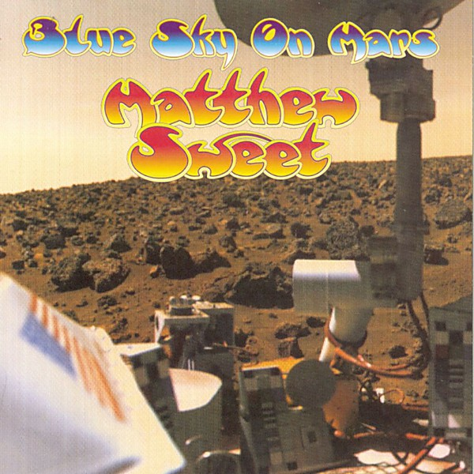

# Blue Sky on Mars

By **Matthew Sweet**

## Album Data

- **Catalog:** Beets
- **Format:** Digital, Album
- **Album:** Blue Sky on Mars
- **Artist:** Matthew Sweet
- **Albumartist:** Matthew Sweet
- **Genre:** Surf Rock
- **MusicBrainz Album Artist ID:** [3fbcd2d3-3d78-470f-9e47-8f4d66da2474](https://musicbrainz.org/artist/3fbcd2d3-3d78-470f-9e47-8f4d66da2474)
- **MusicBrainz Album ID:** [d40182fc-6a84-42bd-8957-49a170ef29f7](https://musicbrainz.org/release/d40182fc-6a84-42bd-8957-49a170ef29f7)
- **MusicBrainz Release Group ID:** [1d25f534-42e6-3719-8f9c-8cdc99152714](https://musicbrainz.org/release-group/1d25f534-42e6-3719-8f9c-8cdc99152714)
- **Year:** 1997
- **Catalog #:** 72445-11078-2
- **Label:** Zoo Entertainment
- **Total Tracks:** 07

## Album Tracks

### Track 01 - Devil With the Green Eyes (remix)

- **Artist:** Matthew Sweet
- **Format:** MP3
- **Genre:** Rock
- **Length:** 4:41
- **MusicBrainz Track ID:** [1957fcd4-fcbd-48b0-b205-c92114bc49b2](https://musicbrainz.org/recording/1957fcd4-fcbd-48b0-b205-c92114bc49b2)
- **Title:** Devil With the Green Eyes (remix)
- **Track:** 01
- **Year:** 1994

### Track 02 - Superdeformed (live)

- **Artist:** Matthew Sweet
- **Format:** MP3
- **Genre:** Power Pop
- **Length:** 3:39
- **MusicBrainz Track ID:** [b6d3aaec-07c9-48fc-9f69-e32052844e45](https://musicbrainz.org/recording/b6d3aaec-07c9-48fc-9f69-e32052844e45)
- **Title:** Superdeformed (live)
- **Track:** 02
- **Year:** 1994

### Track 03 - Someone to Pull the Trigger (live)

- **Artist:** Matthew Sweet
- **Format:** MP3
- **Genre:** Power Pop
- **Length:** 4:19
- **MusicBrainz Track ID:** [efe0203f-a829-481c-9e42-0dbae11ca776](https://musicbrainz.org/recording/efe0203f-a829-481c-9e42-0dbae11ca776)
- **Title:** Someone to Pull the Trigger (live)
- **Track:** 03
- **Year:** 1994

### Track 04 - Knowing People (live)

- **Artist:** Matthew Sweet
- **Format:** MP3
- **Genre:** Power Pop
- **Length:** 4:35
- **MusicBrainz Track ID:** [8c3c1047-a80c-437d-86d1-ef814c9ddba3](https://musicbrainz.org/recording/8c3c1047-a80c-437d-86d1-ef814c9ddba3)
- **Title:** Knowing People (live)
- **Track:** 04
- **Year:** 1994

### Track 05 - I Wanted to Tell You (live)

- **Artist:** Matthew Sweet
- **Format:** MP3
- **Genre:** Power Pop
- **Length:** 4:32
- **MusicBrainz Track ID:** [c6ec6e21-690c-486a-85d1-9d82016c9f1c](https://musicbrainz.org/recording/c6ec6e21-690c-486a-85d1-9d82016c9f1c)
- **Title:** I Wanted to Tell You (live)
- **Track:** 05
- **Year:** 1994

### Track 06 - Don't Cry No Tears (live)

- **Artist:** Matthew Sweet
- **Format:** MP3
- **Genre:** Power Pop
- **Length:** 2:50
- **MusicBrainz Track ID:** [fb62a51d-c0a3-41b5-9d30-52e27fb027eb](https://musicbrainz.org/recording/fb62a51d-c0a3-41b5-9d30-52e27fb027eb)
- **Title:** Don't Cry No Tears (live)
- **Track:** 06
- **Year:** 1994

### Track 07 - Ultrasuede (studio outake)

- **Artist:** Matthew Sweet
- **Format:** MP3
- **Genre:** Power Pop
- **Length:** 3:56
- **MusicBrainz Track ID:** [718aa12e-e2db-4c59-8a1f-cddf2129da8f](https://musicbrainz.org/recording/718aa12e-e2db-4c59-8a1f-cddf2129da8f)
- **Title:** Ultrasuede (studio outake)
- **Track:** 07
- **Year:** 1994

## See also

- [100% Fun](100%_Fun.md)
- [Altered Beast](Altered_Beast.md)
- [Son of Altered Beast](Son_of_Altered_Beast.md)
- [Roon: Girlfriend (Legacy Edition)](../../Roon/Matthew_Sweet/Girlfriend_Legacy_Edition.md)
