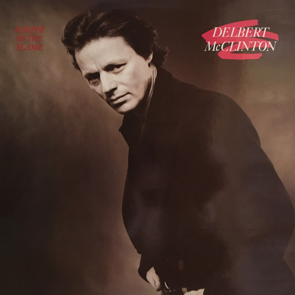

# Keeper Of The Flame

By **McClinton, Delbert**

## Album Data

- **Catalog:** Beets
- **Format:** Digital, Album
- **Album:** Keeper Of The Flame
- **Artist:** Mcclinton, Delbert
- **Albumartist:** McClinton, Delbert
- **Genre:** Unknown
- **MusicBrainz Album Artist ID:** 
- **MusicBrainz Album ID:** 
- **MusicBrainz Release Group ID:** 
- **Year:** 1979
- **Catalog #:** 
- **Label:** 
- **Total Tracks:** 10

## Album Tracks

### Track 01 - Plain Old Makin' Love

- **Artist:** McClinton, Delbert
- **Format:** ALAC
- **Genre:** Unknown
- **Length:** 3:07
- **MusicBrainz Track ID:** 
- **Title:** Plain Old Makin' Love
- **Track:** 01
- **Year:** 1979

### Track 02 - Just A Little Bit

- **Artist:** McClinton, Delbert
- **Format:** ALAC
- **Genre:** Unknown
- **Length:** 3:01
- **MusicBrainz Track ID:** 
- **Title:** Just A Little Bit
- **Track:** 02
- **Year:** 1979

### Track 03 - Shot From The Saddle

- **Artist:** McClinton, Delbert
- **Format:** ALAC
- **Genre:** Unknown
- **Length:** 3:47
- **MusicBrainz Track ID:** 
- **Title:** Shot From The Saddle
- **Track:** 03
- **Year:** 1979

### Track 04 - I Don't Want Hear It Anymore

- **Artist:** McClinton, Delbert
- **Format:** ALAC
- **Genre:** Unknown
- **Length:** 3:36
- **MusicBrainz Track ID:** 
- **Title:** I Don't Want Hear It Anymore
- **Track:** 04
- **Year:** 1979

### Track 05 - Have Mercy

- **Artist:** McClinton, Delbert
- **Format:** ALAC
- **Genre:** Unknown
- **Length:** 4:12
- **MusicBrainz Track ID:** 
- **Title:** Have Mercy
- **Track:** 05
- **Year:** 1979

### Track 06 - I'm Talking About You

- **Artist:** McClinton, Delbert
- **Format:** ALAC
- **Genre:** Unknown
- **Length:** 3:00
- **MusicBrainz Track ID:** 
- **Title:** I'm Talking About You
- **Track:** 06
- **Year:** 1979

### Track 07 - Two More Bottles Of Wine

- **Artist:** McClinton, Delbert
- **Format:** ALAC
- **Genre:** Unknown
- **Length:** 4:57
- **MusicBrainz Track ID:** 
- **Title:** Two More Bottles Of Wine
- **Track:** 07
- **Year:** 1979

### Track 08 - Seesaw

- **Artist:** McClinton, Delbert
- **Format:** ALAC
- **Genre:** Unknown
- **Length:** 2:57
- **MusicBrainz Track ID:** 
- **Title:** Seesaw
- **Track:** 08
- **Year:** 1979

### Track 09 - I Received A Letter

- **Artist:** McClinton, Delbert
- **Format:** ALAC
- **Genre:** Unknown
- **Length:** 3:00
- **MusicBrainz Track ID:** 
- **Title:** I Received A Letter
- **Track:** 09
- **Year:** 1979

### Track 10 - A Mess Of The Blues

- **Artist:** McClinton, Delbert
- **Format:** ALAC
- **Genre:** Unknown
- **Length:** 4:16
- **MusicBrainz Track ID:** 
- **Title:** A Mess Of The Blues
- **Track:** 10
- **Year:** 1979

