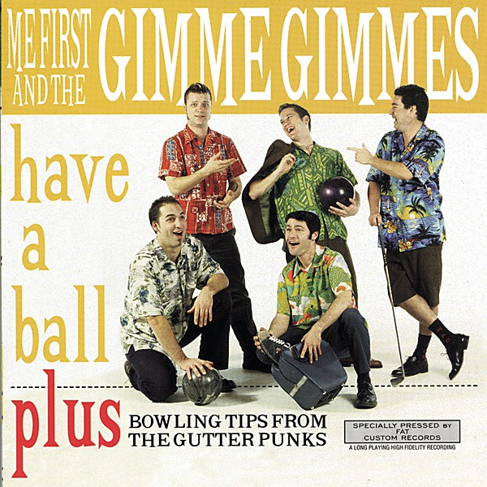

# Have a Ball

By **Me First and the Gimme Gimmes**

## Album Data

- **Catalog:** Beets
- **Format:** Digital, Album
- **Album:** Have a Ball
- **Artist:** Me First And The Gimme Gimmes
- **Albumartist:** Me First and the Gimme Gimmes
- **Genre:** Pop Punk
- **MusicBrainz Album Artist ID:** [9478e346-7c52-4780-9555-3d1577f0b905](https://musicbrainz.org/artist/9478e346-7c52-4780-9555-3d1577f0b905)
- **MusicBrainz Album ID:** [6871b9fc-531d-422a-8b46-8e4ce31132ff](https://musicbrainz.org/release/6871b9fc-531d-422a-8b46-8e4ce31132ff)
- **MusicBrainz Release Group ID:** [3cd68b32-0d81-3cf4-a2a4-f76b5452480c](https://musicbrainz.org/release-group/3cd68b32-0d81-3cf4-a2a4-f76b5452480c)
- **Year:** 1997
- **Catalog #:** FAT650-2
- **Label:** Fat Wreck Chords
- **Total Tracks:** 13

## Album Tracks

### Track 01 - Where Do Broken Hearts Go

- **Artist:** Me First and the Gimme Gimmes
- **Format:** AAC
- **Genre:** Pop Punk
- **Length:** 2:32
- **MusicBrainz Track ID:** [faf6c967-1c98-4758-bcdb-86484fb25bb8](https://musicbrainz.org/recording/faf6c967-1c98-4758-bcdb-86484fb25bb8)
- **Title:** Where Do Broken Hearts Go
- **Track:** 01
- **Year:** 2003

### Track 02 - Hello

- **Artist:** Me First and the Gimme Gimmes
- **Format:** AAC
- **Genre:** Ska Punk
- **Length:** 2:20
- **MusicBrainz Track ID:** [b26b2ddb-6d38-44e9-b24c-036ac3fff507](https://musicbrainz.org/recording/b26b2ddb-6d38-44e9-b24c-036ac3fff507)
- **Title:** Hello
- **Track:** 02
- **Year:** 2003

### Track 03 - End of the Road

- **Artist:** Me First and the Gimme Gimmes
- **Format:** AAC
- **Genre:** Ska Punk
- **Length:** 3:04
- **MusicBrainz Track ID:** [aa8e29d3-d86f-4c17-8052-09a00f853cfe](https://musicbrainz.org/recording/aa8e29d3-d86f-4c17-8052-09a00f853cfe)
- **Title:** End of the Road
- **Track:** 03
- **Year:** 2003

### Track 04 - Ain’t No Sunshine

- **Artist:** Me First and the Gimme Gimmes
- **Format:** AAC
- **Genre:** Skate Punk
- **Length:** 1:45
- **MusicBrainz Track ID:** [7fdf9636-a283-46be-a698-632118babb3d](https://musicbrainz.org/recording/7fdf9636-a283-46be-a698-632118babb3d)
- **Title:** Ain’t No Sunshine
- **Track:** 04
- **Year:** 2003

### Track 05 - Nothing Compares 2 U

- **Artist:** Me First and the Gimme Gimmes
- **Format:** AAC
- **Genre:** Ska Punk
- **Length:** 2:44
- **MusicBrainz Track ID:** [45920d77-f1d6-4d3c-afa5-7e181b319ee3](https://musicbrainz.org/recording/45920d77-f1d6-4d3c-afa5-7e181b319ee3)
- **Title:** Nothing Compares 2 U
- **Track:** 05
- **Year:** 2003

### Track 06 - Crazy

- **Artist:** Me First and the Gimme Gimmes
- **Format:** AAC
- **Genre:** Ska Punk
- **Length:** 3:11
- **MusicBrainz Track ID:** [baedceff-ace6-4104-9eb3-bddf63163933](https://musicbrainz.org/recording/baedceff-ace6-4104-9eb3-bddf63163933)
- **Title:** Crazy
- **Track:** 06
- **Year:** 2003

### Track 08 - I Believe I Can Fly

- **Artist:** Me First and the Gimme Gimmes
- **Format:** AAC
- **Genre:** Ska Punk
- **Length:** 3:10
- **MusicBrainz Track ID:** [dc7bf11c-b261-4945-9176-eca259f5212c](https://musicbrainz.org/recording/dc7bf11c-b261-4945-9176-eca259f5212c)
- **Title:** I Believe I Can Fly
- **Track:** 08
- **Year:** 2003

### Track 09 - Oh Girl

- **Artist:** Me First and the Gimme Gimmes
- **Format:** AAC
- **Genre:** Punk Rock
- **Length:** 2:00
- **MusicBrainz Track ID:** [42d8d860-c329-46b5-b2e6-f58ea5b6c94a](https://musicbrainz.org/recording/42d8d860-c329-46b5-b2e6-f58ea5b6c94a)
- **Title:** Oh Girl
- **Track:** 09
- **Year:** 2003

### Track 10 - I’ll Be There

- **Artist:** Me First and the Gimme Gimmes
- **Format:** AAC
- **Genre:** Skate Punk
- **Length:** 2:07
- **MusicBrainz Track ID:** [8a58d3c3-95d2-466a-b02a-81bd563065f0](https://musicbrainz.org/recording/8a58d3c3-95d2-466a-b02a-81bd563065f0)
- **Title:** I’ll Be There
- **Track:** 10
- **Year:** 2003

### Track 11 - Mona Lisa

- **Artist:** Me First and the Gimme Gimmes
- **Format:** AAC
- **Genre:** Ska Punk
- **Length:** 2:55
- **MusicBrainz Track ID:** [39919a5a-9b9b-4585-8d6a-38bc2f45a6bf](https://musicbrainz.org/recording/39919a5a-9b9b-4585-8d6a-38bc2f45a6bf)
- **Title:** Mona Lisa
- **Track:** 11
- **Year:** 2003

### Track 12 - Save the Best for Last

- **Artist:** Me First and the Gimme Gimmes
- **Format:** AAC
- **Genre:** Pop Punk
- **Length:** 2:06
- **MusicBrainz Track ID:** [365adb7c-aac6-49b1-8198-0d3688136527](https://musicbrainz.org/recording/365adb7c-aac6-49b1-8198-0d3688136527)
- **Title:** Save the Best for Last
- **Track:** 12
- **Year:** 2003

### Track 13 - Natural Woman

- **Artist:** Me First and the Gimme Gimmes
- **Format:** AAC
- **Genre:** Ska
- **Length:** 2:40
- **MusicBrainz Track ID:** [7967186b-7b27-43cf-adc5-4f19d94d5163](https://musicbrainz.org/recording/7967186b-7b27-43cf-adc5-4f19d94d5163)
- **Title:** Natural Woman
- **Track:** 13
- **Year:** 2003

## See also

- [Take a Break](Take_a_Break.md)
- [Vinyl: Have A Ball](../../Vinyl/Me_First_And_The_Gimme_Gimmes/Have_A_Ball.md)
- [Vinyl: ](../../Vinyl/Me_First_And_The_Gimme_Gimmes/Me_First_And_The_Gimme_Gimmes.md)
- [Vinyl: Take A Break](../../Vinyl/Me_First_And_The_Gimme_Gimmes/Take_A_Break.md)
