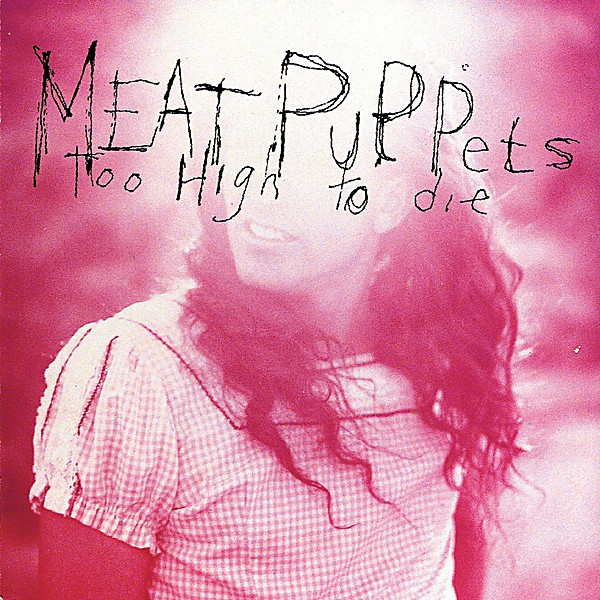

# Too High to Die

By **Meat Puppets**

## Album Data

- **Catalog:** Beets
- **Format:** Digital, Album
- **Album:** Too High to Die
- **Artist:** Meat Puppets
- **Albumartist:** Meat Puppets
- **Genre:** Grunge
- **MusicBrainz Album Artist ID:** [3df040ee-2b8b-446b-937a-3f86f4b2cabf](https://musicbrainz.org/artist/3df040ee-2b8b-446b-937a-3f86f4b2cabf)
- **MusicBrainz Album ID:** [f96c6938-def4-4bf8-904b-63f4595da54f](https://musicbrainz.org/release/f96c6938-def4-4bf8-904b-63f4595da54f)
- **MusicBrainz Release Group ID:** [a7b4605f-00fa-3148-b3a2-1a2a0934c756](https://musicbrainz.org/release-group/a7b4605f-00fa-3148-b3a2-1a2a0934c756)
- **Year:** 1994
- **Catalog #:** 828 484-2
- **Label:** London Records
- **Total Tracks:** 13

## Album Tracks

### Track 01 - Violet Eyes

- **Artist:** Meat Puppets
- **Format:** ALAC
- **Genre:** No Wave
- **Length:** 3:51
- **MusicBrainz Track ID:** [bfc10a9c-a462-4c25-8372-2184363c13c9](https://musicbrainz.org/recording/bfc10a9c-a462-4c25-8372-2184363c13c9)
- **Title:** Violet Eyes
- **Track:** 01
- **Year:** 1994

### Track 02 - Never to Be Found

- **Artist:** Meat Puppets
- **Format:** ALAC
- **Genre:** Grunge
- **Length:** 4:46
- **MusicBrainz Track ID:** [ebc1aaa5-03c7-4c75-ac1f-91648c5dddc7](https://musicbrainz.org/recording/ebc1aaa5-03c7-4c75-ac1f-91648c5dddc7)
- **Title:** Never to Be Found
- **Track:** 02
- **Year:** 1994

### Track 03 - We Don’t Exist

- **Artist:** Meat Puppets
- **Format:** ALAC
- **Genre:** Grunge
- **Length:** 3:44
- **MusicBrainz Track ID:** [347f0bfa-43a4-4e0f-976b-7e605d8cb25f](https://musicbrainz.org/recording/347f0bfa-43a4-4e0f-976b-7e605d8cb25f)
- **Title:** We Don’t Exist
- **Track:** 03
- **Year:** 1994

### Track 04 - Severed Goddess Hand

- **Artist:** Meat Puppets
- **Format:** ALAC
- **Genre:** Grunge
- **Length:** 2:59
- **MusicBrainz Track ID:** [a92ab952-5c14-4a25-9e8f-d611a8530893](https://musicbrainz.org/recording/a92ab952-5c14-4a25-9e8f-d611a8530893)
- **Title:** Severed Goddess Hand
- **Track:** 04
- **Year:** 1994

### Track 05 - Flaming Heart

- **Artist:** Meat Puppets
- **Format:** ALAC
- **Genre:** Grunge
- **Length:** 4:49
- **MusicBrainz Track ID:** [3e4da98b-ac39-4c95-bbfa-bbb2b60c28c0](https://musicbrainz.org/recording/3e4da98b-ac39-4c95-bbfa-bbb2b60c28c0)
- **Title:** Flaming Heart
- **Track:** 05
- **Year:** 1994

### Track 06 - Shine

- **Artist:** Meat Puppets
- **Format:** ALAC
- **Genre:** Grunge
- **Length:** 3:50
- **MusicBrainz Track ID:** [572c9e27-093f-441e-ba08-b39296c299c5](https://musicbrainz.org/recording/572c9e27-093f-441e-ba08-b39296c299c5)
- **Title:** Shine
- **Track:** 06
- **Year:** 1994

### Track 07 - Station

- **Artist:** Meat Puppets
- **Format:** ALAC
- **Genre:** Grunge
- **Length:** 2:22
- **MusicBrainz Track ID:** [3f02116b-1635-4ae7-8b48-9e49fdc55b11](https://musicbrainz.org/recording/3f02116b-1635-4ae7-8b48-9e49fdc55b11)
- **Title:** Station
- **Track:** 07
- **Year:** 1994

### Track 08 - Roof With a Hole

- **Artist:** Meat Puppets
- **Format:** ALAC
- **Genre:** Grunge
- **Length:** 3:34
- **MusicBrainz Track ID:** [00ad1161-0eb0-44fa-9971-f14e2961bcd5](https://musicbrainz.org/recording/00ad1161-0eb0-44fa-9971-f14e2961bcd5)
- **Title:** Roof With a Hole
- **Track:** 08
- **Year:** 1994

### Track 09 - Backwater

- **Artist:** Meat Puppets
- **Format:** ALAC
- **Genre:** Grunge
- **Length:** 3:42
- **MusicBrainz Track ID:** [f5c6c25f-7c71-45de-89c1-bb1072a7ffba](https://musicbrainz.org/recording/f5c6c25f-7c71-45de-89c1-bb1072a7ffba)
- **Title:** Backwater
- **Track:** 09
- **Year:** 1994

### Track 10 - Things

- **Artist:** Meat Puppets
- **Format:** ALAC
- **Genre:** Grunge
- **Length:** 4:06
- **MusicBrainz Track ID:** [10d1b624-9833-4c6d-aa24-376699a384fb](https://musicbrainz.org/recording/10d1b624-9833-4c6d-aa24-376699a384fb)
- **Title:** Things
- **Track:** 10
- **Year:** 1994

### Track 11 - Why?

- **Artist:** Meat Puppets
- **Format:** ALAC
- **Genre:** Indie Rock
- **Length:** 4:20
- **MusicBrainz Track ID:** [cdc8b42c-7b92-4520-9168-967e88049f89](https://musicbrainz.org/recording/cdc8b42c-7b92-4520-9168-967e88049f89)
- **Title:** Why?
- **Track:** 11
- **Year:** 1994

### Track 12 - Evil Love

- **Artist:** Meat Puppets
- **Format:** ALAC
- **Genre:** Indie Rock
- **Length:** 3:07
- **MusicBrainz Track ID:** [63eccfd9-4cc7-4f5d-ab13-08c27047e562](https://musicbrainz.org/recording/63eccfd9-4cc7-4f5d-ab13-08c27047e562)
- **Title:** Evil Love
- **Track:** 12
- **Year:** 1994

### Track 13 - Comin’ Down / Lake of Fire

- **Artist:** Meat Puppets
- **Format:** ALAC
- **Genre:** Grunge
- **Length:** 6:56
- **MusicBrainz Track ID:** [d970d79f-5c63-4cec-944f-e4b3ae8f6ddb](https://musicbrainz.org/recording/d970d79f-5c63-4cec-944f-e4b3ae8f6ddb)
- **Title:** Comin’ Down / Lake of Fire
- **Track:** 13
- **Year:** 1994

## See also

- [CD: ](../../CD/Meat_Puppets/Meat_Puppets.md)
- [CD: Too High To Die](../../CD/Meat_Puppets/Too_High_To_Die.md)
- [Roon: Too High To Die](../../Roon/Meat_Puppets/Too_High_To_Die.md)
